# Understanding APIs in Government

## Chris Nesbitt-Smith | cns.me [CDDO]

---

<!-- _class: frame lead -->

# &nbsp;&nbsp;&nbsp; 👋 &nbsp;&nbsp;&nbsp;&nbsp; <!--fit-->

## Chris Nesbitt-Smith | cns.me [CDDO]

<!--
Hello everyone, I'm Chris Nesbitt-Smith, a consultant from cns.me working in partnership with the Central Digital and Data Office (CDDO). Today, I've been asked to demystify APIs or Application Programming Interfaces and explain how they are essential to the future of public services.
-->

---

<!-- _class: frame lead -->

- What
- How
- When
- Where
- Why
  ...an API

<!--
By the end of this talk you'll hopefully come away knowing:

- What an API is
- How an API works
- When an API is used
- Where APIs are used
- Why APIs are used, and specifically why they are essential to underpin the future integration of government services
- And if I can still pronounce API at the end after repeating it so many times without existential doubt.
-->

---


# Platformland:

### An anatomy of next-generation public services

#### anatomyofpublicservices.com <!--fit-->

<!--
I'm going to be directly and indirectly citing Platformland by Richard Pope a lot in this talk, which is a fantastic book that I strongly recommend everyone gift yourselves and a colleague a copy of this Christmas.
-->

---

.jpg>)

<!--
In this case a direct excerpt from the book:
The idea of APIs has roots in an early computer: the British EDSAC of the late 1940s. Reusable subroutines that solved common problems, such as calculating a logarithm were stored on punched paper tape and organized in a filing cabinet along with instructions on how to use them.
-->

---


<!--
So, what exactly is an API? An API, or Application Programming Interface, well you can think of it as a contract or set of rules and protocols that allow different software applications to communicate with each other.
-->

---

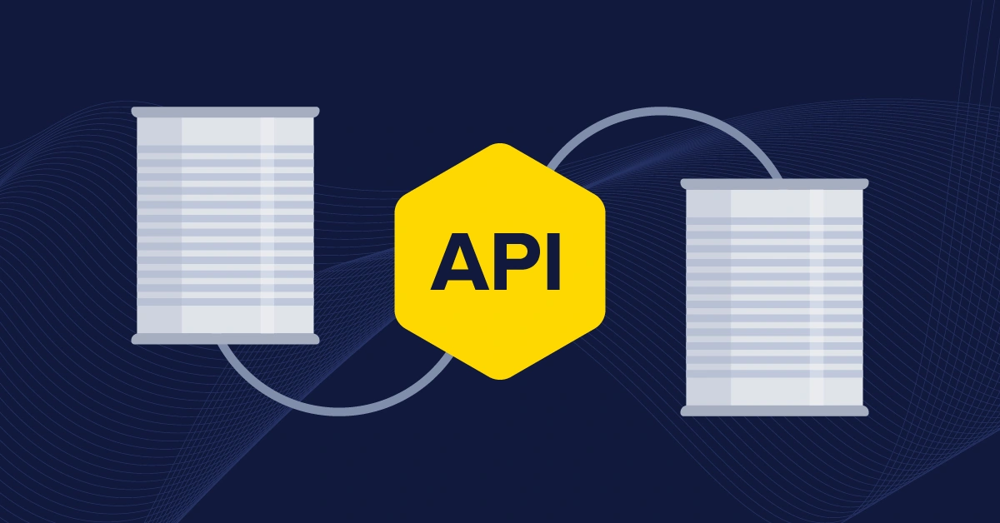

<!--
Or more visually an API could be seen as a bridge connecting two different software systems, enabling them to share data and functionalities seamlessly with a defined boundary.
-->

---

# Key Concepts <!--fit-->

<!--
Before we dive deeper, let's cover some key terms, concepts and buzzwords you'll come across when discussing APIs.
-->

---

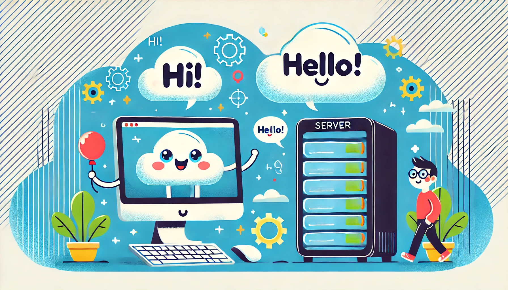

<!--
First, we have the client and the server. The client is the application or system that makes a request, while the server is the one that provides a response
-->

---

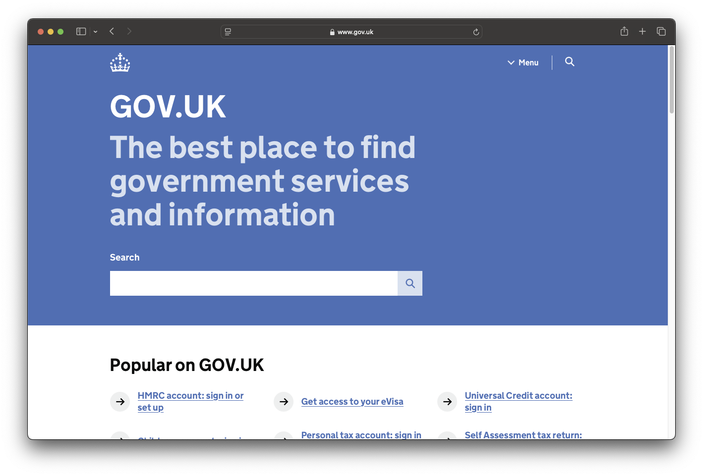

<!--
This could perhaps be a web browser and the server could be a webserver such as gov.uk.
-->

---


<!--
Servers often act as clients, so you can have a very long and complex chain of servers and clients.
It is turtles all the way down.
-->

---

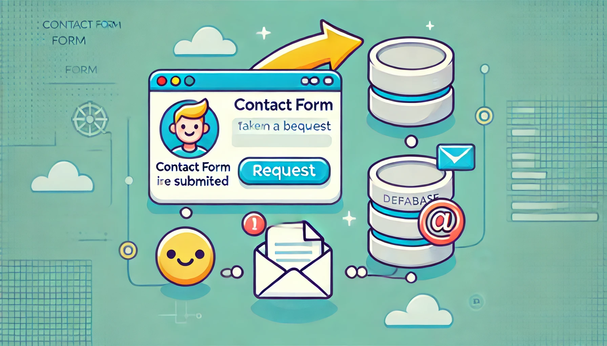

<!-- for example a contact form on a website will take a request from the browser, store that in a database, and then send a notification -->

---

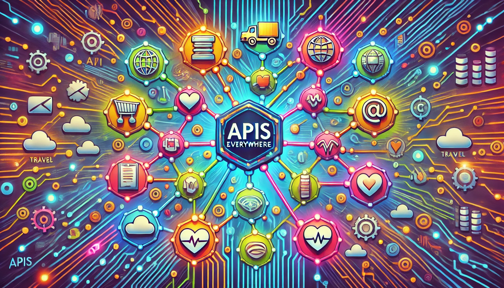

<!--
Often the detail isn't that important, but the outcome is they underpin all the digital services we use today, whether we know about them or not.
-->

---


<!--
Next, we have requests and responses. The client sends a request to the server, and the server sends back a response.
This exchange is the fundamental interaction in APIs.
-->

---

# Endpoint <!--fit-->

# e.g. https://api.gov.uk/v1

<!--
An endpoint is a specific point where the API can access the resources it needs, often represented as a URL.
-->

---


<!--
Think of it as the address where you send your request.
-->

---

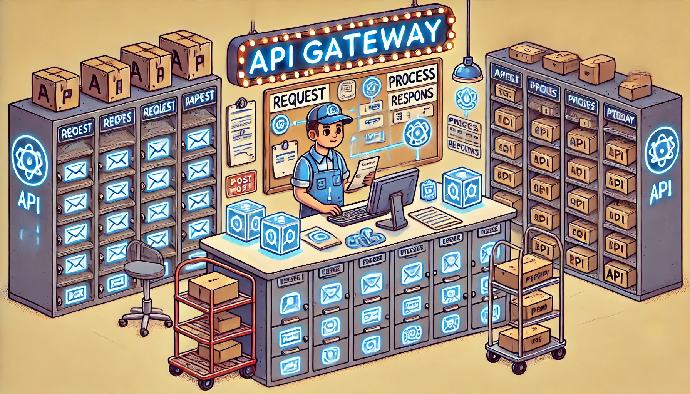

<!--
An API gateway acts as a single entry point for a set of APIs.
to stretch the metaphor a little, perhaps think of this as a building with many units, if you send a request to the building, your letter can be ultimately routed to the correct unit.
These are put in place often to help manage, secure, and scale services.
-->

---

# Types of APIs <!--fit-->

<!--
There are various types of APIs that you might hear about.
So let's go through some more buzzwords you might encounter, don't worry I won't be testing you at the end, it might just help join the dots when you hear about them in the real world.
-->

---

<!-- _class: frame lead -->

# RPC (Remote Procedure Call)

# SOAP (Simple Object Access Protocol)

<!--
RPC, gRPC and SOAP you probably won't come across, but they are low level mechanisms for communication between systems, that are not often used directly.
-->

---

<!-- _class: frame lead -->

# REST &nbsp;&nbsp;&nbsp;&nbsp;<!--fit-->

## (Representational State Transfer) <!--fit-->

<!--
REST is an architectural style that uses standard HTTP methods.
It is how everything works on the web today, for example your browser issues a GET request to retrieve data, a POST request is used to send something or carry out an action like submit a form.
You'll often find that APIs are described as RESTful, which is a way of saying they are built using REST principles.
Most other things you'll come across are built on top of REST.
-->

---

# GraphQL <!--fit-->

<!--
GraphQL is a query language for APIs, allowing clients to request exactly what they need quite specifically, and to get back a very specific response.
This is great for performance and reducing over-fetching or under-fetching of data, in that there is no need to retrieve more data than is needed for the task at hand, however can have a higher maintenance burden.
-->

---

# Data Formats <!--fit-->

<!--
Next, lets move on to Data Formats.
APIs use various data formats to exchange information, while these could include a variety such as images, pdf, word files or even video.
-->

---

JSON (JavaScript Object Notation)

```json
{
  "name": "John",
  "age": 30,
  "city": "New York",
  "children": [
    {
      "name": "Jane",
      "age": 5
    }
  ]
}
```

<!--
The most common you'll find is JSON, which is a lightweight data-interchange format that's relatively easy for humans to read and write.
The slide here shows what this actually looks like, where we've got a Person object with a name, age, city and detail of their children, the indentation and new lines are not required, but are often added for readability.
-->

---

# XML (eXtensible Markup Language)

```xml
<Person>
  <Name>John</Name>
  <Age>30</Age>
  <City>New York</City>
  <Children>
    <Child>
      <Name>Jane</Name>
      <Age>5</Age>
    </Child>
  </Children>
</Person>
```

<!--
Here is that same data, but in XML format this time.
If you've ever looked at the source code of a webpage, you'll have seen XML before, XML is what HTML (HyperText Markup Language) is built on top of.
It's older than JSON but still used, especially in SOAP APIs and of course for HTML.
-->

---

# CSV (Comma-Separated Values)

```csv
Name,Age,City
John,30,New York
```

```csv
ParentName,ChildName,ChildAge
John,Jane,5
```

<!--
CSV is a simple format for storing tabular data, much like a spreadsheet.
-->

---

# Plain Text

```
John is thirty years old and lives in New York,
he has a child named Jane who is five years old.
```

<!--
Some APIs might return data in plain text format.
It's human-readable but lacks structure.
-->

---

# &nbsp;&nbsp;&nbsp; 😮‍💨 &nbsp;&nbsp;&nbsp;&nbsp;<!--fit-->

## The end of the abstract jargon <!--fit-->

<!--
You may not need to know the details of JSON vs. XML, but understanding that data can flow between systems in these standardized formats helps ensure services are consistent, scalable, and interoperable.
You'll be pleased to know that's the end of me talking about abstract jargon and concepts, now lets move on to how APIs are actually used in the real world.
-->

---

# How Companies Use APIs <!--fit-->

<!--
To take a famous example, Amazon in 2002 issued what is now commonly known as the "Bezos API Mandate" or "Amazon API Mandate", that is often credited for their ability to scale.
Jeff Bezos known for his brevity, issued this mandate with just seven points.
-->

---

<!-- _class: lead quote -->

# 1. All teams will henceforth expose their data and functionality through service interfaces.

<!-- All teams will henceforth expose their data and functionality through service interfaces. -->

---

<!-- _class: lead quote -->

# 2. Teams must communicate with each other through these interfaces.

<!-- Teams must communicate with each other through these interfaces. -->

---

<!-- _class: lead quote -->

# 3. There will be no other form of interprocess communication allowed: no direct linking, no direct reads of another team’s data store, no shared-memory model, no back-doors whatsoever. The only communication allowed is via service interface calls over the network.

<!-- There will be no other form of interprocess communication allowed: no direct linking, no direct reads of another team’s data store, no shared-memory model, no back-doors whatsoever. The only communication allowed is via service interface calls over the network. -->

---

<!-- _class: lead quote -->

# 4. It doesn’t matter what technology they use. HTTP, Corba, Pubsub, custom protocols — doesn’t matter.

<!-- It doesn’t matter what technology they use. HTTP, Corba, Pubsub, custom protocols — doesn’t matter. -->

---

<!-- _class: lead quote -->

# 5. All service interfaces, without exception, must be designed from the ground up to be externalizable. That is to say, the team must plan and design to be able to expose the interface to developers in the outside world. No exceptions.

<!-- All service interfaces, without exception, must be designed from the ground up to be externalizable. That is to say, the team must plan and design to be able to expose the interface to developers in the outside world. No exceptions. -->

---

<!-- _class: lead quote -->

# 6. Anyone who doesn’t do this will be fired.

<!-- Anyone who doesn’t do this will be fired. -->

---

<!-- _class: lead quote -->

# 7. Thank you; have a nice day!

<!--
Blunt and to the point, however 22 years on it is still the case, and allowed a bookstore to become a multi trillion dollar company, entering new markets, launching new products and services several times a week.
Other bookstores, retailers, hyperscale cloud providers, supermarkets, movie studios, streaming services, consumer hardware manufacturers, marketplace providers, satellite operators, etc are of course available.
-->

---

# Government and APIs <!--fit-->

<!--
Just as Amazon used APIs to break down internal silos and scale new services rapidly, government can use APIs to reduce duplication, improve service delivery, and share data more seamlessly across departments.
-->

---

# Data Sharing <!--fit-->

<!--
APIs enable seamless data sharing between departments without duplication, of what you might be used to where a department provides a copy of their data to another department, which is a point in time snapshot.
-->

---

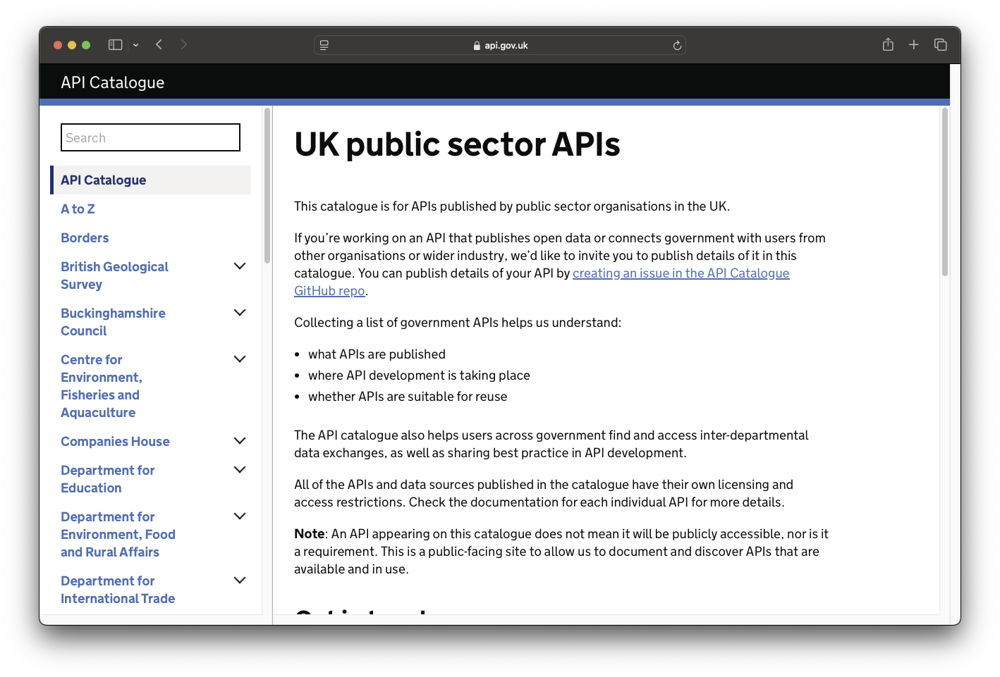

<!--
You can find a catalogue of many uk government APIs published at api.gov.uk
-->

---

https://data.police.uk/api/metropolitan/E05009386/events

```json
[
  {
    "contact_details":{},
    "description":"<p>A one-to-one consultation session
    in conjunction with property marking.<\/p>",
    "end_date":"2024-12-11T15:00:00",
    "title":"Property Marking Scheme",
    "address":"Bike Marking and Phone Marking
    schemes @ Lauriston Road, E9 (Opposite Fish House)",
    "type":"meeting",
    "start_date":"2024-12-11T13:30:00"
  },
]
```

<!-- For example, I can look up events in my local police area, in this case I'm looking at Victoria, London, and I can see there is a property marking event coming up where I can go get my phone or bike marked, while I could obviously find this from the website, the API allows for other applications to access this data, for example a bicycle manufacturer or phone provider could query this central API and notify their customers who are registered in the area along with also looking up local crime stats, cycle routes and traffic. If I'm going to receive marketing information, it may as well be relevant to me, so recommend I invest in a better bike lock, or that I'm more cautious than normal when walking while doom scrolling my phone. -->

---

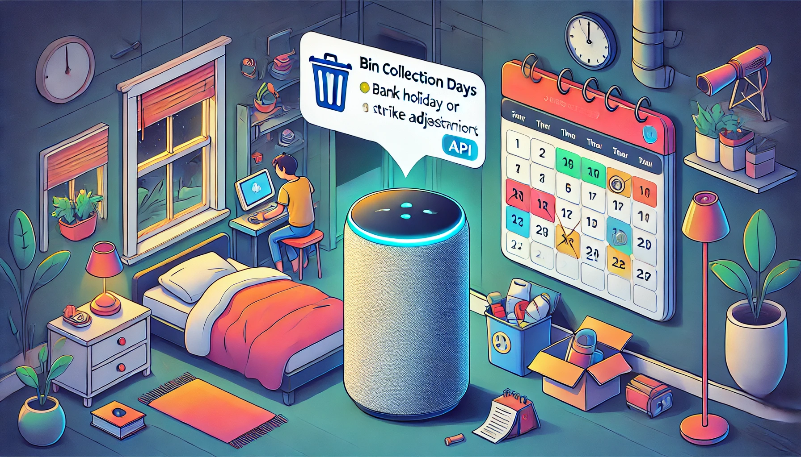

<!-- Personally for me, I found that my local council provide an API for their bin collection days, including when they move for bank holidays and strike days, so before I go to bed the night before collection my smart home speaker who's name begins with an A or G can remind me. -->

---

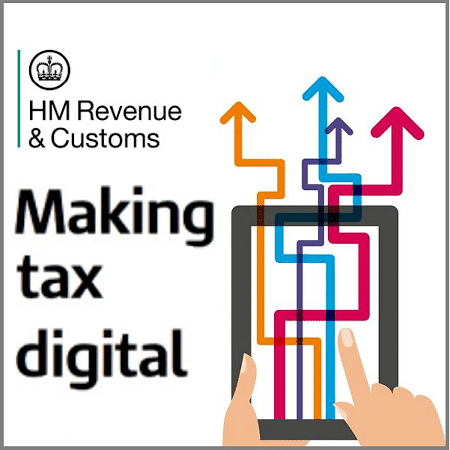

<!-- Or my accounting software can submit my VAT return without me having to log in to a separate system. -->

---


<!--
My local garage sends me a notification to invite me for a MOT when its due
-->

---

<!-- _class: frame lead -->

# 😀 <!--fit-->

<!--
So as a citizen, government exposing publicly owned data can simplify my interaction with government, often by me not having to even know I'm actually interacting with government.
-->

---

# Future of Public Services <!--fit-->

<!--
The increasing ubiquity, maturity and capability of APIs are crucial for scaling public services effectively, ushering in new proactive interactions where government services are ambient provided rather than purely reactive services that must be sought out.
-->

---

# One Government <!--fit-->

<!--
In other words, success looks like a consumer can get on with their day without having to keep a mental model of how government is structured, the fact that DVLA and DWP are separate entities is no longer relevant.
-->

---

<!-- _class: frame lead -->

# 👩‍🔧 🏚️➡️🏡 <!--fit-->

<!--
For example, in the not to distant future Sarah, a busy mother to 3 young children can move in to a new area, and instead of visiting multiple websites, for council tax, gas, water, electricity, broadband, bin collection, recycling, banking, credit cards, tax, school registrations, mail redirection, any relevant benefits she's entitled to, GP and dentist registrations, and everything else, these can all proactively be promoted to her.
-->

---

<!-- _class: frame lead -->

# APIs in Government Today <!--fit-->

## <!-- But the benefits are not just to consumers of government services, but also to the government itself, allowing for more efficient and transparent services, and enabling innovation. -->

<!-- _class: frame lead -->

# DVLA

- Photo at the Roadside enquiry API service
- Provide DVSA a service to check theory test eligibility.
- Digitise paper-based prosecutions with HMCTS

<!--
DVLA cite their API first strategy as a key part of the success in working with the Home Office to help police doing roadside checks, DVSA to make sure drivers are eligible to take a theory test and to carry out instant driving licence checks at the roadside, and to work closely with HM Courts & Tribunals Service to digitise paper-based prosecutions.
-->

---

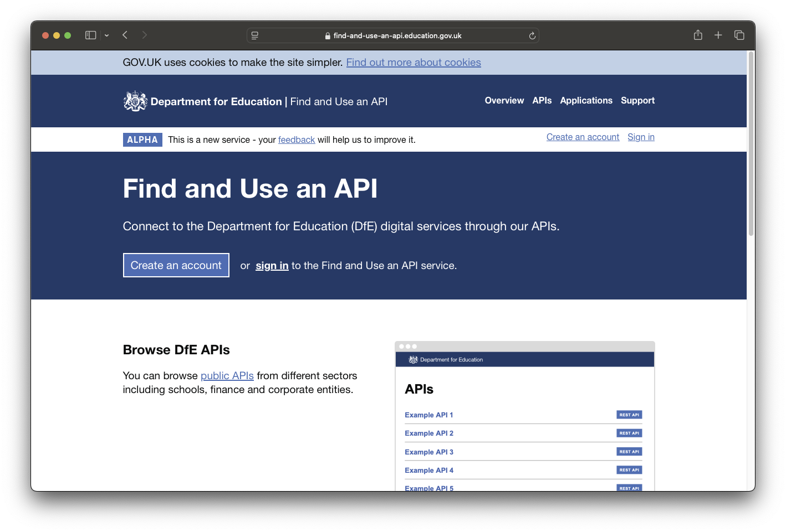

<!--
The Department for Education were able to leverage APIs to move their school attendance tracking system during the pandemic from quarterly reporting to multiple times a day, which was a key metric and included in the daily COVID-19 briefings and was leveraged to make realtime policy decisions.
-->

---

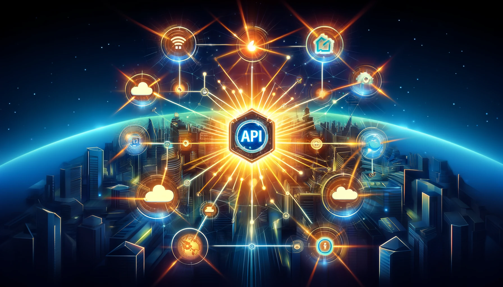

<!-- APIs are essential at organizational boundaries, but if you leverage them well, they can be used to connect services within a single organisation to deliver scalable, and secure dividends, powering the future of our digital services and removing the rigidity in the boundaries.-->

---

# Challenges? <!--fit-->

<!--
It's worth clarifying that not all APIs are created equal, and there are many challenges to be overcome, including the fact that APIs are not always well documented, that the data they return is not always consistent or accurate, and security is and adherence with policy is complex to say the least.
-->

---

<!-- _class: frame lead -->

# Key points:

- Essential building blocks for modern digital services
- Seamless data sharing and reduce duplication
- Strategic asset, not just a technical tool
- More integrated citizen experiences

<!--
In conclusion:
•	APIs are essential building blocks for modern digital services.
•	They enable seamless data sharing and reduce duplication.
•	They are a strategic asset, not just a technical tool.
•	Government is leveraging APIs for better, more integrated citizen experiences.
•	And the future is proactive, “invisible” government services powered by APIs.
-->

---

# `> EOM` <!--fit-->

(end of message)

<!--
Thank you once again for your attention.
-->

---

<!-- _class: invert -->
<style scoped>
h2 {
  position: absolute;
  bottom: 1ch;
  left: 2vw;
  width: 95%
}
</style>

# 🙏 Thanks 🙏 <!--fit-->


- cns.me &nbsp;&nbsp; | &nbsp;&nbsp; talks.cns.me<br/><br/>
- Platformland by Richard Pope
- Government as a Platform by Tim O'Reilly
- api.gov.uk

## Chris Nesbitt-Smith <!--fit-->

<!--
I've been Chris Nesbitt-Smith

Like subscribe whatever the kids do these days on LinkedIn, Github etcetera.

talks.cns.me contains this and other talks, they're all open source.
Go buy Platformland: An Anatomy of Next-Generation Public Services by Richard Pope, he does a far better job of explaining with a lot more detail and incredibly well researched real life examples and case studies.
-->

---

<!-- _class: invert end lead -->

# Q&A🙋‍♀️🙋🙋‍♂️ <!--fit-->


<!--
Let's open the floor for any questions, heckles, corrections or comments.
-->
