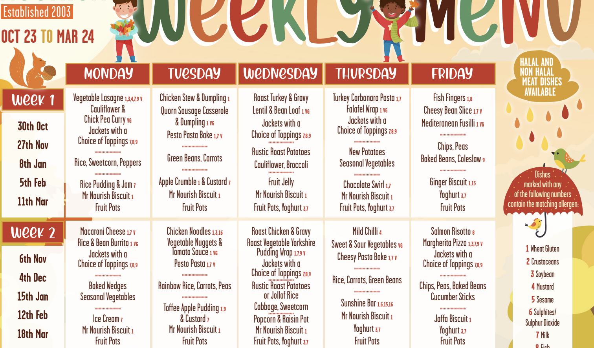
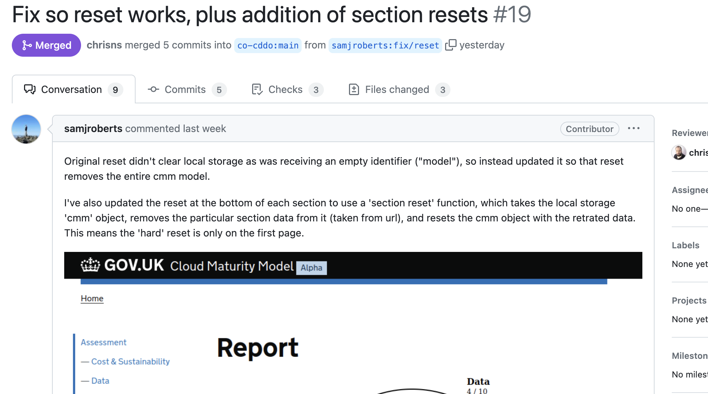

# Cloud Maturity Model

## Chris Nesbitt-Smith

### Mar 2024

---

# 🎥 <!--fit-->

<!--
Housekeeping

I'm about to start recording, if you don't want to be in it, turn off your camera, or leave and watch it offline, you know the drill by now.
<START RECORDING>
-->

---
<!-- _class: front -->

# Cloud Maturity Model

## Chris Nesbitt-Smith

### Mar 2024

<!--
Hello, I'm Chris, I'm a consultant at CDDO, working with the cloud and platforms team.

I'm going to talk about a thing I've been working on for a few months, looking at cloud maturity.
-->

---

# 🔞<!--fit-->

## How to be a grown up in the cloud? <!--fit-->

<!-- The original title for this talk was: 

How to be a grown up in the cloud
because clickbait. -->

---

# ⏸️ <!--fit-->

<!-- Before the grand reveal, theres some things to clarify and provide context -->

---

# What is cloud maturity?<!--fit-->

<!--
What is cloud maturity anyway?

I cheated, I did what everyone else has done for the past 12 months, and asked ChatGPT.
-->

---

# &nbsp;&nbsp;&nbsp;&nbsp;&nbsp;🤖&nbsp;&nbsp;&nbsp;&nbsp;&nbsp; <!--fit-->
`Cloud maturity is the extent to which an organization can effectively leverage cloud technologies and practices to fulfill its business objectives and drive innovation, efficiency, and growth.`

<!--
The answer I got after some prompt engineering was: 

Cloud maturity is the extent to which an organization can effectively leverage cloud technologies and practices to fulfill its business objectives and drive innovation, efficiency, and growth.
-->

---

# Why is it so low? <!--fit-->

<!--
Why is it so low? well thats easy, its hard

And usually any organization's use of cloud starts with something small, possibly incidental, and then it all snowballs from that, and no one goes back to burn it to the ground when you learn new things and start again.
-->

---

# Why is that a problem?<!--fit-->

<!--
Why is that a problem?

Well it's risk, everything from financial risk with spiraling costs to operational risk with growing complexity, security with lack of observability of what is going on to even know if you've been breached let alone mitigate against it.
-->

---
<!-- _class: frame lead -->

# 😱 <!--fit-->

<!-- oh gosh that sounds bad right? well.. -->

---

# it depends... 🥱 <!--fit-->

<!-- it depends, and people usually mistake me for an architect and wander off when I say things like that -->

---

<!--
take my kids school menu for example

I'd hope you'd agree that its probably not a proportionate answer to have the equal rigor of protective controls applied to this as you might find on say the personal data of the children showing who is eligible for free school meals and thus their parents financial state, which children have been referred to social services, ability to change who is on the list to collect them, and so on.

Or is it necessary to serve this from a multi-national content delivery network that ensures it's available with sub second latency delivered anywhere on the planet?
-->

---

# 🛰️ <!--fit-->

<!-- or beyond -->

---

# 🪖<!--fit-->

<!--
So its hard, and it does depend, but thats not useful or actionable
-->

---

# ~~it depends...~~ 🙅 <!--fit-->
<!-- lets have some opinions -->

---

# QBRs (Quarterly Business Review)<!--fit-->

## Q: How much have you moved to cloud? A: 60% <!--fit-->

<!--
Today we in the QBRs we ask departments how much have you moved to public cloud
and they'll respond with no greater context, say 70%. but what is that?
-->

---

# 🖥️<!--fit-->

<!-- maybe its servers, or virtual servers -->

---

# 💾<!--fit-->

<!-- maybe its the amount of data 

(thats a 3.5 inch floppy disk by the way, it pains me to have to explain that, the astute will notice the emoji is a 720 kilobyte read only one, if you can explain why come find me in white chapel building and I'll buy you a coffee downstairs)

TANGENTS
-->

---

# 💰<!--fit-->

<!-- maybe its money?
-->

---

# `¯\_(ツ)_/¯` <!--fit-->

<!--
who knows, basically anything between zero and 100% is interesting to track for a single department, but its not a usable metric between departments, nor does it suggest good/bad/on track/behind, or any other context.

And indeed if they're full steam ahead into creating a future legacy in cloud
-->

---

# Better questions <!--fit-->

<!--
We're well overdue some better questions.
-->

---

# 🏏 <!--fit-->

<!--
That we can take the answers from them to chastise the departments with, right?
Thats the nearest emoji I could find to a stick
-->

---

# 🙅‍♂️ <!--fit-->

<!--
No, that's not helpful.
-->

---

# 🙄🤖 <!--fit-->

<!--
OK I know you really came here wanting to see a million words on a slide not just an emoji or two-->

---

<!-- so we've reached the point where I show you the thing and some code, hooray! -->

---

# SHOW THE THING <!--fit-->

<!--
- no state or database, you can save/extract, but we're CDDO
- the report is actionable guidance, it is not a stick
- we're not the fun police
- pointing to the cloud vendors on how to do the things, not reinventing the world / duping docs
-->

---

# SHOW THE CODE <!--fit-->

<!--
- its markdown
- its static html
-->

---

<!--
Some neat things have happened, I'm developing this in the open, on github, and a few days ago I got my first out the blue pull request fixing a thing.
-->

---

<!-- _class: frame lead -->

# 🥳 <!--fit-->

<!-- Well thats lovely! horrah Open source for the win -->

---

# 🛣️<!--fit-->

<!--
So where to now, well I'm working towards in the next week or so when I've got just enough guidance to test this with some real department teams as an alpha and see if this is useful and or helpful, if you know any friendly ones then let me know.
-->

---

<!-- _class: frame lead -->

# 🐙🦖🦩 <!--fit-->

<!-- What else, well theres maybe a thing in this that might be reusable, I'm aware lots of CDDO folk are thinking about maturity models and how they're going to measure maturity in departments for their respective domains, so if this sort of approach is useful to you, then please ping me an email and lets chat.
-->

---

<!-- _class: frame lead -->

# github.com/co-cddo/cloudmaturity <!--fit-->

<!-- the code is open source, so feel free to steal it, but I'd suggest its probably more sensible we extract the interesting bits into a reusable thing with a bit of guidance of how to set it up, in theory given the content is all markdown, it should be accessible for non-developers to add content to -->

---

<!-- Thank you for your time, if you don't get a chance to ask a question, or you're watching the recording of this, please do find me on google chat or email me -->

---

## Q&A <!--fit-->

<!--
You'll be pleased to know I've run out of slides, the best thing you could do right now is tell me I'm wrong, missing the point or for any other reason to stop.

I've hopefully not been on mute the whole time so I will now invite your very best heckles, failing that questions work too.
-->
