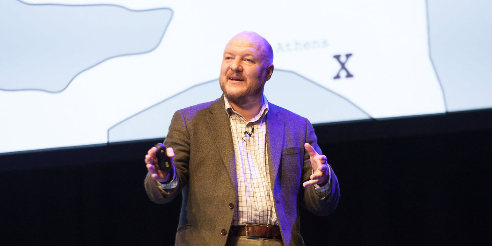
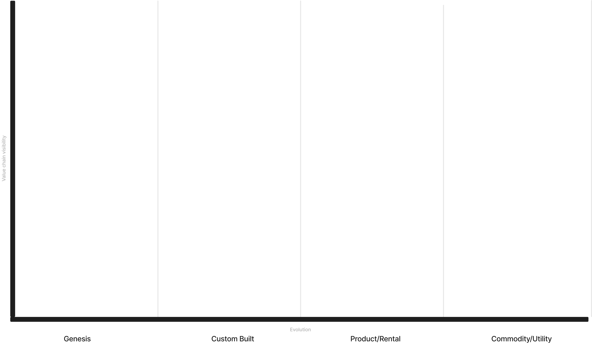
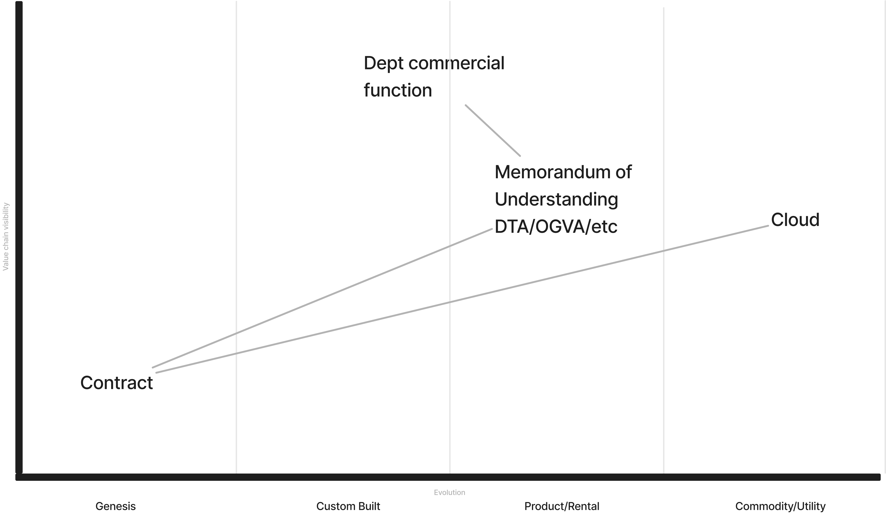
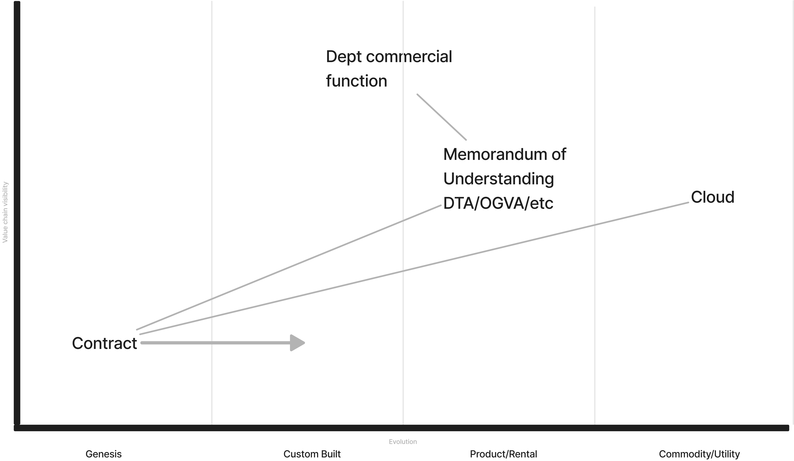
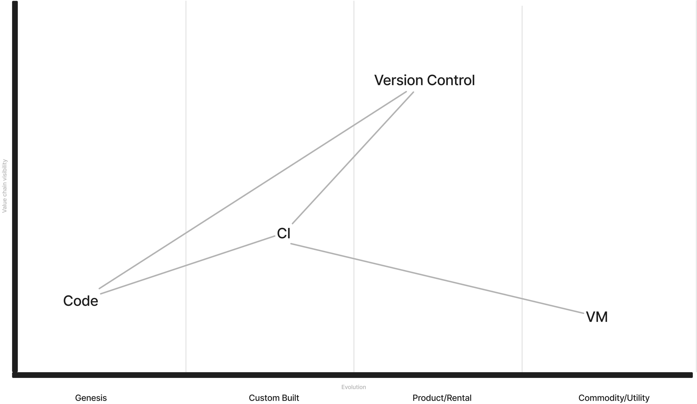
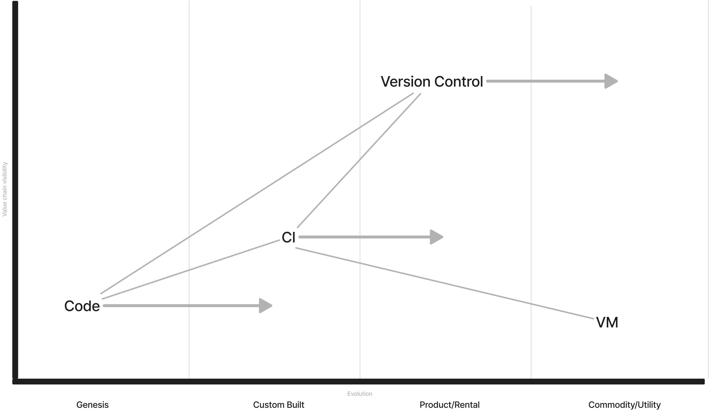
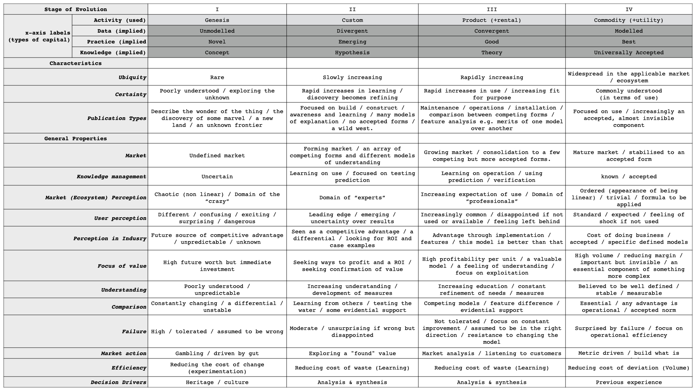

#  Azure 2.0 Starting @ 12:00

---

<!-- _class: frame lead -->

# 👋 <!--fit-->

<!--
<Rob intro>
My name is Chris, I’m a consultant working with CDDO, having been in public sector now for what feels like a lifetime ushering cloud computing into big and small departments, I've apparently earned the right to talk to you about both our maturity in consumption and more importantly for today our suppliers maturity of offering, including but not limited to technical products, training, commercial and everything else.
There might be a few people with a CDDO or Microsoft badge if they could raise their hands? -->

---

<!-- _class: frame lead -->

# 👩‍🌾🙋🙋‍♂️ 🦹‍♀️🙋‍♀️👩‍🚒<!--fit-->

<!-- (pause) And in doing so they’ve all just unwittingly agreed to help me facilitate today, so if you have any issues then please let one of us know. -->

---

<!-- _class: frame lead -->

## ~~agenda~~

# 🫵  <!--fit-->

<!-- Ignore the name of this session from the agenda, reasons, but don't worry you're in the right and most important room, we need your help to help define the future of what azure, and more broadly cloud computing should be -->

---

<!-- _class: frame lead -->

# 🙆‍♂️🧕🙋‍♂️👨‍🌾👩‍🍳 🧑‍🚒👨‍🚀👩‍⚖️🥷🧙‍♀️ <!--fit-->

<!-- and we've got the benefit of being all physically together, so I'd really like to encourage you to engage openly in the room, you are welcome to introduce yourself, or not when you contribute. -->

---

<!-- has anyone done Wardley mapping before?
yes: awesome, you're also my volunteers for helping me here, you can also tell me how I'm doing it all wrong, feel free to takeover, especially as I butcher a crash course in how I'm proposing we collaborate today
no: not to worry, I'm going to really butcher a crash course enough to collaborate today, please google it afterwards theres some fantastic videos of him introducing it
-->

---

<!-- _class: lead quote -->

# **All** models are **wrong**,  _but some are useful_

George Box 1976

<!--
What we're going to produce here will be wrong, thats ok, but I can assure you it will be useful as the public sector tries to mature its vendor relationships,
-->

---

<!-- _class: frame lead -->

# 💰 <!--fit-->

<!-- developing strategic "suppliers" like Microsoft defined only by -->

---

<!-- _class: frame lead -->

# 💰💰💰💰💰 💰💰💰💰💰 <!--fit-->

<!-- the amount money we give them every year -->

---

<!-- _class: frame lead -->

# 🧑‍🤝‍🧑 <!--fit-->

<!-- into a true strategic partner defined by some more valuable and less transactional properties -->

---

<!-- _class: frame lead -->

# 👆 <!--fit-->

<!-- in a second I'm going to ask you all to stand up grab a sharpie and these super duper fancy postit notes
sidebar: these are anti-statically charged, so they stick on anything and you can move them about, honestly its changed my life
-->

---

<!--
So heres how I butcher this, I'm going to ask you to use the wall space we have to put things in categories of Genesis, Custom Built, Product, Commodity
We're going to discuss where things go after so don't spend too much time on debating where things should go, or potential duplication with someone else's postits
There will be a cheatsheet on the screen, and theres a few printed copies if that helps you with the explicit definition
Wardley mapping fans, feel free to use the y-axis, but I'm not focusing on that today
-->

---

<!-- So some commercial fans might add some things like this to our board if they are starting in a cloud
We've got a MOU from CCS like DTA as the microsoft one, OGVA aws etc, which has been built, you can just consume it as a product
Theres ultimately a cloud vendor, well cloud computing is a utility or commodity service by the NIST definition
Theres a department's commercial function which depending on the department and the consumer is somewhere between custom built and a product
Off the back of the MOU they'll write a contract with cloud vendor or a "value add" reseller
-->

---

<!--
And subsequent years you can expect that there'll be a desire to move the contract out of a genesis space with lots of uncertainty into at least custom built

I've drawn the lines just to help you follow, don't worry about trying to connect the postits, we're already stretching the complexity of what we can achieve in the next few minutes
-->

---

<!-- Developers might have a lens more like this, where you've got vms that are commodity
A custom built CI Jenkins snowflake perhaps
Some code in early development
And storing it in a self hosted gitlab instance
 -->

---

<!--
A natural progression might look like moving version control to public github, CI to github actions with public runners, and more mature code
 -->

---

# 🫡 <!--fit-->

<!--
Despite its supposed to be a salute, yes it does look like pastry.
So our first phase is just writing up on the board the 'things' don't worry about the connecting tissue, and describe what you've seen recently in yours or other departments, so I'm fully expecting to see the same thing appear in multiple columns for all sorts of different reasons, thats ok
We're going to spend around 15 minutes scribbling stuff on the board
Don't worry about getting things wrong, the only thing you could do thats wrong is not contribute.
When we regroup we'll spend a bit of time discussing things, and understanding more context behind the placement, after that we're going to do the exciting bit of telling Microsoft where we want things to be, and give them the mission of helping us get there
-->

---

<!-- _class: frame lead -->

<svg fill="#000000" height="800px" width="800px" version="1.1" id="Capa_1" xmlns="http://www.w3.org/2000/svg" xmlns:xlink="http://www.w3.org/1999/xlink" 
	 viewBox="0 0 98.192 98.192" xml:space="preserve"><g><path d="M95.799,87.061c-1.96-1.857-3.291-4.046-3.963-6.514c1.101-2.402,1.658-4.952,1.658-7.593V57.771
		c0-6.521-3.432-12.239-8.572-15.493v-9.857c0-14.083-11.457-25.54-25.54-25.54H31.524c-14.083,0-25.539,11.457-25.539,25.54v21.849
		c0,3.778,0.819,7.423,2.436,10.846c-0.979,3.837-3.005,7.229-6.028,10.092L0,77.475l3.114,1.076c2.032,0.703,4.191,1.06,6.417,1.06
		c3.412,0,6.997-0.823,10.667-2.448c3.505,1.734,7.4,2.646,11.327,2.646h7.265c2.722,6.729,9.297,11.502,16.993,11.502h19.355
		c2.727,0,5.432-0.612,7.884-1.777c2.54,1.089,5.025,1.641,7.402,1.641c1.613,0,3.18-0.259,4.654-0.769l3.114-1.077L95.799,87.061z
		 M21.209,73.179l-0.897-0.49l-0.923,0.44c-4.185,1.996-8.173,2.8-11.817,2.362c2.433-3.004,4.081-6.416,4.913-10.181l0.154-0.698
		l-0.323-0.638c-1.546-3.05-2.331-6.314-2.331-9.706V32.421c0-11.877,9.663-21.54,21.539-21.54h27.858
		c11.877,0,21.54,9.663,21.54,21.54v21.848c0,11.876-9.663,21.538-21.54,21.538H31.524C27.924,75.806,24.357,74.898,21.209,73.179z
		 M90.423,87.172c-2.06,0-4.277-0.561-6.592-1.664l-0.923-0.44l-0.897,0.49c-2.098,1.146-4.475,1.751-6.874,1.751H55.782
		c-5.433,0-10.159-3.039-12.594-7.502h16.194c14.083,0,25.54-11.456,25.54-25.538V47.29c2.809,2.62,4.572,6.345,4.572,10.48v15.183
		c0,2.258-0.523,4.433-1.555,6.466l-0.324,0.638l0.154,0.699c0.516,2.335,1.468,4.481,2.841,6.413
		C90.548,87.17,90.486,87.172,90.423,87.172z"/></g></svg>

<!--
Sound like a plan?
Any questions?
-->

---

<!-- You've got this, GO -->

---

<h1 class="countdowntimer" time="15">15:00</h1>

---

<!-- _class: lead lava -->

# 🗺️ <!--fit-->

# (regroup)

<!-- regroup -->

---

<!-- _class: lead -->

## 🗺️ <!--fit-->

<h1 class="countdowntimer" time="10">10:00</h1>

<!--
Discuss placement of things
-->

---

<!-- _class: lead -->

## ↔️ <!--fit-->

<h1 class="countdowntimer" time="10">10:00</h1>

<!--
Discuss where things should be
-->

---

<!-- _class: lead lava -->

# 🥪 <!--fit-->

<!--
I'm fully aware that its lunch time, and I'm being heckled by your grumbling stomaches
Rob and I will be hanging around for a while if you'd like to carry on discussing but this is the end of what we had planned, I'm sure we could talk about this.
Your contributions are really fantastic
-->

---

<!-- _class: lead frame -->

# 🙏 <!--fit-->

<!-- So thank you so much, you've earned your lunch, enjoy the rest of your conference -->

---

<!-- _class: lead lava -->

# 🏁 ➡ 🥪 <!--fit-->

## Stay in touch!

### `cloud-strategy@digital.cabinet-office.gov.uk`

### `#cloud` `ukgovernmentdigital.slack.com`

---

