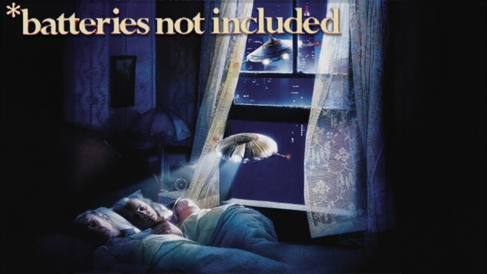

# UK Public Sector Cloud Marketplace

## Chris Nesbitt-Smith

### March 2024

<!--
Hello I'm Chris Nesbitt-Smith, a consultant working with CDDO.
I'm aware theres a drinking game, so to get my participation in that out the way here goes: artificial intelligence, transformation, cloud, Kubernetes, genAI, Containerization, DevSecOps , FinOps and agile.
-->

---

# `Anecdata`<!--fit-->

`Anecdotal evidence; information or evidence based on reports of individual cases rather than systematic research or analysis.`

<!--
A lot of my current work here is based on Anecdata and anecdotes, both my own and borrowed war stories from others in my echo chamber, I will get some details wrong, forgive me.
-->

---

<!-- _class: frame lead -->

# 👴 <!--fit-->

<!--
I've been in/around gov and public sector long enough to have experienced some of the issues in this presentation first hand, including being part of a skunkworks team creating what is still the Home Office AWS tenancy with one of the other contractors credit cards (it's not there anymore).
-->

---

<!-- _class: frame lead -->

# 🦍 <!--fit-->

<!--
Gorilla activities aside, I'd like to think that commercial, governance and indeed threat actors have caught up with that and that wouldn't be possible in 2024.
-->

---

<!-- _class: frame lead -->

# 💳🚫<!--fit-->

<!--
And yet, we're still not fully at a point where cloud happens without credit cards leading to very sad commercial and compliance folk trying to catch up with what some well intentioned pesky technologists have gone and done.
-->

---

<!-- _class: frame lead -->

# 🕹️<!--fit-->

<!--
after that has happened once, and everyones knuckles are rapped and commercial folk are wise to our game, we find ourselves with a single cloud vendor and unable to explore any other options with the same velocity.
-->

---

<!--
Further cemented with an un-opinionated operating model from the cloud vendor, leaving departments and their integrators and partners re-inventing the wheel and developing a cottage industry of cloud operational teams, and struggling to keep on top of even basic cost/security/hygiene factors.
-->

---

<svg height="100%" width="50%" xmlns="http://www.w3.org/2000/svg" viewBox="0 0 23 23"><path fill="#f3f3f3" d="M0 0h23v23H0z"/><path fill="#f35325" d="M1 1h10v10H1z"/><path fill="#81bc06" d="M12 1h10v10H12z"/><path fill="#05a6f0" d="M1 12h10v10H1z"/><path fill="#ffba08" d="M12 12h10v10H12z"/></svg>

<!--
Case in point: Despite AI having a prime ministerial mandate, some departments despite having a relationship with Microsoft as many do, however without azure being their primary cloud, have been unable to safely utilize openAI in Azure many months after starting.
-->

---

<!-- _class: frame lead -->

# 🗓️ <!--fit-->

<!--
For a team to consume a non-incumbent cloud there is around a 6-9 commercial procurement process where all sorts of theatre is carried out to make the RDEL look like CDEL (or OPEX like CAPEX), agree MOUs, pick a framework, establish contracts.
-->

---

$$
{\displaystyle k=Ae^{\frac {-E_{\text{a}}}{k_{\text{B}}T}},}
$$

_(Arrhenius equation for activation energy)_

<!--
Which takes a lots of activation energy to see that through.
And that 6-9 month is just to get to the starting blocks, with some root credentials at the console, you've then got to figure out how to operate with identity, landing zones, governance, policy, guardrails, alerts and so on.
-->

---

<svg xmlns:xlink="http://www.w3.org/1999/xlink" version="1.1" style="font-family: Helvetica, Arial, sans-serif; font-size: 12px;" xmlns="http://www.w3.org/2000/svg" width="100%" height="100%" viewBox="0 0 650 400"><defs ><clipPath id="highcharts-y8z8vu8-130-"><rect x="0" y="0" width="630" height="337" fill="none"></rect></clipPath></defs><rect fill="#ffffff" fill-opacity="50%" x="0" y="0" width="650" height="400" rx="0" ry="0" ></rect><rect fill="none" x="10" y="10" width="630" height="337" ></rect><g data-z-index="0" ></g><rect fill="none" data-z-index="1" x="10" y="10" width="630" height="337" ></rect><g data-z-index="3" ><g data-z-index="0.1" opacity="1" transform="translate(10,10) scale(1 1)" clip-path="none" ><path fill="#94d13d" d="M 314.97376689136405 39.700002671490665 A 128.8 128.8 0 0 1 354.8794183217447 290.97069851323334 L 315 168.5 A 0 0 0 0 0 315 168.5 Z" transform="translate(0,0)" stroke="#ffffff" stroke-width="1" opacity="1" stroke-linejoin="round" tabindex="-1" role="img" aria-label="AWS, 45." style="outline: none;"></path><path fill="#6f58e9" d="M 354.7569277039358 291.0105166895643 A 128.8 128.8 0 0 1 239.18176055878962 64.37971106438816 L 315 168.5 A 0 0 0 0 0 315 168.5 Z" transform="translate(0,0)" stroke="#ffffff" stroke-width="1" opacity="1" stroke-linejoin="round" tabindex="-1" role="img" aria-label="Azure, 45." style="outline: none;"></path><path fill="#2d99fe" d="M 239.28591873948844 64.30394489772344 A 128.8 128.8 0 0 1 275.0480059869747 46.05295767400834 L 315 168.5 A 0 0 0 0 0 315 168.5 Z" transform="translate(0,0)" stroke="#ffffff" stroke-width="1" opacity="1" stroke-linejoin="round" tabindex="-1" role="img" aria-label="GCP, 5." style="outline: none;"></path><path fill="#2ddac1" d="M 275.17047298488825 46.013066910170025 A 128.8 128.8 0 0 1 314.8210993839764 39.70012424474319 L 315 168.5 A 0 0 0 0 0 315 168.5 Z" transform="translate(0,0)" stroke="#ffffff" stroke-width="1" opacity="1" stroke-linejoin="round" tabindex="-1" role="img" aria-label="Other, 5." style="outline: none;"></path></g><g data-z-index="0.1" opacity="1" transform="translate(10,10) scale(1 1)" clip-path="none" ></g></g><g data-z-index="7" transform="translate(191,359)" ><rect fill="none" rx="0" ry="0" x="0" y="0" width="268" height="26"></rect><g data-z-index="1"><g><g data-z-index="1" transform="translate(8,3)"><text x="21" text-anchor="start" data-z-index="2" y="15" style="color: rgb(51, 51, 51); cursor: pointer; font-size: 12px; font-weight: bold; fill: rgb(51, 51, 51);">AWS</text><rect x="2" y="4" width="12" height="12" fill="#94d13d" rx="6" ry="6"></rect></g><g data-z-index="1" transform="translate(74.30355644226074,3)"><text x="21" y="15" text-anchor="start" data-z-index="2" style="color: rgb(51, 51, 51); cursor: pointer; font-size: 12px; font-weight: bold; fill: rgb(51, 51, 51);">Azure</text><rect x="2" y="4" width="12" height="12" fill="#6f58e9" rx="6" ry="6"  data-z-index="3"></rect></g><g data-z-index="1" transform="translate(146.18523788452148,3)"><text x="21" y="15" text-anchor="start" data-z-index="2" style="color: rgb(51, 51, 51); cursor: pointer; font-size: 12px; font-weight: bold; fill: rgb(51, 51, 51);">GCP</text><rect x="2" y="4" width="12" height="12" fill="#2d99fe" rx="6" ry="6" data-z-index="3"></rect></g><g data-z-index="1" transform="translate(210.73992538452148,3)"><text x="21" y="15" text-anchor="start" data-z-index="2" style="color: rgb(51, 51, 51); cursor: pointer; font-size: 12px; font-weight: bold; fill: rgb(51, 51, 51);">Other</text><rect x="2" y="4" width="12" height="12" fill="#2ddac1" rx="6" ry="6" data-z-index="3"></rect></g></g></g></g></svg>

<!--
well the consequence is we have a split of spend that looks something like:
45% AWS, 45 Azure, 5 google, and 5% Other
And without intervention, that is unlikely to dramatically change with the tail firmly wagging the dog
-->

---

<!-- _class: frame lead -->

# 🤒 <!--fit-->

<!-- This results in a unhealthy market, with limited negotiating power and contractual commitments that are one sided and even medium term unsustainable growth expectations. -->

---

<!-- _class: frame lead -->

# &nbsp;&nbsp;&nbsp;&nbsp;🚀 🌙&nbsp;&nbsp;&nbsp;&nbsp;<!--fit-->

(moonshot)
What if... 6-9 months could happen in an afternoon?

<!--
So heres the moonshot
What if with the right people in the room 6-9 months could happen in an afternoon?
What if we could treat cloud like a utility and buy at whole public sector spend levels?
-->

---

# &nbsp;&nbsp;&nbsp;&nbsp;🔋🔋🔋&nbsp;&nbsp;&nbsp;&nbsp;<!--fit-->

(batteries included)

<!--
What if we could use that well over a billion pounds a year to negotiate unheard of discounts?
What if we could set some standards, and have the vendors provide a batteries included cloud?
For example
-->

---

# 🟰 <!--fit-->

<!--
What if a parish council could enjoy the same discount and benefits that the big five departments get?

And anyone with a gov.uk email address could immediately get sanctioned generous self-destructing free tier access for learning and development and create proof of concepts in cutting edge cloud tech.
-->

---

# 👩‍💻 <!--fit-->

<!--
What if without a devOps in sight my cloudflare worker could securely talk to my openAI in azure, an amazon s3 bucket and my google big table all without any egress charges or secret stores.
-->

---

# &nbsp;&nbsp;&nbsp;&nbsp;&nbsp;&nbsp;&nbsp;&nbsp;🐘&nbsp;&nbsp;&nbsp;&nbsp;&nbsp;&nbsp;&nbsp;&nbsp; <!--fit-->

# ~~GOV.UK PaaS 2.0~~ <!--fit-->

<!--
to pre-empt what is probably on your minds by this point, no this absolutely not GOV.UK PaaS 2.0
-->

---

# ⚔️ Call to arms<!--fit-->

<!--
So what do I want to get out of this?
I'm going to be holding some in person sessions with the cloud vendors next month, I'd love to have some real projects and services in the room, to talk about the challenges you face.
-->

---

# ⚔️ Call to arms<!--fit-->

<!--
So if you're a public sector organization that has some war stories, would like to get started in a public cloud, new to you public cloud, or get a better handle on what you've already got then please reach out, I'd love to hear from you.
-->

---

<!--_class: front -->

## Chris Nesbitt-Smith | cns.me

<!--
I've got my conference trousers on to make me easy to spot and I'll be hanging around for a little while so if any of this sounds interesting or awful then please do come find me in person, otherwise I can be found in the cross government Slack in the hash cloud channel
-->
