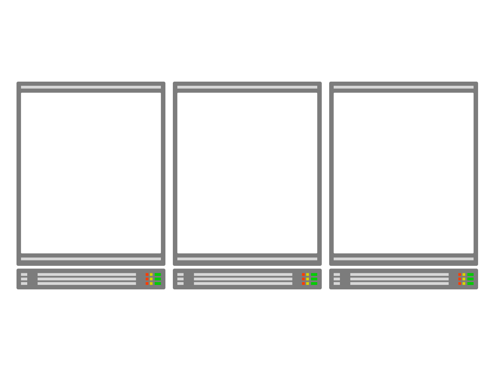
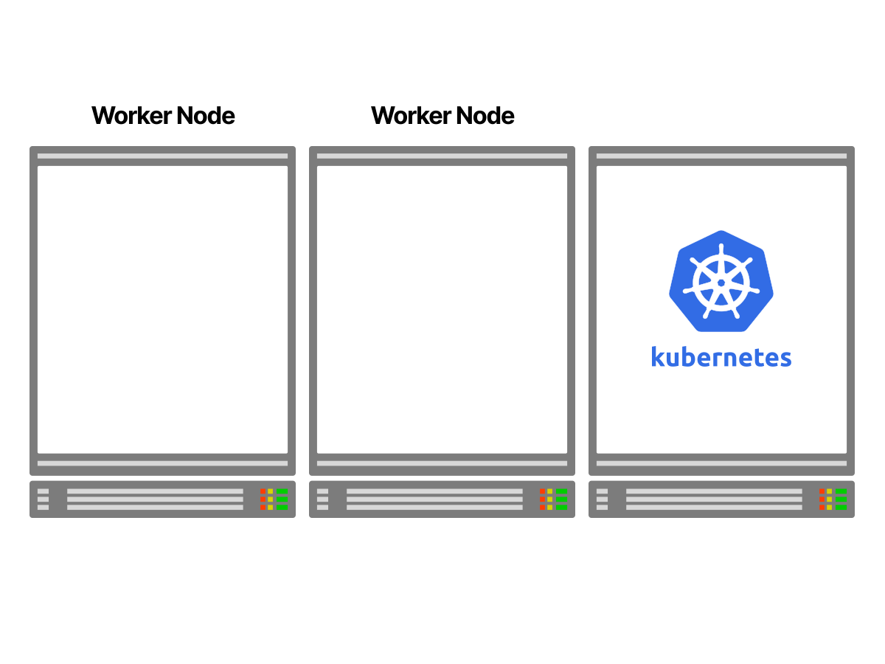
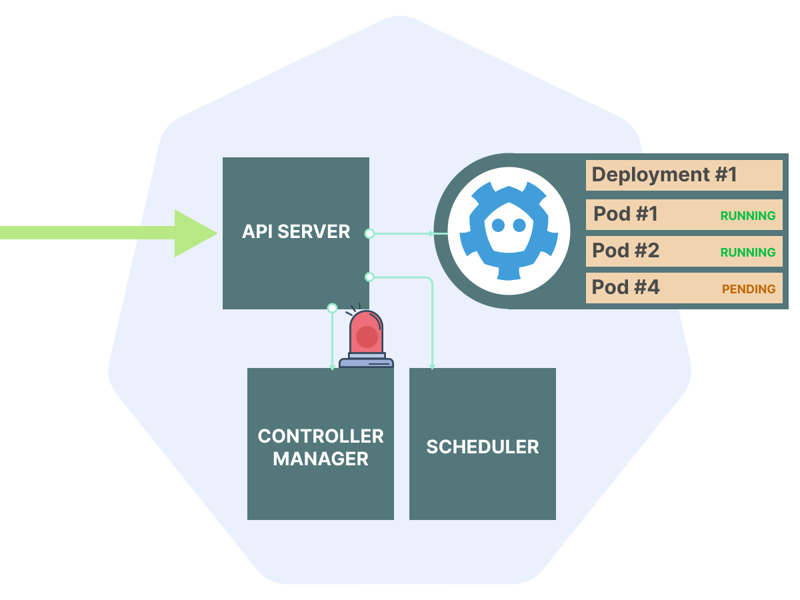
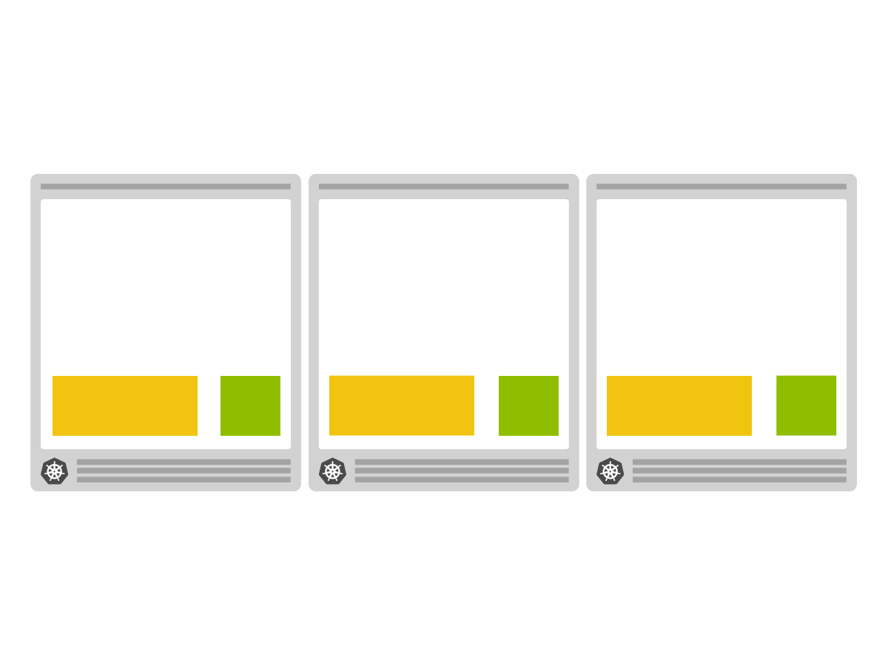
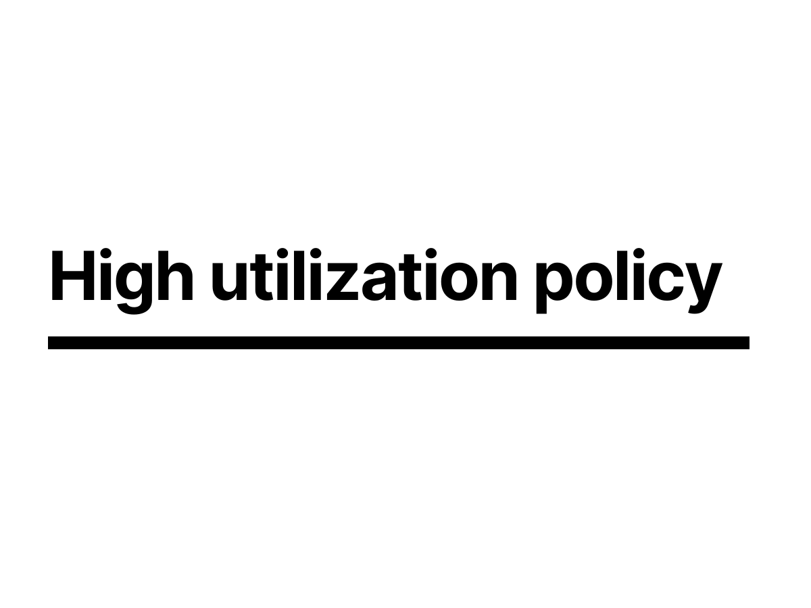
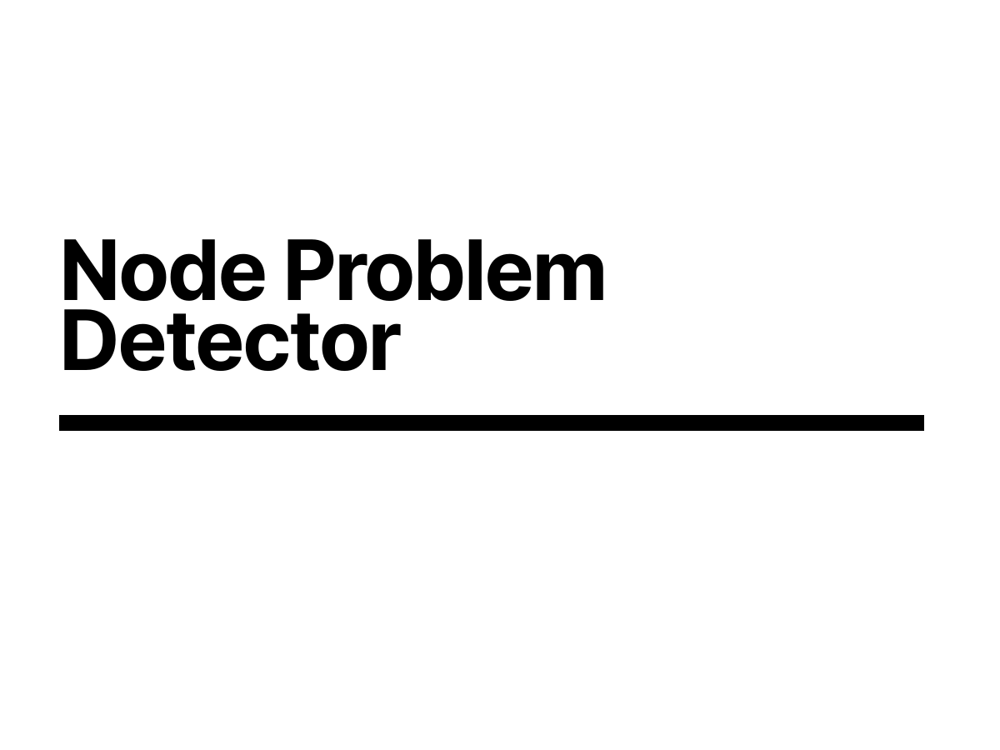
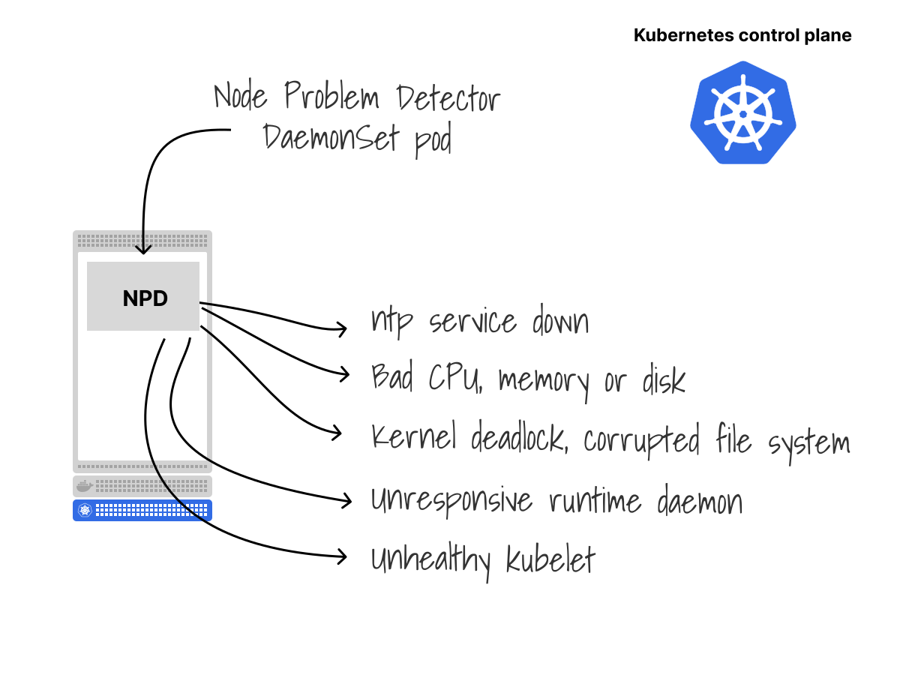
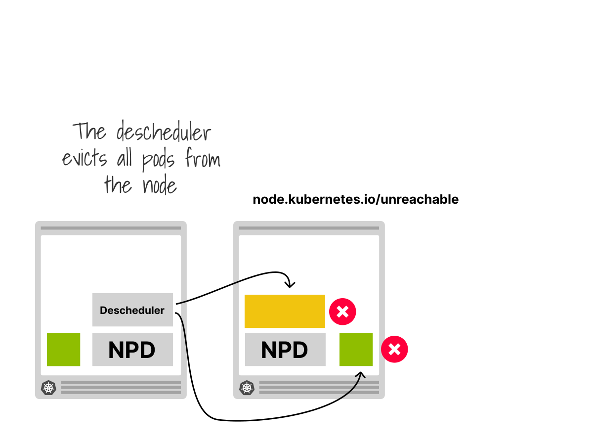
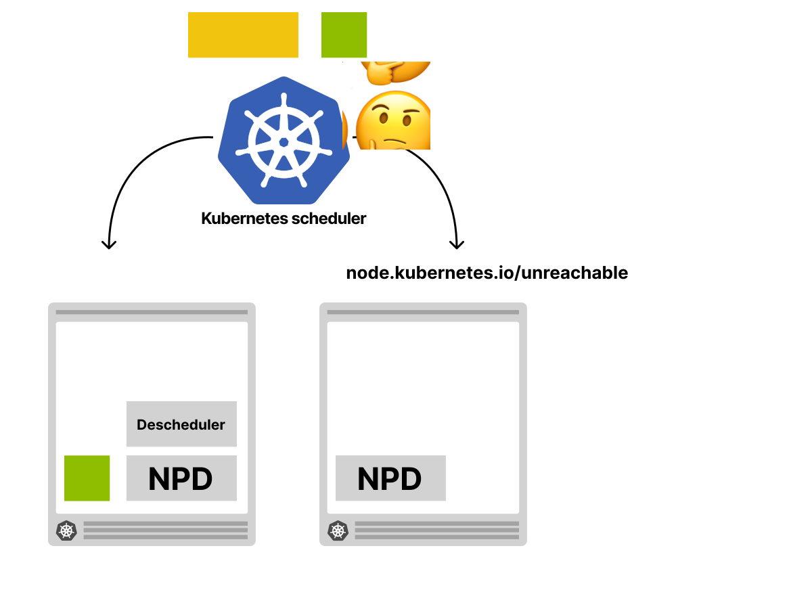
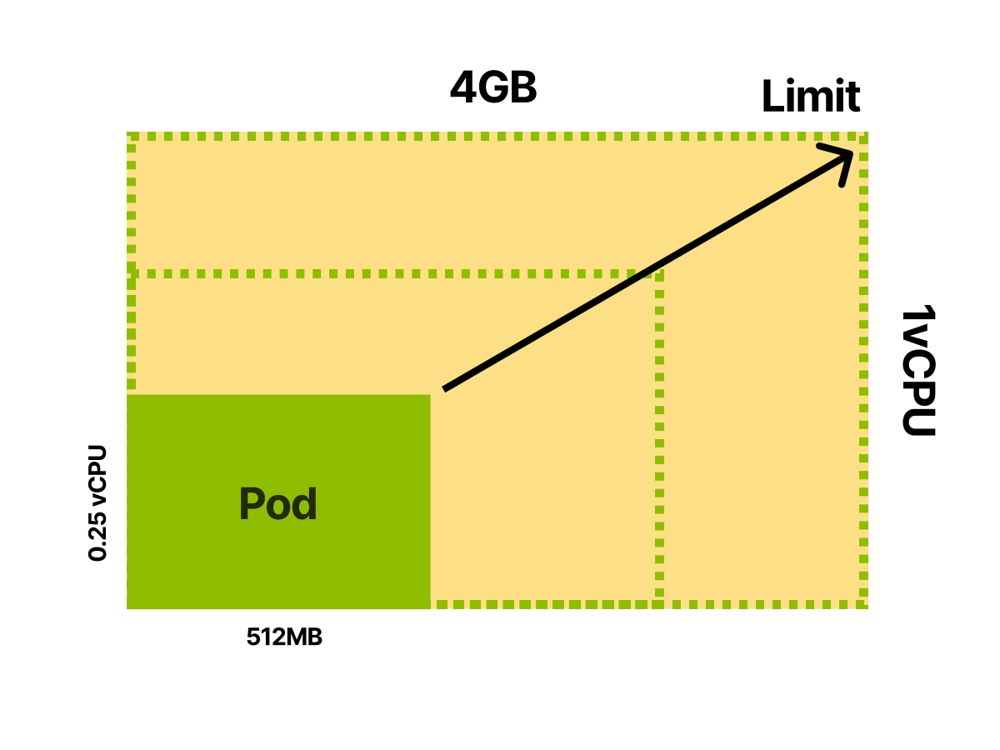

<!--
Hi
-->

---

<!--
So, to kick things off my name is Chris Nesbitt-Smith, I'm based in London and currently work with some well known brands like learnk8s, control plane, and various bits of UK Government I'm also a tinkerer of open source stuff.

I've been using and abusing Kubernetes in production since it was 0.4, believe me when I say its been a journey!

I've definitely got the war wounds to show for it.

We should have time for questions and heckles at the end, but if we run out of time or you're not watching this in realtime, then please find me on LinkedIn or in the linode slack
-->

---

<!--
Kubernetes embraces the idea of treating your servers as a single unit and abstracts away how individual computer resources operate.
From a collection of three servers, Kubernetes makes a single cluster that behaves like one.

-->

---

<!--
1/4
So if we Imagine having three servers.

-->

---

<!--
2/4
You can use one of those servers to install the Kubernetes control plane.

-->

---

<!--
3/4
The remaining servers can join the cluster as worker nodes.

-->

---

<!--
4/4
Once the setup is completed, the servers are abstracted from you. You deal with Kubernetes as a single unit.

-->

---

<!--
1/4
When you want to deploy a container, you submit your request to the cluster.
Kubernetes takes care of executing `docker run` and scheduling the container in the right server.

-->

---

<!--
2/4
The same happens for all other containers.

-->

---

<!--
3/4

-->

---

<!--
4/4
For every deployment, Kubernetes finds the best place to run the application.

-->

---

<!--
Kubernetes can automatically scale your application for you
-->

---

<!--
But you'll likely find you run out of compute resource

but all is not lost, Kubernetes has yet another trick up its sleeve
-->

---

<!--
Given access to your underlying infrastructure when you run out
-->

---

<!--
it can even dynamically provision additional compute when you require it using the Cluster autoscaler
-->

---

<!--
If you didn't see Salman's fantastic talk on this a couple of weeks ago, I highly recommend watching that back for a really insightful walk through that
-->

---

<!--
So far this is all sounding great, clusters can scale up and down both in workload and compute resource, and scheduling is all working perfectly
-->

---

<!--
but you'll quickly find when your workload scales down, it might not happen how you would anticipate it to
-->

---

<!--
which can lead you to undesirably loaded clusters, when what you'd really like is for things to rebalance
-->

---

<!--
So If we look at a deployment spec
-->

---

<!--
You'll notice there is no field or instruction for Kubernetes  on how you'd like your workload to be rebalanced.
Put simply once Kubernetes has scheduled the workload, it considers it's job done, thats the end, until something goes wrong.
-->

---

<!--
This has been an issue that has played on many people's minds which has led to the desire for descheduling workload in order to let the scheduler readjust with new information
-->

---

<!--
I might be showing my age now, but I remember a time when I used to have to defragment my hard disk
-->

---

<!--
Hours staring at a screen that looks like this because the way the file system works is data is written anywhere, then when its later deleted leaves gaps
-->

---

<!--
Not at all dissimilar to how the Kubernetes scheduler works
-->

---

<!--
When you delete workload you can find yourself with gaps, that if you were to reschedule everything from scratch wouldn't exist
-->

---

<!--
The effect of descheduling then causes our old friend the Kubernetes scheduler
-->

---

<!--
to notice that a pod has been deleted from an undesirable location
-->

---

<!--
create a new pod
-->

---

<!--
and then go through all the process
-->

---

<!--
of filtering what nodes are available to run the workload with all sorts of complex rules
-->

---

<!--
then scoring them through some more very complex rules
-->

---

<!--
before deciding where best to place the workload
-->

---

<!--
In order to do this the descheduler has policies you can define at a cluster level
-->

---

<!--
these are split into two categories of balance and deschedule

where balance is intended to redistribute your workload across the nodes

the deschedule is intended to cause the workload to be evicted based on some rules such as the lifetime of a pod
-->

---

<!--
And the configuration looks very familiar to other things in Kubernetes in that it closely resembles a CRD

though don't be fooled by this, its not actually a CRD,
you have to put this into a specifically named configmap as a text blob
-->

---

<!--
So here we can define our plugin configurations in our profile
-->

---

<!--
And elect which plugins should be enabled
-->

---

<!--
and our categories we saw earlier are referred to as extension points
-->

---

<!--
there are other extension points available, but we'll be focusing on the deschedule and balance ones today
-->

---

<!--
A common use case might be, you've got applications that for whatever reason you want to restart, once an hour, or night because reasons
-->

---

<!--
So an example of that configuration might look like this, where we will look to restart pods over 10 seconds old
-->

---

<!--
this is the exciting part where i pray to the demo gods for the first time today....
-->

---

<!--
There are a few options for how you can run the descheduler on your cluster
-->

---

<!--
You could run it as a one off job, or perhaps you've got some other orchestration system that will create jobs on your cluster for you
-->

---

<!--
Or a cronjob, resulting in periodic jobs being created as you desire
-->

---

<!--
Or a deployment that will run all the time in a loop
-->

---

<!--
To look at cronjob option
-->

---

<!--
Here we can see a cronjob specification, that will execute every minute, depending on your size of cluster and shape of workload this may be undesirable, you may want more or less frequent
-->

---

<!--
Because it runs as a cronjob the descheduler pod is created somewhere on your cluster, allocated dynamically, and of course uses resource of its own
-->

---

<!--
which could end up influencing the schuedler when it comes round to rescheduling all the work it deletes
-->

---

<!--
So having it disappear as soon as its descheduled the other workloads allows for the new rebalanced scheduling to happen without the presence of the deschedulers influence
-->

---

<!--
Another approach is to run the descheduler in a deployment
-->

---

<!--
It does support a highly available configuration where you can have multiple concurrent deschedulers running
-->

---

<!--
And they will periodically run to delete pods
-->

---

<!--
However only one descheduler is actually doing the work, they will elect a leader, and the other replicas will only become active if the current leader is unavailable
-->

---

<!--
So to look at another policy available to you, theres the duplicate policy
-->

---

<!--
if we consider a scenario like this
-->

---

<!--
if you were to loose the right hand node, your orange pods would suffer a 67% impact and your green pods would be entirely unavailable until the node outage were picked up some 5 minutes later
-->

---

<!--
which is what the remove duplicates balancer is intended for
-->

---

<!--
which should cause your workload to rebalance across your nodes and reduce your concentration of risk a single node
-->

---

<!--
demo gods..
-->

---

<!--
Metrics are a pretty big deal in Kubernetes as you are no doubt aware, while there are more advanced metrics capabilities available
-->

---

<!--
the descheduler uses some more primitive and consistently available ones

if we remember how the kubelet that exists on every node works
-->

---

<!--
The job of the kubelet is to keep the current node synchronized with the state of the control plane.
So it continuously polls the control plane for updates.
Remember when we said that the scheduler assigns pods to nodes?
If the kubelet finds a pod assigned to the current node, it will retrieve the spec for that pod.
-->

---

<!--
causing the docker image to be pulled down, given to container d and start running
-->

---

<!--
the kubelet then reports the ongoing health of the node and the pods to the kubelet, and it uses cAdvisor to gather local metrics on CPU, memory and disk concentration
-->

---

<!--
to send off to the Kubernetes api server where that is tracked

for the astute amongst you, cadvisor is due to be replaced in the next release of Kubernetes, but the principal will remain the same
-->

---

<!--
using that data allows us to make some interesting decisions on how to deschedule our workloads to reach a more desirable balance
-->

---

<!--
an example of that is the high node utilization plugin, which will work to schedule your workloads to maximise your bang for buck on compute nodes
-->

---

<!--
so if you have a node looking like this
-->

---

<!--
it will identify the under utilized node and deschedule the workload in order to allow your cluster auto scaler to remove the node
-->

---

<!--
As a quick refresher
-->

---

<!--
1/5
When you provision an EC2 instance, you might think that the memory and CPU available can be used for running Pods.
And you are right.

-->

---

<!--
2/5
However, some memory and CPU should be saved for the operating system.

-->

---

<!--
3/5
And you should also reserve memory and CPU for the kubelet.

-->

---

<!--
4/5
Is the rest made available to the pods?

-->

---

<!--
5/5
Not quite yet. You also need to reserve memory for the Eviction threshold.
If the kubelet notices that memory usage is going over that threshold, it will start evicting pods.

-->

---

<!--
Daniele (or d5e to his friends)

Did a brilliant talk on this last month, and the considerations on how to right size your cluster, which if you didn't see, then please do seek that out
-->

---

<!--
next up is the low utilisation policy
-->

---

<!--
which provides a few more options to try and achieve a sweet spot of node
-->

---

<!--
utilisation by providing an upper threshold and a lower threshold
in my scenario a node under 20% is considered under utilised
and over 70% is over utilised
-->

---

<!--
which will cause the descheduler to rebalance accordingly to try and get the nodes into that sweet spot between
-->

---

<!--
last demo gods
-->

---

<!--
Related to a lot of this space is the node problem detector
there are loads of things that can go wrong on a node, but without this installed, Kubernetes will be totally unaware and continue to schedule workload on to an unhappy node until it is marked offline 5 minutes after it has totally failed
-->

---

<!--
which you can run as a daemonset in your cluster, meaning that it will run on every node
-->

---

<!--
and can detect things such as NTP being down or out of sync
-->

---

<!--
CPU, memory and disk issues
-->

---

<!--
kernel deadlocks, corrupted file systems
-->

---

<!--
issues with the container runtime
-->

---

<!--
or the kubelet
-->

---

<!--
and report that to the Kubernetes controlplane
-->

---

<!--
the node controller is the Kubernetes component that is ready to process that information
-->

---

<!--
after it has arrived at the api server
-->

---

<!--
the node controller lives in the controller manager
-->

---

<!--
and can add taints such as unreachable to the node
-->

---

<!--
combining this all
-->

---

<!--
with the node problem detector deployed
-->

---

<!--
if it detects that the node is unreachable
-->

---

<!--
the node can be tainted
-->

---

<!--
and the taints violation policy
-->

---

<!--
could be configured to reschedule the workload on that node
-->

---

<!--
causing the descheduler to evict all the pods
-->

---

<!--
and allow the scheduler to rebalance the workload
-->

---

<!--
preventing any pods being scheduled on the right hand node
-->

---

<!--
in combination with the cluster autosscaler
-->

---

<!--
it can notice that the utilization is low and trigger the downscaling of that node
-->

---

<!--
That was a long journey!

So some key takeaways
-->

---

<!--
Vanilla Kubernetes will not rebalance or defrag your nodes and pods
-->

---

<!--
The descheduler exists as an add on that will take on this task
-->

---

<!--
it is configured by policies that dictate its behaviour and will drive your cluster to a more desirable configuration
-->

---

<!--
and it will take low level metrics from the nodes and pods in order to inform this rather than using metrics-server or similar
-->

---

<!--
And the node problem detector can be used to provide early reactions to nodes becoming unhealthy and direct your workload to run elsewhere
-->

---

<!--
Thank you very much for your time
I've been Chris Nesbitt-Smith
find me on linked in, and do be sure to check out the other webinars we've done with linode

Like, subscribe and whatever the kids do these days
-->

---

<!--
I'll now open the floor to any questions, if we don't get to you or you're not watching this in realtime, then please do join the slack community
-->

---

---

---

---

---

---

---

---

---

---

---

---

---

---

---

---

---

---

---
