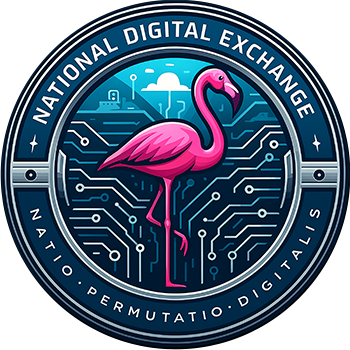
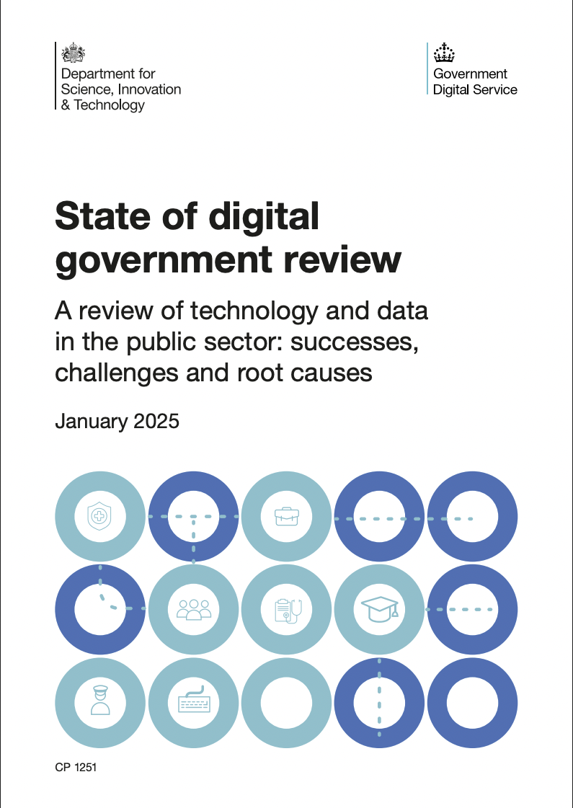
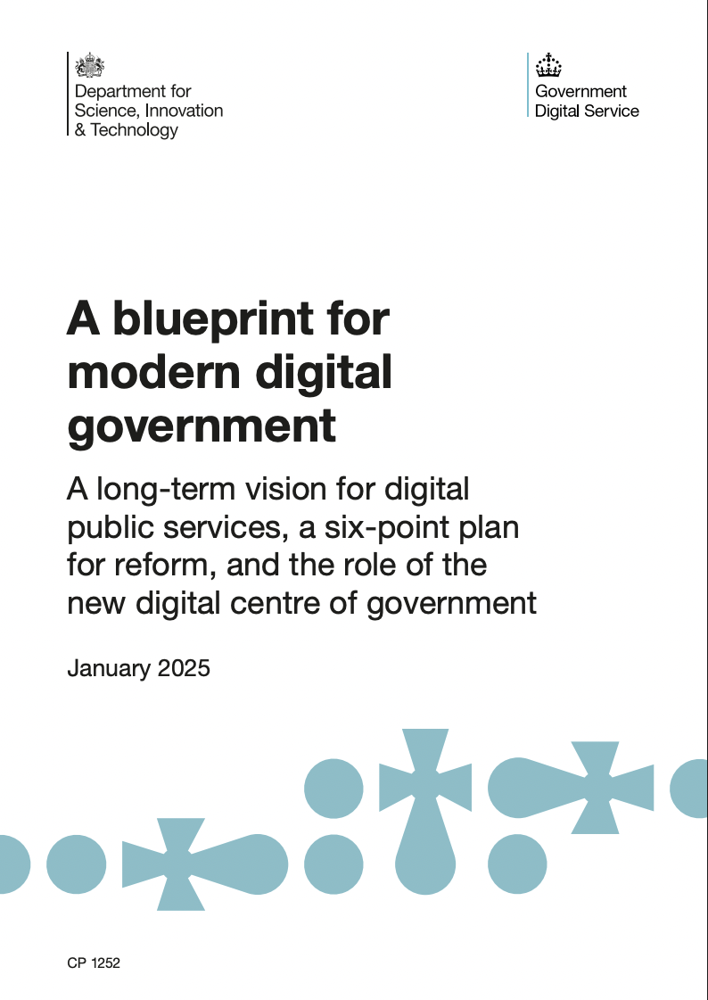
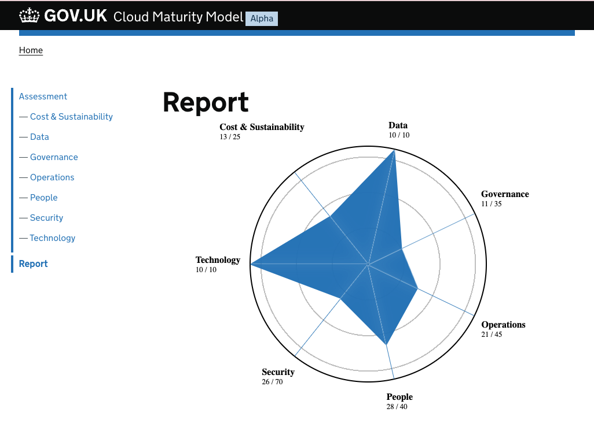
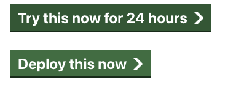
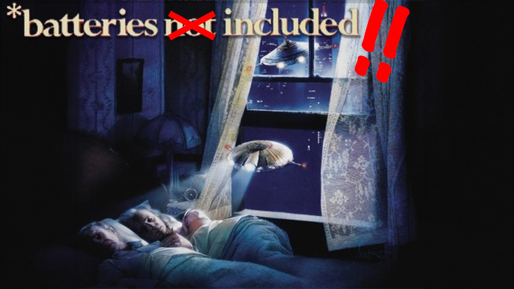
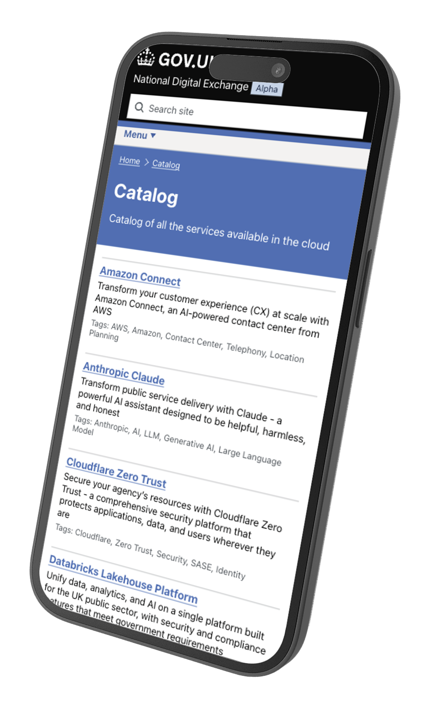
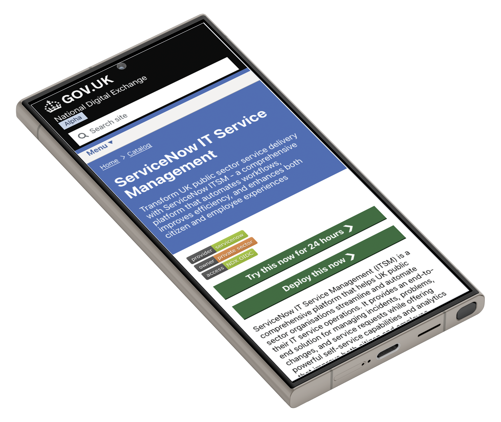

# National Digital Exchange (NDX)

### Chris Nesbitt-Smith | cns.me

---

<!-- _class: frame lead -->

# &nbsp;&nbsp;&nbsp;&nbsp;👋 &nbsp;&nbsp;&nbsp;&nbsp;&nbsp;<!--fit-->

# Chris Nesbitt-Smith | cns.me

<!--
Hello I'm Chris Nesbitt-Smith, a consultant working with The UK Government Digital Service (GDS), I've been in and around uk government digital _stuff_ for a long time, and I've been lucky to work with some amazing people on some amazing projects.
-->

---

<!-- _class: frame lead -->

# &nbsp;&nbsp;&nbsp;&nbsp;&nbsp;👋&nbsp;&nbsp;&nbsp;&nbsp;&nbsp;&nbsp;<!--fit-->

## National Digital Exchange: Accelerating Modern Digital Government

<!--
It's an honor to be invited here to talk to you through something I'm really excited about and share how it will accelerate modern digital government.
-->

---

<!--
For governments worldwide, digital is not optional – it's imperative. People expect seamless, accessible, efficient public services. Technology is evolving rapidly, offering huge opportunities to improve lives. Internationally, we share a common mission: to harness digital innovation for the public good.
-->

---

# ⬅️ Urgency<!--fit-->

<!--
In the UK, the State of Digital Government review showed that, while we've made progress, our public sector still struggles with outdated systems, siloed efforts, and inconsistent services. It's a familiar story globally – and it's clear we must do better.
-->

---

# Ambition ➡️<!--fit-->

<!--
At the same time we published the review we also published the Blueprint for Modern Digital Government – our strategic vision also published earlier this year. It lays out a bold long-term plan: to join up services, harness data and AI, strengthen digital skills, and fundamentally redesign government for the digital age.
There are hopefully some QR codes around that you can scan to download this essential reading, and there may even be some physical copies left at the GDS stand if you're quick.
-->

---

# Our Vision: Transformed Services

<!--
Imagine public services that are as easy to use as the best private apps—where data powers proactive solutions and innovation happens at lightning speed. Our vision is a transformed public sector: more responsive, more efficient, and built around the needs of users.
-->

---

# The Challenge: Siloes and Friction

<!--
For years, our organisations have often worked in silos. Each team reinventing the wheel, disconnected systems, and data stuck in siloes. Sharing between organisations has been so difficult that it sometimes felt practically irrational to even try. This friction has held us all back.
-->

---

# The Opportunity: Shared Power

<!--
Imagine if we could easily share solutions and data across every organisation. No more duplication – build once, use everywhere. Skilled people could focus on innovation, not repetitive fixes. The opportunity is immense: to make government a truly collaborative network.
-->

---

#   The National  Digital Exchange <!--fit-->

<!--
That's where the National Digital Exchange – NDX – comes in: a government platform built to break down silos and supercharge the adoption of technology and secure data sharing across the public sector. For the first time, all organisations will have a unified way to access cutting-edge solutions at the speed of cloud.
-->

---

<!--
At its heart, NDX’s mission is to democratise digital capability across the public sector. Whether a small local team or a major department, every organisation can quickly leverage modern cloud services through NDX. With consistent security, ready-to-use platforms, and a dramatically faster path from idea to impact.
-->

---

<!--
NDX isn’t just a single tool – it's a platform that solves a whole problem for users. It brings together everything needed to innovate in one place: a discovery hub for what's new, learning resources to build skills, a catalog of pre-vetted services, instant cloud environments to experiment, and tools to optimize existing systems.
-->

---

# 🔭<!--fit-->

<!--
First, NDX helps our people stay informed and skilled. The “Discover” section highlights the latest industry news, case studies, and events relevant to public sector tech. And “Learn” offers pathways for training and career development – helping build the cloud skills our organisations need.
-->

---

<!-- _class: front frame -->

# Try

<!--
Next, NDX lets teams experiment and build with ease. Through “Try,” any organisation can spin up a secure cloud environment for short experiments or proofs of concept, with no hassle or cost. And with “Access,” once ready, they can set up production-ready cloud environments fast and securely.
-->

---

<!--
NDX even helps improve what you already have. The “Optimise” feature guides organisations in refining their existing cloud setups – tightening security, boosting performance, and trimming costs. And we’re weaving in AI assistance to help users navigate options smartly from the start.
-->

---

# NDX ❤️ <!--fit-->

<!--
At the heart of this platform is the NDX Catalog. This is what truly makes NDX a game-changer. The Catalog is a comprehensive online directory of cloud services and digital solutions available to our public sector – all up to scratch for public sector turnkey use.
-->

---

$$
{\displaystyle k=Ae^{\frac {-E_{\text{a}}}{k_{\text{B}}T}},}
$$

_(Arrhenius equation for activation energy)_

<!--
Think of the NDX Catalog as a one-stop marketplace for digital solutions. In the past, finding and procuring the right technology took hours and an artificial gravity around the procurement and technical activation process favoured incumbent suppliers. Now, there’s one place where any organisation can quickly discover and access the best commodity tools. It's a true marketplace built for public sector needs.
-->

---

<!-- _class: frame -->

# ⛓️‍💥 vs ⛓️ <!--fit-->

<!--
For our users, this means no more fragmented approaches. Instead of each organisation procuring and building in isolation, the Catalog provides a common menu of trusted solutions. It brings consistency across services, while still offering choice and flexibility to innovate.
-->

---

<!-- _class: frame lead -->

# 🛡️<!--fit-->

<!--
Every service in the Catalog consistently demonstrates its alignment to security, compliance, and value. Users can trust that each listing meets our standards and has been tuned to public sector needs. With clear descriptions, tags, and guidance for every solution. This way, organisations adopt new tools with confidence, not guesswork.
-->

---

<!--
The Catalog truly levels the playing field. Both small councils and arms lengths bodies through to large departments alike can access cutting-edge tech on equal footing. A tiny IT team can leverage the same solutions at the same price point as an organisation with hundreds of developers is able to negotiate. Digital innovation is finally becoming inclusive.
-->

---

<!-- _class: frame lead -->

# 🔎 to 🚀 <!--fit-->

<!--
Importantly, the Catalog is actionable – not just a list of products. See a service you like? With one click you can launch a trial or even deploy it, already wired up to your organisation's existing systems. The Catalog connects directly to NDX’s “Try” sandbox and “Access” deployment features, making the journey from discovery to deployment seamless.
-->

---

<!--
We're building the Catalog with users in mind. It will be easy to navigate, with clear categories and search filters to quickly find what you need. Non-technical staff can understand the options, while technical teams get detailed information. In short, everyone finds it intuitive.
-->

---

<!-- _class: front frame -->

<!--
So often, adopting new technology stalls because teams can’t easily test solutions first; or worse they end up stuck with a choice they made early on. NDX changes that. Thanks to the Catalog’s integration with “Try,” any user can spin up and test a service immediately. No lengthy setup or cost – just hands-on learning and proof of value.
-->

---

# ⏩ ☁️<!--fit-->

<!--
The leap from pilot to production is no longer a leap at all. With NDX, the moment something works in “Try,” you'll be able to instantly deploy it for real using “Access.” This turns a successful experiment into an operational service in a fraction of the time.
-->

---

<!--
One of the Catalog’s strengths will be its breadth. It spans everything in the digital commodity space that will benefit from our collective buying power from End user devices to AI and data analytics to cybersecurity and low-code app builders, and hyperscale cloud. Whether you need a CRM system or a weather data API, you’ll be able to find it there – all already tailored for the public sector. Batteries included.
-->

---

<!--
Here’s a glimpse of our early thinking for the Catalog interface. As you can see, services are listed with descriptions and tags. It will be clean, user-friendly, and designed to help you quickly understand what's on offer at a glance.
-->

---

<!--
This is what it looks like when you open a specific service in the Catalog. You get a detailed description, guidance on usage, and one-click options like “Try now” or “Deploy”. Everything you need to evaluate and adopt a solution is right at your fingertips.
We're exploring how we can make this more useful and informative for users with trust indicators, reviews, and more; so you'll be able to connect with other public sector users and get recommendations.
-->

---

# 🚀<!--fit-->

<!--
For organisations, this new approach means drastically faster delivery of digital services. What used to take weeks and months can now be done in minutes. That speed means users get improvements sooner, and public needs are met more rapidly than ever.
-->

---

<!-- _class: frame lead -->

# 💡<!--fit-->

<!--
By eliminating duplicate efforts and wasted spend, NDX saves tremendous resources. Money and time that would have been lost on redundant work can instead go to the delivery of public services.
-->

---

<!-- _class: frame lead -->

# 🔐<!--fit-->

<!--
This format of solutions also raises the security bar. Services in NDX will meet strong security and compliance standards, so any organisation adopting it can easily communicate to others they wish to share with how they're doing it. This reduces risk everywhere. And consistency across platforms makes oversight and updates easier and more reliable.
-->

---

<!-- _class: frame lead -->

# ✨<!--fit-->

<!--
NDX unleashes innovation across the public sector. In the past, only the largest organisations with big budgets could experiment with cutting-edge tech. Now smaller teams can too and at unprecedented pace, because the best tools are easily accessible. New ideas can emerge from anywhere – not just from the top.
-->

---

<!-- _class: frame lead -->

# 🤝<!--fit-->

<!--
When everyone is using a common exchange, it fosters a new culture. Organisations share experiences: when one finds a great solution via NDX, others can follow quickly. Success stories spread. As a result, the public sector behaves more like a connected community rather than isolated units.
-->

---

<!-- _class: frame lead -->

# &nbsp;&nbsp;&nbsp;&nbsp;&nbsp;📚&nbsp;&nbsp;&nbsp;&nbsp;&nbsp;&nbsp;<!--fit-->

# The National Data Library

<!--
Another key element of our transformation is data. In the UK, we’re creating a National Data Library – a vision to make public sector data widely accessible for research and innovation. NDX will support this by providing the technical environments where data can be shared and used securely across organisations.
-->

---

<!-- _class: front -->

# &nbsp;&nbsp;&nbsp;&nbsp;A New Era for Digital Government

<!--
We are at the dawn of a new era for digital government. With the National Digital Exchange becoming a reality, those old limitations can no longer hold us back. We have a blueprint, and we have one of the platforms that will support turning that vision into reality.
-->

---

<!--
To our international peers, the UK’s approach is a case study in bold action. We’re not waiting – we’re building solutions. By pioneering NDX, we hope to inspire others as well. Digital government is a global effort, and together we can raise the game worldwide.
-->

---

<!--
Our journey with NDX is just beginning. It's in an alpha phase now, with so much more to come. We'll keep iterating, adding more services and features, and scaling up. The vision is to embed this exchange into the very fabric of how we deliver digital government.
-->

---

<!-- _class: frame lead -->

# Join Us in This Mission

# &nbsp;&nbsp;&nbsp;&nbsp;&nbsp;⚔️&nbsp;&nbsp;&nbsp;&nbsp;&nbsp;<!--fit-->

<!--
I invite all of you to join us in this mission. Whether you’re a digital innovator or a policymaker, consider how you might engage with NDX. By plugging in your solutions or championing this approach, you can help accelerate progress. Together, we can do so much more.
-->

---

<!--
We stand on the cusp of an exciting digital future for public service. The National Digital Exchange is more than a platform – it's a symbol of what’s possible when we think big and work together. Our goal is to redefine how government serves people in the digital age.
-->

---

<!--
Thank you all for listening to my silent digital disco experience. The journey to modern digital government is ours to shape. The National Digital Exchange is a bold step forward. Together, let's turn this vision into reality. Thank you.
-->

---

<!--_class: front -->

## Chris Nesbitt-Smith | cns.me

<!--
I've got my conference trousers on to make me easy to spot and I'll be hanging around for a little while so if any of this sounds interesting or awful then please do come find me in person, otherwise I can be found in the UK government Slack in the hash cloud channel. and cns.me will get you to my LinkedIn profile quickly.
-->

---

# 🙋 Q&A<!--fit-->

## ndx@digital.cabinet-office.gov.uk

<!-- Do we have time for any questions? Fabulous! If you've got any questions please make yourself known to one of my glamorous assistants will hopefully be able to get a microphone to you. -->
