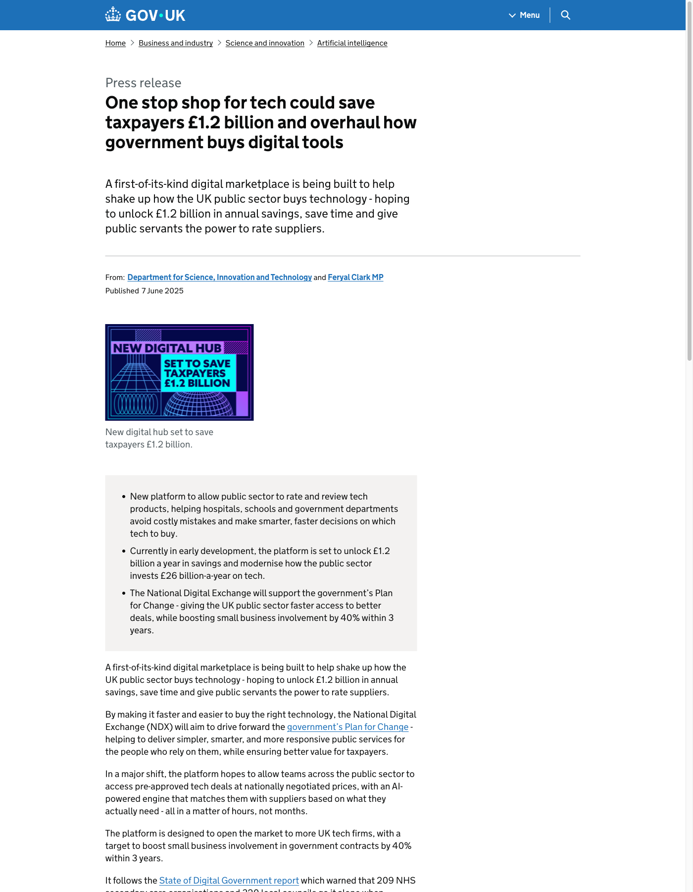
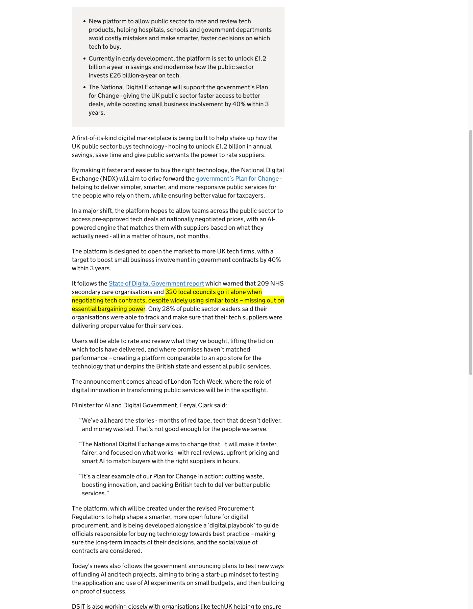
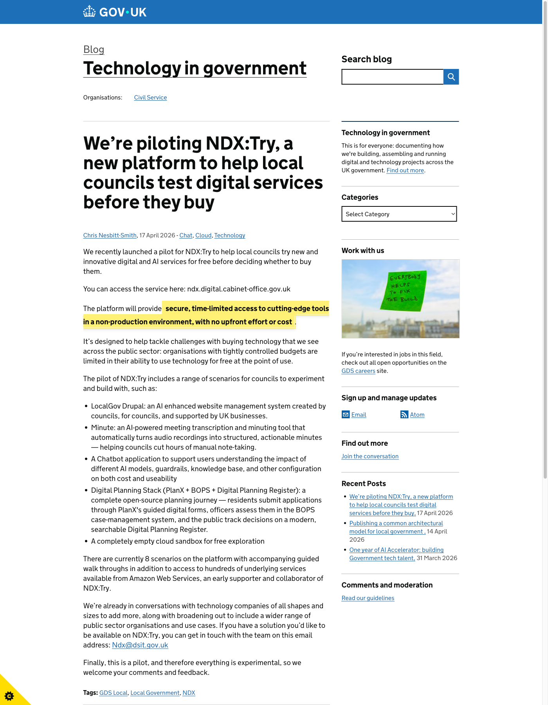
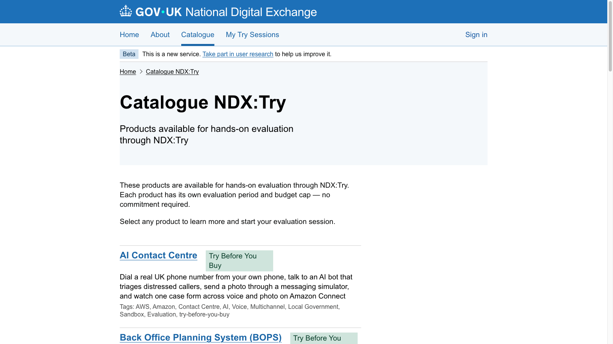
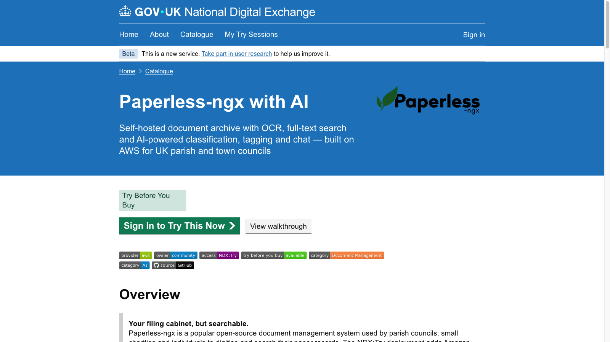
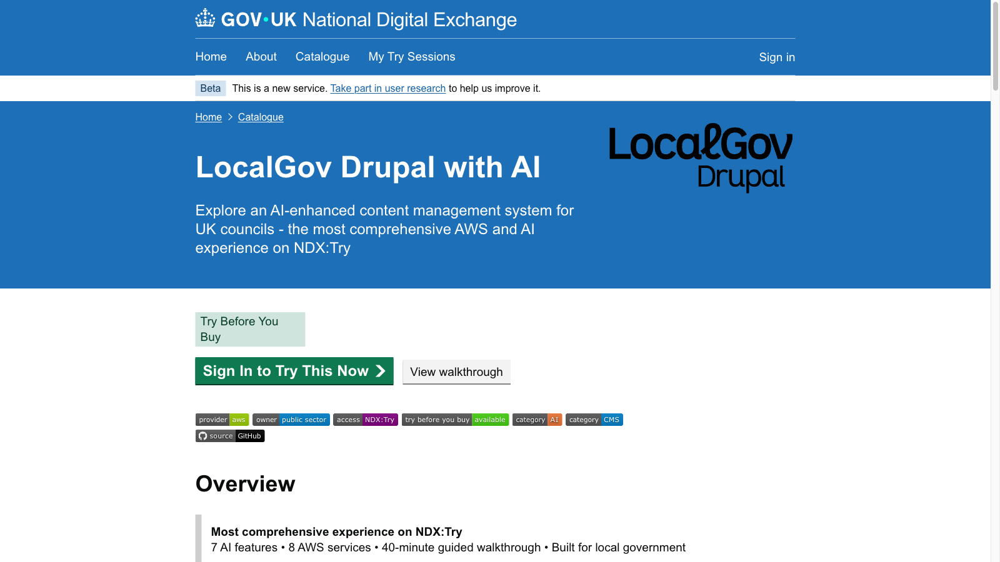
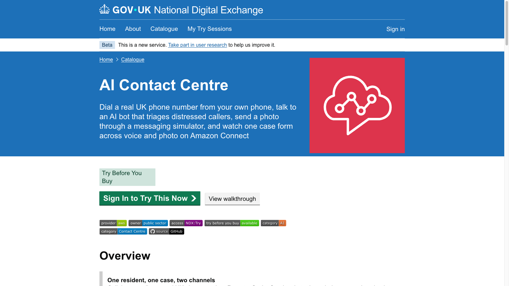
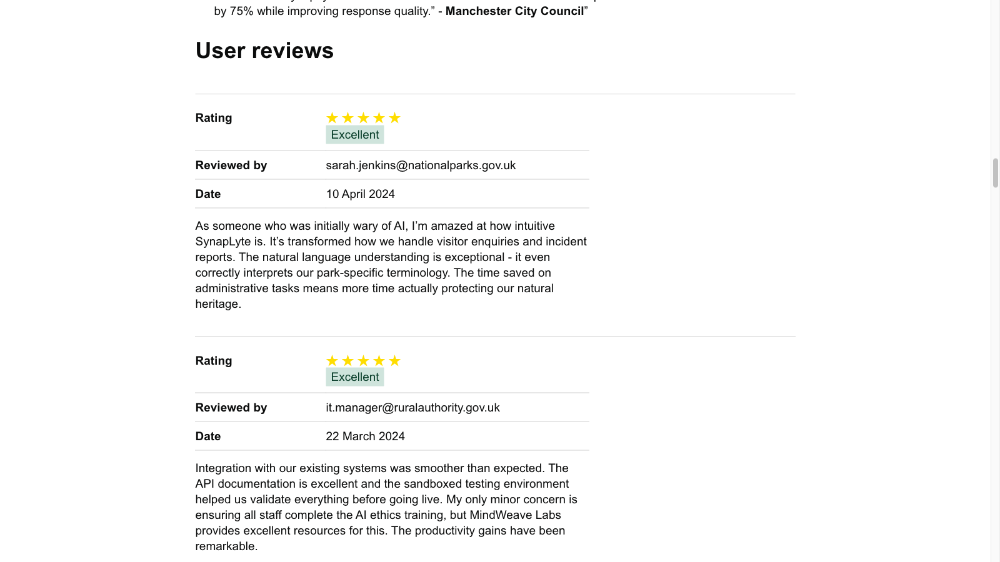
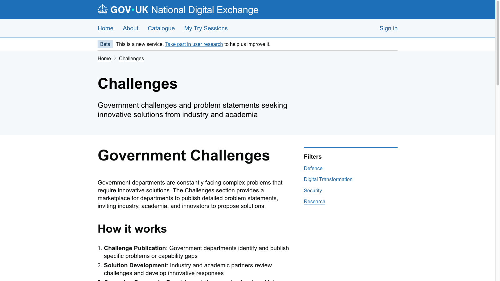

# NDX, Opportunities for London Boroughs

### Chris Nesbitt-Smith &nbsp; · &nbsp; Wing Lau, Hackney

#### LOTI AI Community of Practice · 21 May 2026

<!--
Hello. Thanks Sarbjit. I'm Chris, this is Wing, and we've got about 57 minutes. I want at least 17 of those to be questions, so I'll move quickly. Plan: I'll set the scene for what NDX is and why you're hearing about it, then I'll spend 20 minutes inside the platform showing you three scenarios — one of which Wing built with me last week. Then I'll close on what's coming and what you can do this afternoon. Stop me if I'm going too fast or too slow.
-->

---

<!-- _class: lead -->

<h1 class="hero-emoji">👋</h1>

## Chris Nesbitt-Smith · OCTO, DSIT

## Wing Lau · Hackney

<!--
Me: OCTO at DSIT, I lead a thing called NDX. Day job is building the platform you're about to see. About sixteen years across various corners of UK public-sector tech before this.

Wing: developer at Hackney, came to GDS last week, spent half a day at Whitechapel with me working through one of the scenarios on Try. He'll chip in when we get to that scenario. Anything else, ask in Q&A.

I want to acknowledge upfront — Wing is here as a developer who tried the platform and built something with it. Not as Hackney's official position on NDX. Whatever he says is his read, not the council's. That matters because boroughs in this room will ask "is this for real or is it another central-gov shiny thing" and the most honest answer is "another developer turned up and we built something". Wing is the proof point.
-->

---

<!-- _class: frame lead -->

# The problem<!--fit-->

#### _You've got an AI vendor pitch._

#### _Your CIO wants you to prove it works before signing._

#### _Your procurement, for even a £0 trial, says wait._

#### _Your security team needs to see it running first._

#### _Six months later you decide not to buy._

<!--
Quick check: does this sound familiar? Hands? Yeah. This is the procurement valley of death for everyone in this room. Vendor lands, makes promises, your CIO is keen. Then the kicker — your procurement people quote weeks of paperwork for even a zero-pound trial. Because procurement gates aren't about money, they're about contract risk and process. Your security team will not green-light anything they cannot see running with their own eyes. And by the time all that's resolved either the vendor has gone, the AI capability has been superseded, or the political will to actually decide has evaporated. We have all watched this happen, repeatedly, across every corner of UK public sector, on the same eight or nine AI capabilities.

That problem is what NDX:Try exists to fix. Specifically: it lets you skip steps one through four and just kick the tyres on the thing.
-->

---

# £1.2bn

#### in annual savings — if government bought tech better

##### Feryal Clark MP — gov.uk, June 2025

<!--
Press release. June last year. Minister for AI and Digital Government. £1.2 billion a year in savings against an annual public-sector tech spend of £26 billion. The vehicle named to deliver that was the National Digital Exchange — NDX. That's the actual gov.uk page on your right.

I'm not asking you to believe the £1.2 billion. It's an estimate; it'll be wrong in at least one direction. What it gives you is the political backing this initiative sits inside. A minister has put their name to this number. Officials have a mandate. The funding is in the spending review. NDX is not someone's side project — it's a programme with ministerial cover. That matters because most of you have seen central-gov-things-for-local-gov come and go, and the legitimate question is "will this one stick around". This one has cover. Best honest answer I can give.

Source: https://www.gov.uk/government/news/one-stop-shop-for-tech-could-save-taxpayers-12-billion-and-overhaul-how-government-buys-digital-tools
-->

---

# 320

#### councils "go it alone when negotiating tech contracts"

###### gov.uk press release · 7 June 2025

<!--
Same press release, different number. Quote in full: "320 local councils go it alone when negotiating tech contracts, despite widely using similar tools — missing out on essential bargaining power."

LOTI is only a chunk of those 320 — the London piece. The story isn't just that you'd get a discount through collective buying, though that's part of it. It's also about being a more intelligent customer. When 320 councils each procure broadly the same tools independently, vendors spend an enormous amount on customer acquisition — 320 separate sales cycles, 320 separate procurement teams to win over, 320 separate tenancies to defend at renewal time. That acquisition cost and that retention cost gets baked into the prices all of you pay. You are indirectly paying for the inefficiency of how vendors have to sell to you. The longer-term NDX play is to make you collectively easier and cheaper for the right suppliers to acquire and retain — and to push that saving back to you in better prices and better terms. We are not building a national contract you're all forced into. We are building the mechanisms that turn 320 isolated buyers into a coherent, more intelligent market. First mechanism is Try.
-->

---

<!-- _class: lead -->

<h1 class="hero-emoji">🧪</h1>

# NDX:Try

<!--
NDX:Try. The first piece of NDX. I wrote about it on the GDS technology blog in April — I'm allowed to quote myself, possibly. Let me give you the proposition in three beats.

Source: https://technology.blog.gov.uk/2026/04/17/were-piloting-ndxtry-a-new-platform-to-help-local-councils-test-digital-services-before-they-buy/
-->

---

## "Secure, time-limited access to cutting-edge tools, with no upfront effort or cost."

###### technology.blog.gov.uk · 17 April 2026

<!--
The frame: organisations with tightly controlled budgets are limited in their ability to use technology for free at the point of use. Try fixes that. The cloud vendor pays the bill — that's AWS today, others as they come on. You get a sandbox cloud account, you click a scenario from a catalogue, it deploys in roughly five minutes, you kick the tyres for up to 24 hours. No procurement gravity, no contract, no PO, no IT involvement. You can do it from your phone in your lunch break.
-->

---

<!-- _class: lead -->

<h1 class="hero-emoji">🔁</h1>

# Re-launch as often as you want.

## _Each session is fresh._

<!--
And I want to be very explicit about this: it is not a one-shot trial. You can re-launch the same scenario tomorrow, next week, next month, and again the week after. As many times as you want. Each session is fresh, clean, isolated. If you ran out of time today, click again tomorrow. If a colleague wants to see it, give them a link and they get their own session — they're not borrowing yours. If you want to test a different configuration, fresh session, no contamination from the last one. The 24-hour limit is about the per-instance environment, not about your access to the platform.
-->

---

<!-- _class: frame lead -->

# ~$50<!--fit-->

# per session, fair use

# _figure under review_

#### Most things you'll want to try fit well inside this.

<!--
There's one boundary worth flagging. A fair-use budget per session, currently sitting around fifty US dollars of compute. That figure is under review and may move. It is not a hard cap, it is a fair-use guideline, and the hypothesis behind the number is this: if you're doing the things Try is designed for — running the walkthrough, kicking the tyres, asking the chat a few hundred questions, generating a hundred documents — most of what you'll want to test fits comfortably inside that envelope. If you bump against it, tell us. That feedback is exactly what we need to decide whether the number is in the right place. Don't lose sleep over it.
-->

---

<!-- _class: frame lead -->

# AWS pays.

# DSIT operates.

# _You consume._

<!--
The bit boroughs find hard to believe at first: there is no catch. The cloud vendor underwrites the compute as a marketing and public-good play — AWS is the one doing that today, and that's the pattern we want others to follow. We — DSIT — operate the platform under that agreement. You consume the scenarios. That's the deal. No invoice arrives later. No cloud account of yours is touched. No clawback if you change your mind.
-->

---

<!-- _class: frame -->

<strong>17</strong> scenarios live today &nbsp;·&nbsp; <strong>8</strong> more in the backlog

AI Contact Centre

BOPS Planning

Council Chatbot

Digital Planning Register

Empty AWS Sandbox

FixMyStreet

FOI Redaction

LocalGov Drupal with AI

LocalGov IMS

Minute

Paperless-ngx with AI

Planning AI

PlanX Digital Planning

QuickSight Dashboard

Simply Readable

Smart Car Park

Text to Speech

<!--
Seventeen scenarios live as of this morning. Each one is a complete, working deployment of a real piece of software — open-source, vendor product, or AI capability — pre-configured so it lights up the moment it deploys. I'm not going to read them. They're on the screen. Three I'm coming to in a minute; pick any of the others this afternoon and have a go. An empty cloud sandbox in the list if you want to build something yourself from scratch rather than start with a pre-built scenario.

We added two scenarios in the last six weeks. Eight more in the backlog. The point is: if you're a borough and you want to test an AI capability, the question is not "will it be there", it's "is it there yet".
-->

---

<!-- _class: lead -->

<h1 class="hero-emoji">🤝</h1>

# Last week, in Hackney, with Wing

<!--
Best way to show you what this means is to show you what someone in your seat is already doing with it. Wing came up to Whitechapel last week. Half a day. We sat down, picked one of the scenarios, and worked through extending it. Wing was not a Hackney official delegation. He was a developer with an idea who reads the GDS tech blog, emailed me, and turned up. The whole interaction took two weeks from his first email to him sitting in our office with a coffee.

I'm going to show you the catalogue first, then we'll go into the scenario Wing and I worked on together, then I'll show you two more.
-->

---

<!-- _class: frame -->

<!--
This is the live catalogue. ndx.digital.cabinet-office.gov.uk slash catalogue slash tags slash try-before-you-buy. Bookmark it. Each tile is a scenario. Each scenario is a one-click deploy. Each one has a Blueprint — a written walkthrough of what it does, the architecture, the cost shape — and a guided walkthrough you can follow.

I'll dip into three of these in the next twenty minutes. Paperless-ngx with Wing, then LocalGov Drupal, then the AI Contact Centre. I have all three pre-deployed in tabs because we don't have time for the five-minute deploy beat, but normally you'd see a CloudFormation progress bar here.

Important to flag: these environments are ephemeral. The ones I'm showing you were spun up an hour ago. They'll be gone by tomorrow morning. If you sign up tonight you get your own — different account, different data, different URL. Nothing I do in this demo persists into your environment or anyone else's.
-->

---

<!-- _class: lead -->

<h1 class="hero-emoji">📄</h1>

# Pattern: document AI

#### _paperless-ngx with AI_

<!--
First pattern: document AI. The problem: every council in this room has a building full of paper, a folder structure full of scanned PDFs from 2008, and a backlog of FOI requests where the answer is in there somewhere but no one can find it. The pattern under paperless-ngx is OCR plus retrieval plus a chat interface over a knowledge base. Open-source document management on the bottom, Bedrock Knowledge Bases on S3 Vectors in the middle, a chat UI on top, Guardrails for PII on the way in.

The vendor pitch you've all had for this is some flavour of "M365 Copilot for documents" or "Azure AI Search with a chat front end". The Try version lets you compare the open-source alternative against the vendor pitch without buying either.
-->

---

<!-- _class: frame -->

<!--
Scenario page. Blueprint button takes you to the architecture write-up — Aurora Serverless v2 for the Postgres bit, ElastiCache for Redis, Fargate for the container, CloudFront on the front, Lambda plus Bedrock plus S3 Vectors for the chat side. About $0.50 for a 90-minute session. Walkthrough button gives you the click-by-click tour.

I'll switch to the live environment now.

CUE WING (first time): "Wing — what got your attention about this scenario when we sat down last week?" Wait for his answer.

Then drive through the UI: upload a doc, watch it OCR, ask the chat a question, show the answer with citations.

CUE WING (second time): "And what we added together last week was the PII piece. Wing, talk us through that." Wing speaks to the Guardrails / synthetic-data work.
-->

---

<!-- _class: lead -->

<h1 class="hero-emoji">🌐</h1>

# Pattern: content AI

#### _LocalGov Drupal with AI_

<!--
Second pattern: content AI. LocalGov Drupal is the open-source content management system built by councils, for councils, supported by UK businesses. Sixty-plus councils run it in production already. You probably know whether yours does — if you don't, ask your web team.

What Try adds is an AI layer on top of the published content: ask the website questions, generate page drafts, summarise meeting minutes for the news section, accessibility-rewrite existing content to plain English. The pattern is content generation and retrieval over a CMS you already trust the content shape of.

For councils that already run LocalGov Drupal in production, this is the path to test the AI extension without touching your live stack. Spin up the Try environment, get the AI layer working against the demo content, then decide whether you want to commission the same shape for your own production site.
-->

---

<!-- _class: frame -->

<!--
Scenario page. Same shape: Blueprint, Walkthrough, Deploy button. Switch to the live environment, demo the AI search against the residents-facing pages, demo the content generation, demo the readability rewriter.

Narrate solo on this one. No Wing chip-in.

If someone in the room runs LocalGov Drupal already, flag the AI extension is what's new — the Drupal stack itself is what they're already running.
-->

---

<!-- _class: lead -->

<h1 class="hero-emoji">☎️</h1>

# Pattern: voice AI

#### _AI Contact Centre_

<!--
Third pattern: voice AI in the contact centre. The problem: every borough contact centre has the same five or six top-volume call types — bin not collected, missed appointment, pothole, council tax query, housing repair, school admission. Those calls are a) repetitive, b) answerable from existing content the council already publishes, c) expensive to handle at human-agent rates.

The pattern: Connect for the phone bit, Transcribe for speech-to-text, Lex for intent matching, Lambda calling Bedrock against a Knowledge Base of the council's existing published content for the answer. End-to-end voice agent in a cloud sandbox account in five minutes from click.

This is the one that opens the conversation about what AI in council contact centres actually looks like before you sign a 12-month deal with a vendor.
-->

---

<!-- _class: frame -->

<!--
Scenario page. Same shape. Switch to the live environment.

The demo number is in the walkthrough. Aldershire — the imaginary council we use for scenarios — has a number. If the room is up for it, call it on speaker. Mavis from Aldershire: bin not collected. Watch the agent transcribe, intent-match, retrieve the answer from Aldershire's published collection schedule, speak it back. Then try a multi-intent call: bin AND pothole.

Narrate solo. No Wing chip-in.

If the live call doesn't work — and live phone calls on Teams sometimes don't — the walkthrough has screenshots and a recording. Fall back to those.
-->

---

<!-- _class: lead -->

<h1 class="hero-emoji">⏱️</h1>

# ~5 min deploy · <£1/day · 24h ephemeral

## _AWS picks up the bill_

<!--
The bit you should photograph. The numbers behind everything you just saw.

Roughly five minutes from clicking Deploy to a working environment. I skipped the deploy step for time — you'd normally see a CloudFormation progress screen here, with about forty resources spinning up — but five minutes is the honest number.

Standing-still cost: less than a pound a day. A busy day of clicking around inside the environment is maybe five to twenty quid. The cloud vendor picks all of that up — AWS today. You do not get a bill. There is no cloud account of yours involved. We — DSIT — operate this on vendor-funded compute under an agreement signed last year.

Twenty-four hour ephemerality is deliberate. The environment self-destructs. No leftover infrastructure, no surprise charge in three weeks, no orphaned resources, no security worry about "did anyone shut down the test environment from August". Click again tomorrow and you get a fresh one.

The cost-vs-value pitch to take back to your CIO: half an hour of your time and zero pounds of borough budget to test something that would have cost twelve weeks of procurement and a five-figure PoC contract this time last year.
-->

---

<!-- _class: lead -->

# What we want from you

#### 🎯 _Sign up. Click one scenario this week._

#### 🗣️ _Tell us what's broken. What works. What's missing._

#### 📣 _Tell other boroughs. Tell your suppliers._

<!--
This is a pilot. Word "pilot" matters. It means I genuinely do not know what shape the platform should be in twelve months' time, and I would rather find out from twenty boroughs trying it badly than from a steering group designing it slowly.

So three things from you. First: sign up. Just sign up. Click one scenario. Even if you don't use it — the act of signing up tells me a borough cares, and tells the Treasury the same thing.

Second: tell us what's broken. Every scenario has a feedback link. We read them. Last week somebody told us the FOI redaction scenario didn't handle Welsh place names. We fixed it on Friday. You are not shouting into a void.

Third: word of mouth, sideways. Other boroughs. And — separate ask coming on the next slide — your suppliers. The platform gets stronger as more of you turn up. Network effects beat central announcements every time.
-->

---

<!-- _class: frame lead -->

# 3 starts<!--fit-->

#### **Try** is the first feature. Catalog, Campaign, Challenge, Assist are coming.

#### **Local government** is the first audience. Wider public sector next.

#### **AWS** is the first vendor. Others at their pace.

<!--
Three starts. Try is the start, not the destination.

One: Try is the first feature of NDX. Behind it — Catalog, Campaign, Challenge, Assist. I'll cover those in the next three slides. None are live today. Try is. That gap matters: if you came here today expecting a full marketplace, you'd leave disappointed. The Catalog will arrive properly in the next months. The point of starting with Try is that you don't have to wait for the rest of NDX to use this part.

Two: local government first. London boroughs are the launch audience. Not an afterthought, not a test bed for central, but the cohort we're shaping the platform around. Wider public sector — central, NHS, devolved — comes next, on a roadmap that learns from what works for you.

Three: AWS first, honestly because AWS moved fastest, brought the funding, and brought the integration engineering. Others are coming at their pace not ours. I'd be lying if I said otherwise. If you want Azure or Google equivalents faster, that comes through your supplier conversations — which is the closing slide.
-->

---

<h1 class="hero-emoji">📚</h1>

# Next: Catalog

#### _Assured marketplace · peer reviews · published trust evidence_

<!--
Catalog. The assured marketplace piece. On the right, an example: real user reviews on a product page in the catalogue. Five stars, named reviewers from National Parks and Rural Authority, with the substance of what worked and what they were nervous about. Each listing has a trust panel — security posture, accessibility statement, support model, the publishable bits of vendor due diligence — alongside reviews from your peer organisations. Not the vendor's website. Your peers in this room.

Borough-leverage hook: when you're about to procure a piece of cloud software, you'll be able to see what other boroughs paid, what they think, what broke, what they switched to. Crowd-sourced due-diligence is the unlock. The 320-councils-going-it-alone problem from earlier — Catalog is the mechanism that fixes that side of it.

Timing: not promising a date because I don't have one to promise yet. Soon enough that you should have a view on what you want in it.
-->

---

<!-- _class: lead -->

<h1 class="hero-emoji">💰</h1>

# Next: Campaign

## _Pooled demand · co-funded builds · the Kickstarter mechanic_

<!--
Campaign. Public-sector demand-pooling. Imagine twenty boroughs all want the same AI-driven housing-repair-triage capability. None of you has the budget to commission it alone. Vendors won't build it speculatively because they can't see the demand. Campaign is the mechanic that lets you collectively pledge — "if this gets built to this spec, we'll buy it, here's our share" — and unlocks the commission.

Think Kickstarter, for public services, with real procurement obligations behind the pledge. Not marketing, not awareness, not a hackathon — actual money on the table from organisations that have committed to buy.

Borough-leverage hook: when LOTI as a body coordinates pledges, you become the demand signal that pulls capability into existence. Right now you're the demand signal that vendors talk over each other to chase individually.
-->

---

<h1 class="hero-emoji">📋</h1>

# Next: Challenge

#### _Public sector problem book · suppliers respond · innovators target_

<!--
Challenge. The published problem book. That page on the right exists today — "government challenges and problem statements seeking innovative solutions from industry and academia". Right now the unmet needs of public sector live in long-lists in IT strategy documents that nobody outside reads. Challenge surfaces those into one public, searchable problem book that vendors, innovators, university researchers, social enterprises, and other boroughs can see.

Not a hackathon. Not a competition with prizes. A long-running, openly-maintained list of "this is what we need" — categorised, with a clear "is anyone working on this" status.

Borough-leverage hook: your unmet need can be on the book. Suppliers watch the book. You get inbound proposals targeted at problems you've actually surfaced, rather than vendor cold-pitches at problems you don't have.
-->

---

<!-- _class: lead -->

# What you can do this afternoon

## 🔗 **Use it** &nbsp;&nbsp; `ndx.digital.cabinet-office.gov.uk`

## 🎤 **Come hands-on** &nbsp;&nbsp; _AWS, 4 June_ — `aws-experience.com/emea/smb/e/300f4/hands-on-with-ndxtry`

## 📣 **Tell your suppliers** &nbsp;&nbsp; Name "NDX:Try" → `ndx@dsit.gov.uk`

<!--
This is the slide to photograph. Three concrete things.

One. Use it. Go to ndx.digital.cabinet-office.gov.uk this afternoon. Sign-up button. Pick a scenario. Deploy it. Costs nothing, no procurement, no PO, doesn't touch any cloud account of yours. If your IT security team has questions, they can email me directly and I'll talk them through the isolation model.

Two. Come to the AWS hands-on event on 4 June. GDS Local, AWS, and other friends will be there. Half a day in the room with the platform team, running scenarios with hands-on help, asking questions face to face. Free. Link on screen. Best place to bring a colleague.

Three. The supplier conversation. When your Microsoft account team next pitches you Copilot for Government, or your Salesforce rep walks you through their AI offering, name NDX:Try and ask where their equivalent is. Send them to ndx@dsit.gov.uk. We will have that conversation directly with any supplier who turns up serious. Collectively, that is the strongest signal you can send for getting Microsoft, Salesforce, Google and other equivalents on the platform. DSIT can carry that message but it lands harder coming from twenty boroughs than from us.
-->

---

<!-- _class: lead -->

# 5 questions to ask your supplier

#### 1. Can I try this without signing anything?

#### 2. What does it cost to stop using it?

#### 3. Where do I find peer reviews from other boroughs?

#### 4. Why isn't this on NDX:Try yet?

#### 5. What problem on the NDX Challenge book are you working on?

##### _Bonus, for procurement: which framework lets us score peer reviews as previous performance? (Procurement Act 2023.)_

<!--
If you take one thing away that isn't "go to ndx.digital.cabinet-office.gov.uk", take this slide. Five questions. The next time a supplier pitches you an AI capability, work through these.

One: can I try this without signing anything. If the answer is no, the answer to whether you buy it is also no.

Two: what does it cost to stop using it. Exit cost, data extraction, hidden lock-in. Every supplier hates this question because the honest answer is rarely good.

Three: where do I find peer reviews from other boroughs. If the answer is "the vendor website testimonials", that's not peer reviews, and they know it.

Four: why isn't this on NDX:Try yet. They will not have a good answer. The follow-up is "right, can you talk to ndx@dsit.gov.uk and put one together".

Five: what problem on the NDX Challenge book are you working on. Two outcomes. Either they have an answer (good — they're paying attention to public sector demand), or they don't (also useful — you've just given them homework).

And one bonus question, not for the supplier but for your procurement team: which procurement framework lets us count the Catalog peer reviews as previous performance evidence in supplier scoring? The Procurement Act 2023, in force since February 2025, lets you take account of supplier past performance — and the trust evidence on a Catalog product page is exactly the kind of data the new regime lets you score on. Worth your procurement people knowing that. The old PCR 2015 didn't. PA 2023 does.

The five questions, plus that one to procurement, don't just help you make better purchases. They re-shape the market on your behalf without you having to lift any further finger.
-->

---

<!-- _class: lead -->

<h1 class="hero-emoji">❓</h1>

# Questions

## Wing's on the line for _"what's it actually like to use"_ questions.

<!--
Seventeen-ish minutes. I'll take strategic, architectural, "what about X scenario" questions. Wing — anything practitioner-flavoured, take it.

Q&A PREP — anticipated questions and pre-baked answers:

* "Aren't you locking us in to AWS?" — No. Scenarios are open-source CloudFormation, you can fork them to your own AWS account, the architectural patterns translate to Azure and GCP for anyone who wants to do that work, we want other vendors on the platform but they need to bring the funding and the integration effort like AWS did. The lock-in worry is real but Try is genuinely escapable. If you do that work, send us the diff.

* "What about data? Can we put real council data in?" — No, not in the sandbox. Try is for testing patterns and prototypes with synthetic / public data. Once you've decided you want the pattern, you procure it onto your own estate and put your data in there. Same answer for PII more generally.

* "Who supports it if something breaks?" — Best-effort, no SLA. Email ndx@dsit.gov.uk. Slack channel for borough users coming. Honest framing: it's a pilot, we are responsive but not 24/7. If you're depending on it for production, you're using it wrong.

* "Will it still be here in 18 months?" — Yes. Ministerial backing exists (the press release), funding is in place through to FY26/27, the team is growing not shrinking. Best honest answer.

* "Why isn't it on Azure or GCP yet?" — AWS moved fastest and funded the integration engineering. Others at their pace, not ours. Fastest way to change that is the supplier conversations from the closing slide.

* "Can we add a scenario?" — Yes. If you've got a council workflow worth packaging, talk to me after. We've added two scenarios in the last six weeks. We can add yours.

* "What about LocalGov Drupal in production?" — Yes, the AI extension is what's new. The Drupal stack itself is what councils already run.

* "What if it gets popular and the AWS funding runs out?" — Funding is committed through FY26/27. Beyond that we expect either renewed AWS sponsorship, the addition of other vendor sponsors, or commercial Catalog revenue. Worst case: it becomes a paid service at cost, which is still cheaper than your current PoC procurement.

* "Is there a charge later if we like a scenario?" — No charge from NDX. You take the open-source code, deploy it in your own AWS account (or commission a supplier to), and you're on commercial AWS rates at that point. Try is the free testing path; production is on you.

* "How do I get my borough's IT security to sign off?" — Email me, I'll do a 30-min call with them. The isolation model — separate AWS accounts per session, no shared infrastructure — is genuinely strong. Most security teams accept it once they understand it.

* "Are you replacing G-Cloud?" — No, not as a wholesale replacement. Catalog will cover some of what G-Cloud covers — digital commodities from partner-tier suppliers — but G-Cloud and CCS sit alongside, and we're working with CCS rather than around them. Don't volunteer this framing in narration.

* "What's stopping me using this for production?" — Nothing technical. Practically: ephemeral environments, no SLA, no data residency guarantees, no contract. It's a testing platform. The grown-up version of "what I used to call a sandbox".
-->

---

<!-- _class: lead -->

<h1 class="hero-emoji">🙏</h1>

# Thank you

## `ndx.digital.cabinet-office.gov.uk`

#### Chris Nesbitt-Smith · chris.nesbitt-smith@dsit.gov.uk

#### Wing Lau · wing.lau@hackney.gov.uk

#### NDX team · ndx@dsit.gov.uk

<!--
Thanks. ndx.digital.cabinet-office.gov.uk is where you start — sign up, pick a scenario, deploy it this afternoon. Book time with me directly if you want to walk through a specific scenario for your borough. Happy to do 30-min walkthroughs for any borough team that wants one.

If you've got a colleague who should have been here today, the recording will be on the LOTI site.

See some of you on the 4th.
-->
