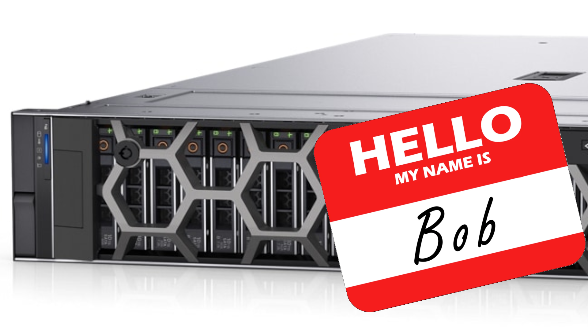
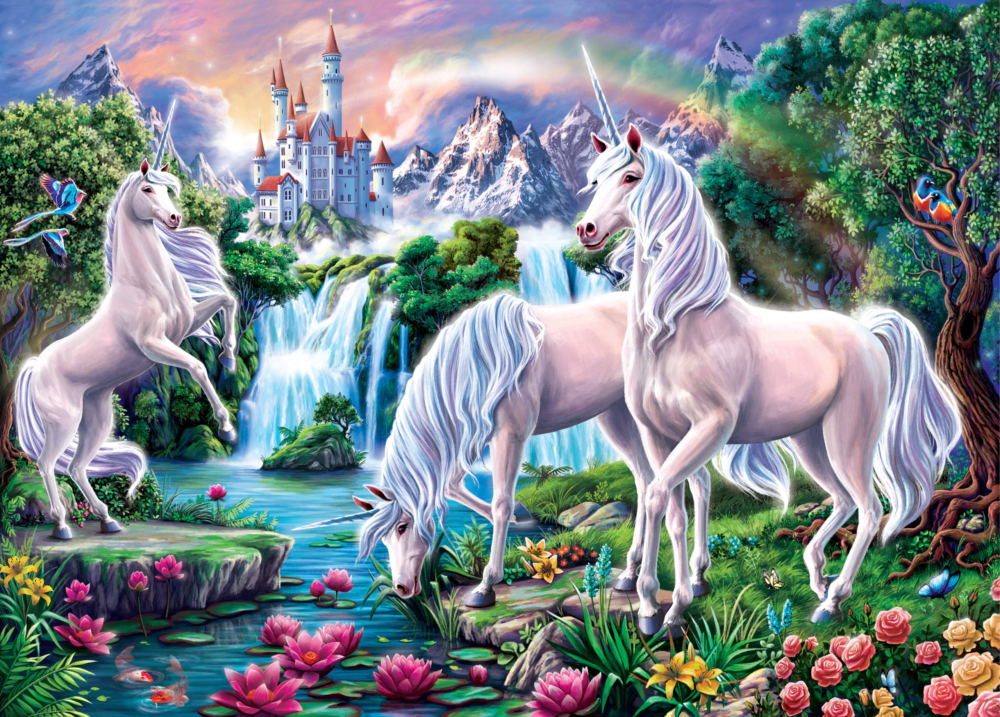
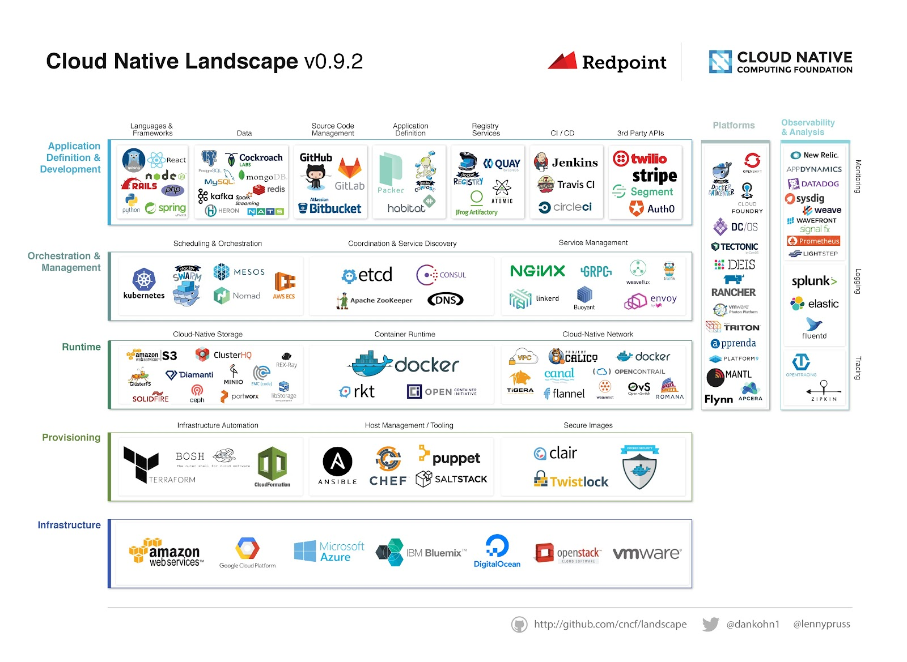
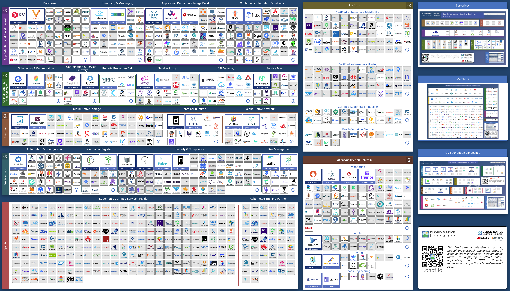
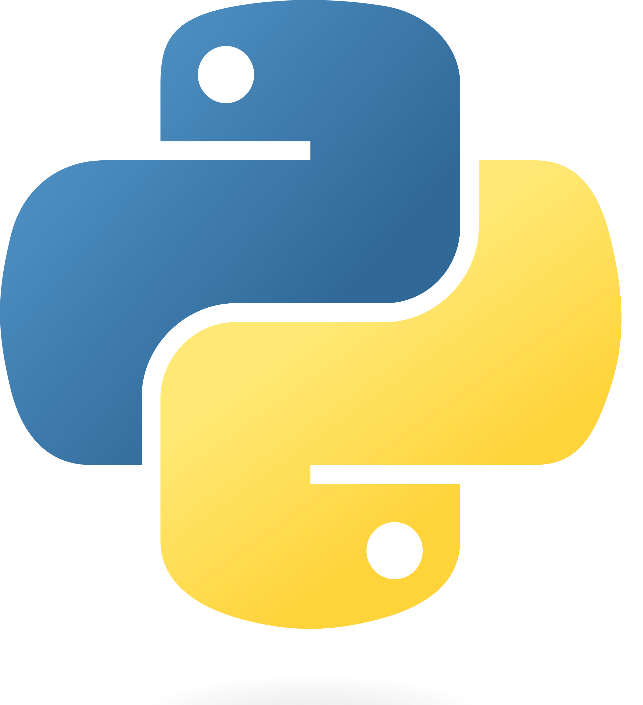
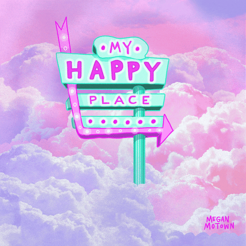
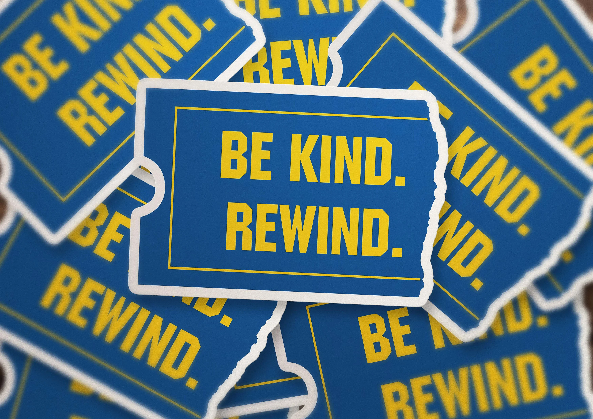
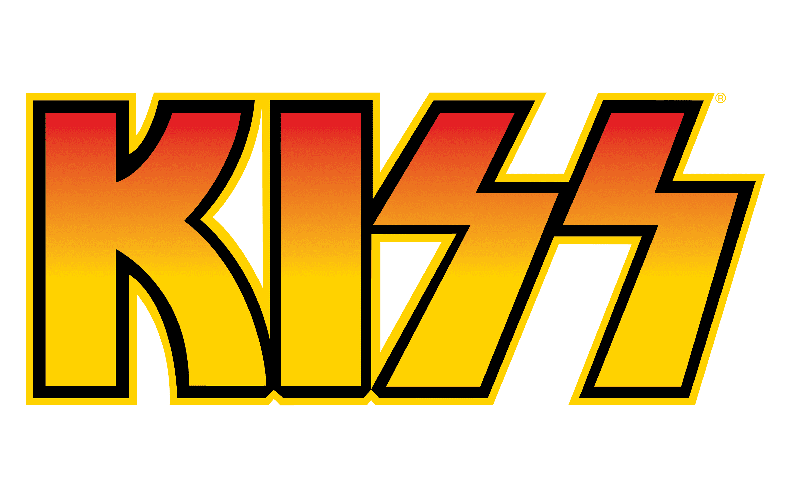
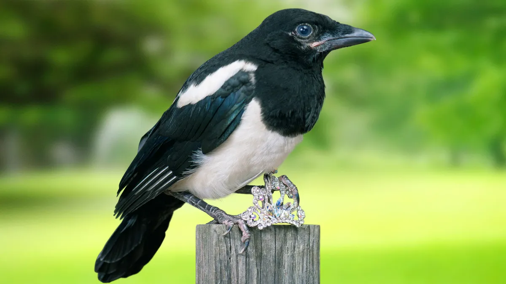

<!-- _class: title-page-->

<div>
<svg class="waves" xmlns="http://www.w3.org/2000/svg" xmlns:xlink="http://www.w3.org/1999/xlink"
viewBox="0 24 150 28" preserveAspectRatio="none" shape-rendering="auto">
<defs>
<path id="gentle-wave" d="M-160 44c30 0 58-18 88-18s 58 18 88 18 58-18 88-18 58 18 88 18 v44h-352z" />
</defs>
<g class="parallax">
<use xlink:href="#gentle-wave" x="48" y="0" fill="rgba(255,255,255,0.7" />
<use xlink:href="#gentle-wave" x="48" y="3" fill="rgba(255,255,255,0.5)" />
<use xlink:href="#gentle-wave" x="48" y="5" fill="rgba(255,255,255,0.3)" />
<use xlink:href="#gentle-wave" x="48" y="7" fill="#fff" />
</g>
</svg>
</div>

<div class="scanlines"></div>

# Is it time to put your pet Kubernetes down?<br/> 🐶☸️🔫⁉

<div class="glitch emoji" data-text="🤔">🤔</div>

## Chris Nesbitt-Smith

### UK Gov | esynergy | Control Pane | LearnK8s | lots of open source

---

# 👋 <br/>Hello<!--fit-->

<!--Hello! Imagine a thing with human faces, what a treat, I get to stand up, not worry about being on mute, use my clicker and everything!-->

---

<!-- _class: invert front -->


<!-- _class: white -->

## Chris Nesbitt-Smith<!--fit-->

- Learnk8s & Control Plane Instructor + Consultant
- esynergy - Digital Transformation Consultant
- Crown Prosecution Service (UK gov) - Consultant
- Opensource

<!--

So, to kick things off my name is Chris Nesbitt-Smith, I'm based in London and currently work with some well known brands like learnk8s, control plane, esynergy and various bits of UK Government I'm also a tinkerer of open source stuff.

I've using and abusing Kubernetes in production since it was 0.4, believe me when I say its been a journey!

I've definitely got the scars to show for it.

We should hopefully have time for questions and heckles at the end, if not come find me afterwards.
-->

---

# Reminder what is Pets vs Cattle?<!--fit-->

# 🐕🐄🤔<!--fit-->

<!--
The history of the pets vs cattle terminology is muddy, most link to a presentation Bill Baker from Microsoft made in 2006 around scaling SQL server.
-->

---

# The before times ⏳ <!--fit-->

<!--
Way back then in the before times, we called ourselves sysadmins and treated our servers like pets
-->

---



<!--
For example Bob the mail server. If Bob goes down, it’s all hands to the pumps.

The CEO can’t get his email and it’s the end of the world.

We do some incantations, make some sacrifices at an alter and resuscitate Bob bringing him back from the dead
-->

---

# 🦹‍♀️👏 <!--fit-->

<!--
Crisis averted, cue the applause and accolades for our valiant sysadmins who stayed up late into the night
-->

---

# 2022(?) ⌛️ <!--fit-->

<!--
In the new world however, servers are numbered or maybe uuids, like cattle in a herd.
-->

---


<!--
For example, www001 to www100. When one server goes down, it’s taken out back, shot, and replaced on the line.
-->

---

<style scoped>
h2 {
  font-size: 10em;
  margin:0
}
</style>

# ☸️ Kubernetes ☸️<!--fit-->

"duh, we're doing Kubernetes"

## 🦸‍♀️

<!--
Why am I telling you this rather morbid story?

Kubernetes deals with that right? and saves us from the tyranny
-->

---

# ☸️ Kubernetes: Nodes (naming)

```bash
$ kubectl get nodes
NAME                                         STATUS   ROLES    AGE   VERSION
ip-10-170-7-102.eu-west-2.compute.internal   Ready    <none>   24h   v1.21.5-eks-9017834
ip-10-170-7-99.eu-west-2.compute.internal    Ready    <none>   24h   v1.21.5-eks-9017834
```

<!--
And you're right, it does.

All you're computers are called nodes and abstracted and given arbitrary names, autoscaling groups and such will automatically detect the sick in your flock, take them out, and bring a replacement in.

all while seamlessly (ish) rescheduling the workload that was on the failed computer
-->

---

# ☸️ Kubernetes: Pods (naming)

```bash
$ kubectl get pods -A
NAMESPACE           NAME                                                  READY   STATUS    RESTARTS   AGE
cert-manager        cert-manager-6d99c7965c-c9q92                         1/1     Running   0          24h
cert-manager        cert-manager-cainjector-748dc889c5-ljv8c              1/1     Running   0          24h
cert-manager        cert-manager-webhook-5b679f47d6-wnt2f                 1/1     Running   0          24h
kube-system         aws-node-7b7q4                                        1/1     Running   0          24h
kube-system         aws-node-vwr5m                                        1/1     Running   0          24h
kube-system         calico-node-jfndm                                     1/1     Running   0          24h
kube-system         calico-node-zhzsf                                     1/1     Running   0          24h
kube-system         calico-typha-7dd5d4b984-p52gx                         1/1     Running   0          24h
kube-system         calico-typha-horizontal-autoscaler-767b5c958c-w6pjt   1/1     Running   0          24h
kube-system         cluster-autoscaler-6c8dc687c6-pts7q                   1/1     Running   1          24h
kube-system         coredns-65ccb76b7c-8pqj6                              1/1     Running   0          24h
kube-system         coredns-65ccb76b7c-dd48d                              1/1     Running   0          24h
kube-system         kube-proxy-5vqz2                                      1/1     Running   0          24h
kube-system         kube-proxy-zlh5k                                      1/1     Running   0          24h
kube-system         metrics-server-977777f66-mvr56                        1/1     Running   0          24h
nginx-ingress       ingress-controller-5b47bfdf66-c2xj8                   1/1     Running   0          24h
nginx-ingress       ingress-controller-5b47bfdf66-g94xw                   1/1     Running   0          24h
external-dns        external-dns-689dc89999-s6mjz                         1/1     Running   0          24h
```

<!--
And Kubernetes takes that a step further, your workload also has unique names
-->

---

# ☸️ Kubernetes: Pods (checks)

```yaml
livenessProbe:
  httpGet:
    path: /healthz
    port: http
```

<!--
Like the physical servers your workload failures can be detected, and replaced seamlessly
-->

---

# 🐶🐱<!--fit-->

<!--
So wheres the pet?
-->

---

# Don't look 🆙 <!--fit-->

<!--
well..
-->

---

# `eksctl create cluster` <!--fit-->

## ...now what?

<!--
Whats the first thing we do with a brand new Kubernetes cluster?
-->

---

# <!--fit-->🧐

<!--
Hint: it's not deploying your application or anything the business cares about
-->

---

# 🙀🙀🙀🙀<!--fit-->

```bash
helm install cert-manager jetstack/cert-manager
helm install external-dns external-dns/external-dns
helm install nginx-ingress nginx-stable/nginx-ingress
helm install istiod istio/istiod
etc
```

<!--
Look familiar?

yeah, we had to do a load of 'things' just to make this cluster able to start running our workloads
-->

---

# So?</br>🤷<!--fit-->

<!--
And it's worth noting that with a trend towards more and more features being being 'out of tree' that is to say they're optional add-ons and don't ship with core Kubernetes.

Examples of this are things like flex volumes, policy and basically all the Kubernetes sig projects that many find essential is only exasperating this issue
-->

---

# Well

<!-- prettier-ignore -->
* ☸️ www.mycompany.com
* ☸️ dev.notprod.mycompany.com
* ☸️ int.notprod.mycompany.com
* ☸️ stg.notprod.mycompany.com
* ☸️ qa.notprod.mycompany.com

<!--
<click>

That might work for when you've got a single cluster<click>

But what about when you've got dev <click>

integration <click>

staging <click>

qa that your app needs to run on
-->

---

# Well

- ☸️ team[1-10].www.mycompany.com
- ☸️ team[1-10].dev.notprod.mycompany.com
- ☸️ team[1-10].int.notprod.mycompany.com
- ☸️ team[1-10].stg.notprod.mycompany.com
- ☸️ team[1-10].qa.notprod.mycompany.com

<!--
Or worse, when you need separation between your teams or products
-->

---

# 🤖 <!--fit-->

<!--
Maybe you've automated that, bash, ansible, terraform, whatever you like, cool good on you
-->

---

# 😱 <!--fit-->

<!--
However you'll find it won't be long before theres an updated version perhaps patching a vulnerability you care about and you may be stuck trying to test every single app across your estate
-->

---

# 📆 Day 2 <!--fit-->

<!--
This is what we're calling day 2 operations, we used to call it BAU or business as usual, and it's where reality catches up with our idealistic good intentions
-->

---

# ❄️ <!--fit -->

<!--
You'll quickly find that clusters are running various versions, given the rate of change in the community its unrealistic to run :latest everywhere confidently without breaking production and disrupting your operational teams.
-->

---

# ❄❅❆<!--fit-->

<!--
Permutations of seemingly common tool choices, some teams might use kong, others nginx, another apache, all for good reasons I'm sure
-->

---


<!--
Seemingly infinite possibilities across the estate emerge
-->

---

# 🤯<!--fit-->

<!--
Sad times
-->

---

# 🐶🐱🐕🐇🐈<br/>🐹🐩🦮🐕‍🦺🐈‍⬛🐰<!--fit-->

<!--
Congratulations, you're now the proud owner of a pet shop, or if you managed to automate the creation
-->

---

# 🤖<br/>🐶🐱🐕🐇🐈<br/>🐹🐩🦮🐕‍🦺🐈‍⬛🐰<br/>🏭<!--fit-->

<!--
You can call it a pet factory, but it's a headache
-->

---

# 🤕 <!--fit -->

<!--
So what, how does this hurt you might ask?
-->

---

# I❤️<br/>🐶🐱🐕🐇🐈<br/>🐹🐩🦮🐕‍🦺🐈‍⬛🐰<!--fit-->

<!--
Maybe you like pets?
-->

---

# 🍸🛒🔫<!--fit-->

<!--
Well, presuming of course you're in cloud, your world could roughly be summarized into tiers

Apps, well these are things that your board room know about, and can probably name, so think your public website, shopping cart system, customer service apps, online chat interfaces, email system etc. These are all implicitly providing some value in of themselves to your end customers.
-->

---

# 🍸🛒🔫</br>☁️<!--fit-->

<!--
Infrastructure, with cloud this is all commodity thankfully, the days where anyone in your business caring about the challenges of physically racking up hardware, not overloading the weight in the cabinet, taking pride in how well they've routed cables have hopefully passed;

and you're consuming infrastructure, hopefully you've codified this but even if you're in to ClickOps, making sure its running is not your problem.

No one in your business is concerned with hardware failures, patching routers every-time theres a critical vulnerability, testing the UPS and the generators regularly, upgrading the HVAC when you add more servers.
-->

---

# 🥱 <!--fit-->

<!--
"YAWN-orarma" as my 16 year old would say and curse me for repeating. Your interactions with any of this is a few clicks or lines of code and some infra is available to you with an SLA attached to it.
-->

---

# 😮‍💨 <!--fit-->

<!--
If only the story ended there
-->

---

# 🍸🛒🔫</br>⚙️🥷🔬🪓🔩</br>☁️<!--fit-->

<!--
But sandwiched between those is a grey layer, of all the operational enablers, its where your 'devops' or 'SRE' team live.

So think log aggregation, certificate issuers, security policies, monitoring, service mesh and others.

These are things you do because of all sorts of reasons ranging from risk mitigation to emotion and technically unqualified opinion or just without foresight of what was round the corner in 6 months.
-->

---


<!--
Let's just make the leap and assume for a minute you are more technically competent than your goliath multi-billion dollar cloud vendor
-->

---


<!--
You've completely negated many of the benefits of going to cloud in the first place by ripping up the shared responsibility model

All of this while technically fascinating for people like me to stand and
-->

---


<!--
stroke my beard at.

This is delivering absolutely zero business value, unless of course your business is building or training on those products.
-->

---

# 😜<!--fit-->

<!--
and who'd want to get into that business!
-->

---


<!--
And thats not all! Recruitment...
-->

---


<!--
You might think you want a devops right?
oh no wait, devops with Kubernetes experience, maybe a CKA?

oh yeah, its on AWS, and we use linkerd and in some places istio, no not the current version, or even the same version everywhere. a mix of pod security policy, kyverno and OPA for policy, some terraform, helm, jenkins, github action soup going on, all in a mono-repo apart from all that stuff that isn't.
-->

---



<!--
We're well outside the remit of commodity skills and back to hunting unicorns.
-->

---


<!--
Sure you'll find some victims. sorry...
-->

---

# 👩‍🎓🧑‍🎓📚 <!--fit-->

<!--
I mean candidates; that you'll hire, well now you've got one hell of an onboarding issue before they can do anything useful and help your business move forwards faster than it did without them.
-->

---

# 💡<!--fit-->

<!--
And if you hired smart people they'll come with experience and their own opinions of what worked for them before, so your landscape gets bigger and bigger and more complex and diverse
-->

---



<!--
I did some googling, this is what the CNCF landscape looked way back in 2017.
--->

---


<!--
Choices, right? choices and logos as far as the eye can see.
-->

---


<!--
Have you seen it recently?
-->

---



<!--
This has got a bit out of hand, I'd say someone aught to have a word but I suspect that'd just make things worse by adding yet another thing
-->

---


<!--
and don't get me started on operators, nice idea but betray any ideals of immutability, crazy levels of abstraction for..
-->

---


<!--
and have you seen the crazy of mutating admission controllers
-->

---


<!--
If you're really mad, you can nest these things, with operators that create crds for other operators that are all mutated, heaven forbid someone bumps the version of anything?
-->

---


<!--
All no doubt held together with sticky tape, chewing gum, glue, pipe cleaners, thoughts and prayers and
-->

---


<!--helm -->

---

<style scoped>section { rotate: 10deg;}</style>


<!--
a string based templating engine where any community module has to eventually expose every parameter in every object file abstracted by a glorified string replace
-->

---

<style scoped>section { rotate: 20deg;}</style>


<!--
So now I've got to have in my head all the complexities of a linux/windows host, how the container runtime works, the software defined network and storage, the hypervisor, before the container, the scheduler, controllers, auth and policy and mutating policy in the cluster.
-->

---

<style scoped>section { rotate: 30deg;}</style>


<!--
before I worry about how someone in the nested helm chart mess of hell, has mapped the replica count of one of the deployments to a string called db replica count, and how that has changed in a new version of a dependency not following semver to "database_replica_count", so instead of having my expected 3 I've now only got 1
-->

---

<style scoped>
section { 
  rotate: 30deg;
  animation-name: spin;
  animation-duration: 40000ms;
  animation-iteration-count: infinite;
}

@keyframes spin {
    from {transform:rotate(0deg);}
    to {transform:rotate(7600deg);}
}
</style>


<!--
when I could have just written a yaml patch for the replica count in the deployment object of the database resource using stable API versioning with schema validation for free, ahhh
-->

---

.jpg>)

<!--
the kids doing Kubernetes don't seem to have learned from the past
-->

---





<!-- don't get me wrong, I love the open source community with all my heart, its so important -->

---


<!-- and its simply not possible to do anything without it
sorry, not sorry, yes as a sidebar, every talk this year is contractually required to reference log4j, this is my slide, deal with, its not relevant, it can come out in a couple of months
-->

---


<!-- everything literally everything that exists around us depends upon it, and the community is brilliant, at building some truly remarkable very high quality things, but we must accept that -->

---


<!-- the open source community -->

---


<!-- is awful at packaging things up -->

---


<!-- in this way for consumption, introducing needless abstractions -->

---


<!--
but enough of that, I'm definitely going to hell now
-->

---



<!--
happy place chris, happy place
where was I, right yes so through all of this
-->

---

# 👷‍♀️ <!--fit-->

<!--
I can't possibly think of a faster way to go from enthusiastic engineers playing with new exciting tech
-->

---

# 🤬 <!--fit-->

<!--
To deeply unhappy ones trying to fix something at 4am
-->

---


<!--
and before they can do anything meaningful they've got an orienteering exercise to switch mental context to whatever the intended permutation of things it is they're looking at.
-->

---

# 🔥👩‍🚒📉<!--fit-->

<!--
Meanwhile your business value delivering apps are offline, or worse at breach
-->

---



<!--
Rewind a minute we didn't want any of these things, how did we get here?
What can we do about it?
-->

---

# 🗑 <!--fit-->

<!-- honestly? bin it all -->

---

# ❤️‍🔥 <!--fit-->

<!-- kill it with fire -->

---

# 🍦 <!--fit-->

<!--
and then Learn to
-->

---

# I ❤️ 🍦 <!--fit-->

<!-- love vanilla, vanilla is great, and delicious too -->

---


<!-- anyone remember KISS? -->

---



<!-- no, not the band -->

---

# KISS<!--fit-->

## Keep It Stupid Simple <!--fit-->

<!-- Keep it stupid simple -->

---

<!-- _class: invert lead -->

# KISS<!--fit-->

## Keep It Simple, Stupid <!--fit-->

<!-- or Keep it simple, stupid -->

---


<!-- and embrace the shared responsibility model on offer, and make your cloud vendors do more than just provide compute, turns out as it happens, they're not that bad at it -->

---

# 💃 <!--fit-->

<!-- I'm not daft I know it's not sexy and exciting, you might even find recruitment harder if you're used to-->

---



<!-- hunting magpies who follow the shiny and don't like boring stuff that works -->

---

# 🐶🔫 ? <!--fit-->

<!--
So, to answer the question posed from the title of my talk, is it time you put your pet Kubernetes cluster down?
-->

---

# 👍 <!--fit-->

<!--
Yes, yes is it.
And in the immortal words of s-club 7 if you can
-->

---


<!--
bring it on back
immutably from code, all without anyone noticing

(I'm referring to the original version of the lyrics)
-->

---


<!--
Then maybe just maybe it can earn the right to stay to
-->

---


<!--
die another day
-->

---

<!-- _class: invert -->
<style scoped>
h2 {
  position: absolute;
  bottom: 1ch;
  left: 2vw;
  width: 95%
}
</style>

# 🙏 Thanks 🙏 <!--fit-->


- cns.me
- talks.cns.me
- github.com/chrisns
- learnk8s.io
- esynergy.co.uk
- controlplane.io

## Chris Nesbitt-Smith <!--fit-->

<!--
I've been Chris Nesbitt-Smith, thank you again for joining me today and enduring my self loathing.

Like subscribe whatever the kids do these days on LinkedIn, Github whatever and you can be assured there'll be no spam or much content at all since I'm awful at self promotion especially on social media. cns.me just points at my LinkedIn.

talks.cns.me contains this and other talks, they're all open source.

-->

---

<!-- _class: invert end lead -->
<style scoped>
  
  </style>

# Q&A🙋‍♀️🙋🙋‍♂️ <!--fit-->


### </br>

<div class="container">
  <div class="glitch" data-text="cns.me">cns.me</div>
  <div class="glow">cns.me</div>
</div>
<div class="scanlines"></div>

### </br>


## Chris Nesbitt-Smith <!--fit-->

<!--
Questions are very welcome on this or anything else, I'll hold the stage as long as I'm allowed, or find me afterwards, this grumpy old man needs to go find somewhere to sit down soon

<Change to last slide>
-->
