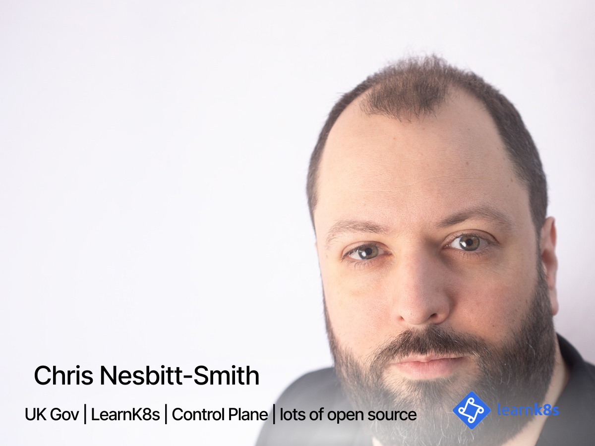
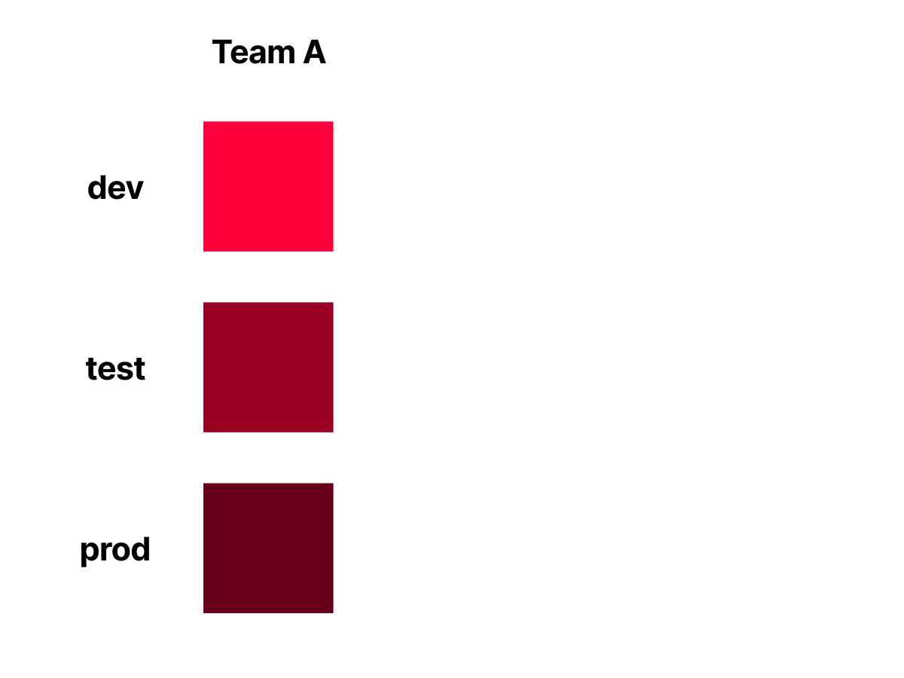
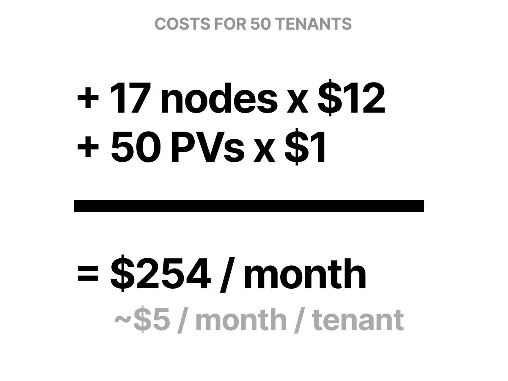
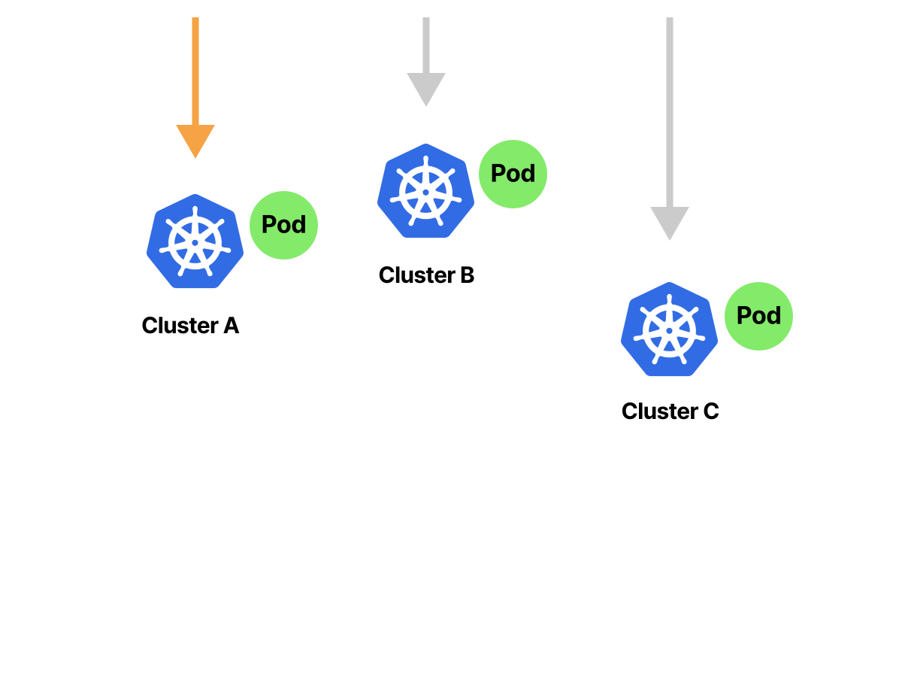
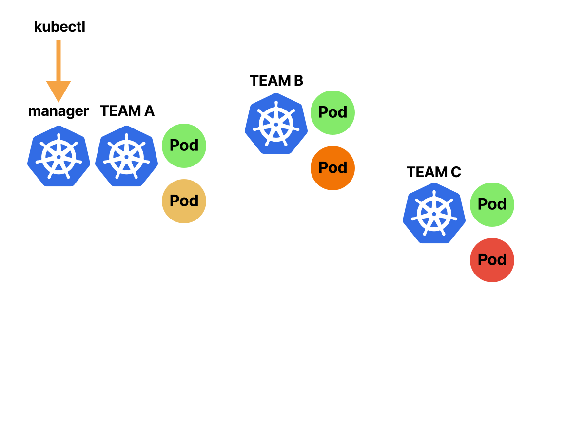
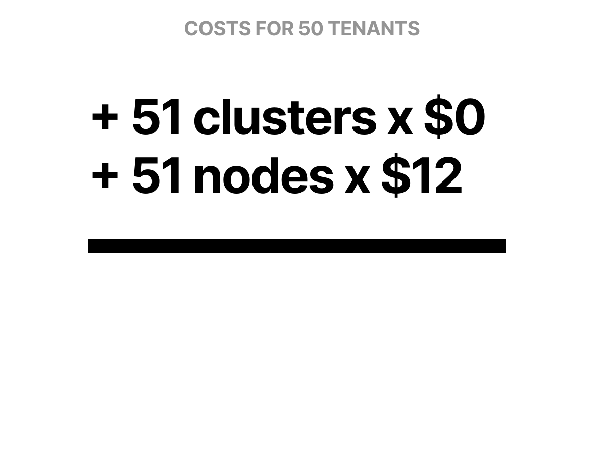
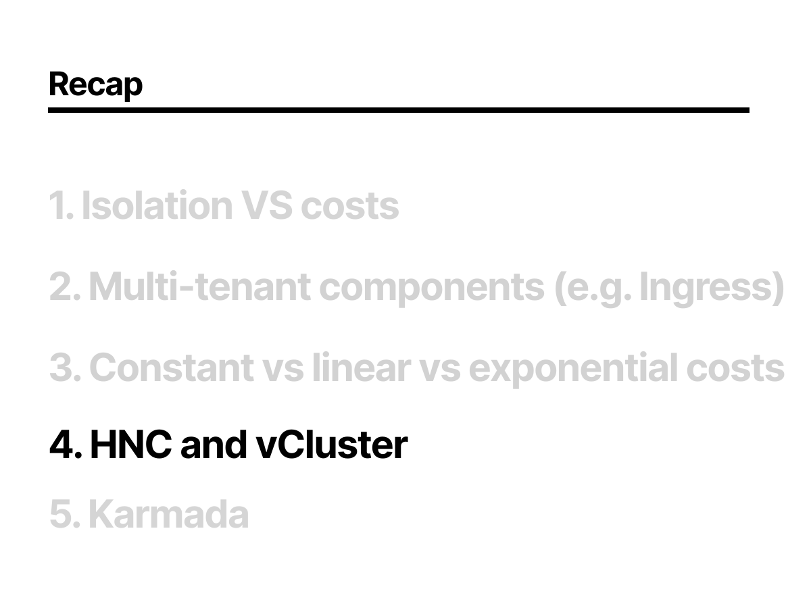

<!--
hello!
 -->

---

<!--
So, to kick things off my name is Chris Nesbitt-Smith, I'm based in London and currently work with some well known brands like learnk8s, control plane, and various bits of UK Government I'm also a tinkerer of open source stuff.

I've using and abusing Kubernetes in production since it was 0.4, believe me when I say its been a journey!

I've definitely got the war wounds to show for it.

We should have time for questions and your best heckles at the end, but if we run out of time or you're not watching this live, then please find me on LinkedIn or in the loft labs slack.

Right lets kick this off
-->

---

<!--
We all came here in search of minimizing wasted overheads in our compute estate, right?
Well, lets go with that, and pretend it wasn't just an exercise in technical naval gazing and CV enhancement
-->

---

<!--
So Ideally we'll want to isolate one workload from another
-->

---

<!--
We'll want super ease of managing all of those isolated things, because we need that collective spare time to think up new exciting abstractions of running processes on computers or a new job title? Shout out to my DevSecOps, SREs, and Platform Engineers!
-->

---

<!--
And our ability to reduce waste on the hardware should give us some cost savings, which we'll all need to buy the Apple Vision Pro for some DevAROps.
So how do we realize those dreams
-->

---

<!--
Here comes the science bit.
Kubernetes embraces the idea of treating your servers as a single unit and abstracts away how individual computer resources operate.
-->

---

<!--
Imagine having three servers.
-->

---

<!--
You can use one of those to install the Kubernetes control plane.
-->

---

<!--
The remaining can join the cluster as worker nodes.
-->

---

<!--
Once the setup is completed, the physical servers are mostly abstracted from you. You deal with Kubernetes as a single unit.
-->

---

<!--
When you want to deploy a container, you submit your request to the cluster.
Kubernetes takes care of executing `docker run` and selecting the best server for the job.
-->

---

<!--
The same happens for
-->

---

<!--
all other containers.
-->

---

<!--
For every deployment, Kubernetes finds the best place to run the application.
-->

---

<!--
Out the box Kubernetes does give you namespaces
-->

---

<!--
So if you have three applications or teams
-->

---

<!--
you could create three Kubernetes namespaces and place one in each. and you'd be forgiven for thinking that namespaces might refer to a lower level implementation kernel capability that would provide you some isolation
-->

---

<!--
However a Kubernetes namespace is just a logical partition of the cluster that is used to group Kubernetes objects together. It doesn't offer any isolation, it's just a convenient way to categorize and compartmentalize objects, and has some performance benefits in scheduling by limiting the scope.
-->

---

<!--
Lets explore how we can apply namespaces to start with, since its a useful baseline, and how many folk have done it in the past, at least before managing multiple clusters became a thing when we put down Kubernetes the hard way (thanks Kelsey) and remembered we can at the very least script things
-->

---

<!--
but how do we carve up estate.
You could split it up by your three teams
-->

---

<!--
Or perhaps by lifecycle stage, say dev, test prod
-->

---

<!--
but what about when your teams need multiple lifecycle stages
-->

---

<!--
you start to see
-->

---

<!--
this getting quite busy
-->

---

<!--
so how big can this get
-->

---

## <!-- lets take a couple of scenarios, one with 10 tenants -->

<!-- and another with 50 tenants -->

---

<!-- assuming they're all serving some http traffic, you'll probably use an ingress controller like nginx -->

---

<!--
which is a single pod that can serve your 10 tenants
-->

---

<!--
just as easily as your 50
-->

---

<!--
Notice how that didn't mean we needed to scale to have 30 nginx ingress for our 10 tenant cluster
-->

---

<!--
or worse, 150 for our 50 tenant cluster
-->

---

<!--
so what are the cost implications of this choice
-->

---

<!--
If we look at the ingress-nginx helm chart config, you'll see we've got a resource request of 100 millicores and 90mb of ram
-->

---

<!--
Lets put scaling for the volume of traffic aside for a minute and assume we're just looking at the standing still cost. while the numbers might seem low in isolation they are likely going to turn into papercuts
-->

---

<!--
so our 10 tenant 3 lifecycle stage cluster looks like this
-->

---

<!--
and our 50 tenant one looks even worse
thats just math, and compute is cheap so who cares
-->

---

<!--
Well someone might when get the bill for your ingress node requirement without it actually doing anything real. 248 bucks a month, just to stand still, before you add monitoring and logging and other stuff.
-->

---

<!--
So a single ingress might look like a good idea
-->

---

<!--
but what happens when one of your snowflake teams wants a configuration option that isn't readily made available by the ingress annotations configuration such as tweaking the keep alive.
-->

---

<!--
But others don't, sure you could use the configuration snippet annotation to tweak this, but thats quite a blunt instrument you shouldn't really give all your teams since it allows any one of them to break ingress for everyone
-->

---

<!--
So you're stuck having to define that configuration option at a full cluster level
-->

---

<!--
consequently, those that didn't want that configuration have it forced upon them
-->

---

<!--
If we look at our patent pending multi-tenancy o'meter you'll see that the configuration of a single shared ingress is tracking nice and cheap
-->

---

<!--
but lets face it, when was the last time ingress was the only thing you installed in a cluster, those Custom Resources won't define themselves after all
-->

---

<!--
Something like this likely looks familiar, logos as far as the eye can see. After all, our DevSecFinOps CV needed something new and shiny added to it.
-->

---

<!--
Lets take prometheus for example, well you don't normally run it like this where you have a shared one for every application workload
-->

---

<!--
So you're cluster is going to be looking something more like this
-->

---

<!--
taking a look at our multi-tenancy-o-meter, we can see the costs of this sort of practice accruing
-->

---

<!--
So, since we're logo loving devops, lets see what more complexity we can add to manage it more easily and give ourselves enough time to anxiously refresh the CNCF landscape for new logos to find what we need to install next.
-->

---

<!--
first tool we'll look at is the hierarchical namespace controller
-->

---

<!--
We'll then look at vCluster from our kind friends loft labs, the v stands for virtual, we'll look at what that means in reality since while novel doesn't really align with the word virtual in other computing senses.
-->

---

<!--
And lastly we'll look at karmada as a means of managing many clusters
-->

---

<!--
hierarchical Namespace Controller as the name suggests is a controller
-->

---

<!--
that allows you to define a root, or parent namespace
-->

---

<!--
and then define a child tree off the back of that
-->

---

<!--
the rabbit hole can go as deep as you like
-->

---

<!--
This is the first of my three demos today, because Daniele and Salman who did the previous two talks thought it'd be really funny if I demoed all the hard stuff.
So join me in prayers to the demo gods while I try not to mess this up.

cd /Users/cns/httpdocs/learnk8s_loft
export PATH=$PATH:${PWD}

kubectl apply -f https://github.com/kubernetes-sigs/hierarchical-namespaces/releases/download/v1.1.0/default.yaml # setup
kubectl -n hnc-system patch deployments.apps hnc-controller-manager  --patch-file hnc-patch.yaml # setup

kubectl create ns parent
kubectl hns create tenant-1 -n parent
kubectl hns config describe
kubectl hns config set-resource resourcequota --mode Propagate
kubectl hns config describe
kubectl apply -f resource-quota.yaml
kubectl get resourcequotas -A
cat hnc-50.sh
./hnc-50.sh
kubectl get resourcequotas -A
kubectl hns set parent --allowCascadingDeletion
kubectl delete ns parent
-->

---

<!--
As you can see the namespaces aren't truly nested, its all smoke and mirrors
-->

---

<!--
theres a single controller doing the templating work for you
-->

---

<!--
but at the end of the day its just regular namespaces
-->

---

<!--
Our multi-tenancy-o-meter shows its cheap since the standing still cost of the tenants is zero since theres no workload in them.
-->

---

<!--
in fact, since these are just empty namespaces, a construct stored in etcd theres absolutely no inherent cost associated with it
-->

---

<!--
So what practical use are these namespaces
-->

---

<!--
lets have a look at roles
so if our team has some roles that they can read and write pods and pvs in the root namespace
-->

---

<!--
we could cascade those role bindings to all the children
-->

---

<!--
and we could do the same for many teams
-->

---

<!--
all allowing them access to the pv
-->

---

<!--
Our next approach of isolating the control plane
-->

---

<!--
which is what vCluster does, where by a namespace is created
-->

---

<!--
And inside that we run a small k3s instance.
Those that aren't familiar with k3s, its a lightweight Kubernetes distribution that by default uses sql lite as it's database backend instead of etcd and can lend itself to working very well running as a single binary
-->

---

<!--
so we can hit the api server with kubectl, and create a pod
but this is just an api server, theres no nodes to run the workload
-->

---

<!--
whats more its the wrong database for the real scheduler to pick it up, so what can we do?
-->

---

<!--
We could copy the pod spec
-->

---

<!--
which would magically cause the pod to be scheduled somewhere on the parent cluster
-->

---

<!--
and thats exactly what the vcluster syncer does, you select the resources and direction to sync them in between the clusters
-->

---

<!--
and with global resources like an ingress controller, crds, I can just sync the primitive resources like pods, configmaps, secrets, pvs and so on
-->

---

<!--
so if I apply my pv to the tenant cluster
-->

---

<!--
it'll get stored in the tenant control plane
-->

---

<!--
and then sync'd to the parent
-->

---

<!--
and allow the pvc to bind to that pv and the pods to connect to it
-->

---

<!--
DEMO

cat pv-values.yaml | yq
vcluster create tenant1 --upgrade -f pv-values.yaml

cat pv.yaml | yq
kubectl apply -f pv.yaml
vcluster disconnect
kubectl get pv

vcluster create tenant2 --upgrade -f pv-values.yaml
kubectl apply -f pv.yaml
kubectl get pv
vcluster disconnect
kubectl get pv

vcluster delete tenant1
vcluster delete tenant2
kubectl delete pv --all
-->

---

<!--
so this gives us a kinda nested control plane
-->

---

<!--
with a sense that we can give what feels like cluster admin out selectively to tenants, if you squint its a virtual cluster
-->

---

<!--
but theres a single parent cluster that exists, and can have controls and configuration set there, and we don't have heaps of fully independent clusters, many highly available.
-->

---

<!--
our multi-tenancy-o-meter is twitching but its still reasonably cheap
-->

---

<!--
We'll need around an extra 17 nodes to handle our 50 tenants controlplane pods
-->

---

<!--
and 50 pvs for all the databases
-->

---

<!--
totalling out around 254 bucks, or $5 per tenant a month
-->

---

<!--
what does that mean for your workloads though when you apply a pod
-->

---

<!--
well the pods will share nodes with other tenants
-->

---

<!--
which introduces a noisy neighbor concern
-->

---

<!--
but we could create node pools to separate that, so a single control plane could operate multiple pools
vcluster makes this a bit easier with the node selector and enforce node selector options
-->

---

<!--
so that all sounds great, but what about network
-->

---

<!--
well the inherent rules of Kubernetes networking still exist that any pod can talk to any pod, and that overarching cluster is a flat network.
-->

---

<!--
depending on your network, you may be able to apply network policy in order to limit what is permitted to talk to what
-->

---

<!--
in effect giving us an isolated network boundary
vcluster makes this easy with the --isolate parameter
-->

---

<!--
so thats the network isolated
-->

---

<!--
but if any one of the containers escapes to the host, perhaps through a kernel vulnerability
-->

---

<!--
well if you've got to the node, then its not a big leap to then take the kubelet
-->

---

<!--
and in turn take the control plane, at which point your entire multi tenant cluster and everything it connects to has been compromised. its a bad day
-->

---

<!--
what alternatives do we have left
-->

---

<!--
Well, we could run a bunch of different clusters
-->

---

<!--
Enter Karmada to make some sense of that
-->

---

<!--
which abstracts some of the things you might be used to seeing in Kubernetes with
-->

---

<!--
some karmada equivalents
-->

---

<!--
to dig in to the architecture of that
-->

---

<!--
so our master cluster can command the child clusters agent
-->

---

<!--
which in turn communicates with the agent's cluster api server
-->

---

<!--
so a kubectl apply to the master
-->

---

<!--
will cascade into the child cluster
-->

---

<!--
This effectively gives us independent clusters with an overarching central management
-->

---

<!--
with calls made to the manager
-->

---

<!--
being passed on to child clusters giving me both standard fixed workloads, perhaps some logging and policy engine and config
-->

---

<!--
along with workloads
-->

---

<!--
that are individual to
-->

---

<!--
each team or environment
and the child clusters could be anywhere, from all being in the same physical data centre, all the way through to geographically disparate multi cloud vendors and some hybrid cloud thrown in for good measure because fun times
-->

---

<!--
Last demo god prayer to make, wish me luck

DEMO

export KUBECONFIG=karmada-apiserver.config
kubectl get cluster

KUBECONFIG=worker-1-kubeconfig.yaml k apply -f deploy.yaml

kubectl get --raw /apis/search.karmada.io/v1alpha1/search/cache/apis/apps/v1/deployments | jq '.items[] | (.metadata.annotations["resource.karmada.io/cached-from-cluster"] + " " + .metadata.name)'

## demo propagating a deploy
kubectl apply -f propagating-deploy.yaml
KUBECONFIG=worker-1-kubeconfig.yaml k get pods -A
KUBECONFIG=worker-2-kubeconfig.yaml k get pods -A

KUBECONFIG=worker-1-kubeconfig.yaml k delete deployments.apps hello-world
kubectl delete -f propagating-deploy.yaml
unset KUBECONFIG
-->

---

<!--
So we saw a cluster of clusters
-->

---

<!--
with administrative control being carried down to the tenant clusters
-->

---

<!--
and we saw there was no sharing of any network, worker nodes. but still some consolidation
ultimately a strong isolation
-->

---

<!--
our multi-tenancy-o-meter is well into the red however
-->

---

<!--
but what is that in dollars
so we need 51 clusters, well the control plane node don't cost us anything with our cloud vendor
-->

---

<!--
there'll need to be at least 1 node per cluster in order to support the agent
-->

---

<!--
so that totals out at 612 bucks or 12 per tenant per month
-->

---

<!--
so by means of a review
-->

---

<!--
we started with basic Kubernetes, and added some multi-tenancy through namespaces
-->

---

<!--
we then added in some isolation with node pools giving us runtime isolation
-->

---

<!--
we saw what happened when we added in some common things like monitoring
-->

---

<!--
logging
-->

---

<!--
storage
-->

---

<!--
ci/cd
-->

---

<!--
and ingress
-->

---

<!--
and of course we saw the cost implications of those choices
-->

---

<!--
We saw the costs ranging from 0 for the Hierarchical namespace controller, vCluster in at 252, and karmada at 612 dollars/month
-->

---

<!--
on top of that, theres the cost of a dedicated ingress for each of those 50 tenants
-->

---

<!--
bringing our totals to this
-->

---

<!--
now add on some monitoring and logging
-->

---

<!--
and any other tooling and you can see the exponential costs mounting
-->

---

<!--
some caveats to the costs
-->

---

<!--
so thats dedicated ingress
-->

---

<!--
what if we dropped that requirement, and had a single ingress controller
well karmada obviously needs one per real cluster, but we can share one with vcluster and hnc
-->

---

<!--
which gives us a slightly more balanced result on our multi-tenancy-o-meter
-->

---

<!--
so a full recap on everything we've covered today
-->

---

<!--
we saw that isolation comes at a cost, only you can be the judge of where you want to shoot for on the multi-tenancy-o-meter.
hopefully we've covered some detail that will allow you to make a more informed decision
-->

---

<!--
we looked at some of the common things folk tend to run in clusters and want to be different such as ingress controllers
-->

---

<!--
we saw how theres some baseline costs, some linearly increasing costs and ultimately some exponentially increasing costs that can really be a gotcha
-->

---

<!--
we looked at some tools along the journey of how to manage something that has something resembling the ergonomics of multi cluster, but fundamentally has the limitations of a single cluster under the hood
-->

---

<!--
and then we covered karmada which is one many products in the space of supporting you wrangling multiple clusters
-->

<!--
Finally a quick thank you to loft labs, for hosting these three sessions with us.
If you've not seen them, then I'd consider Daniele and Salman's talks as essential watching, so absolutely go feast on those.
Special big thanks to Salman who's hopefully been furiously working in the background to support this session by hopefully giving me some well researched hints to any of your questions; so I'll also use that as an opportunity to blame him for any misinformation I pedal.
-->

---

<!--
Thank you so much for your time, we've hopefully got some time for questions, if you don't get a chance to ask it, or you're not watching this live then please do drop a line in the loftlabs slack, or hunt me down on linkedin
-->

---

---

---

---

---

---
