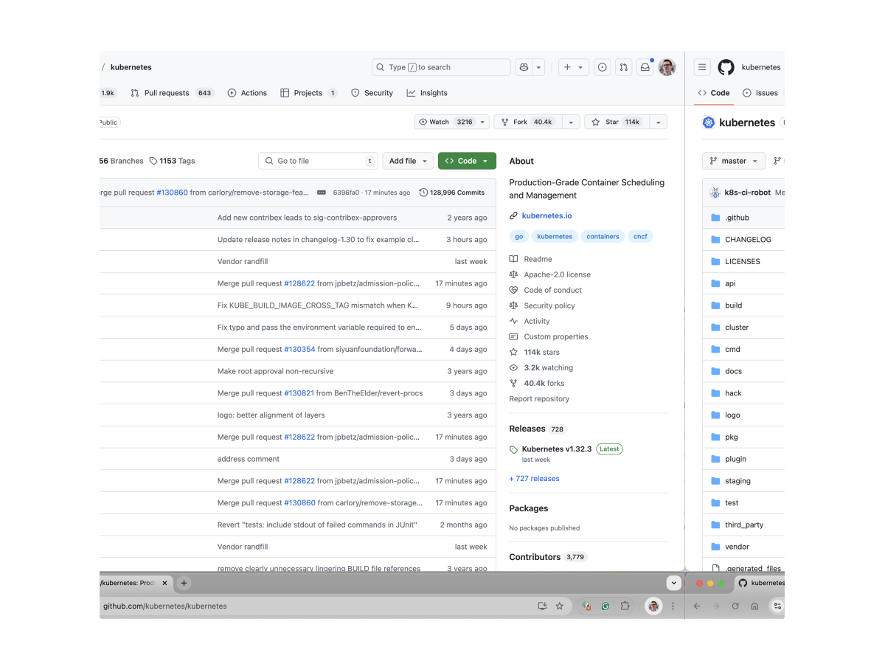
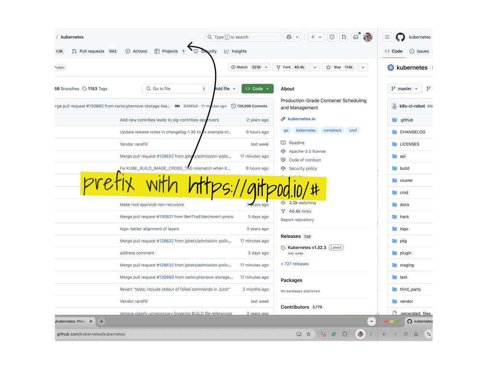
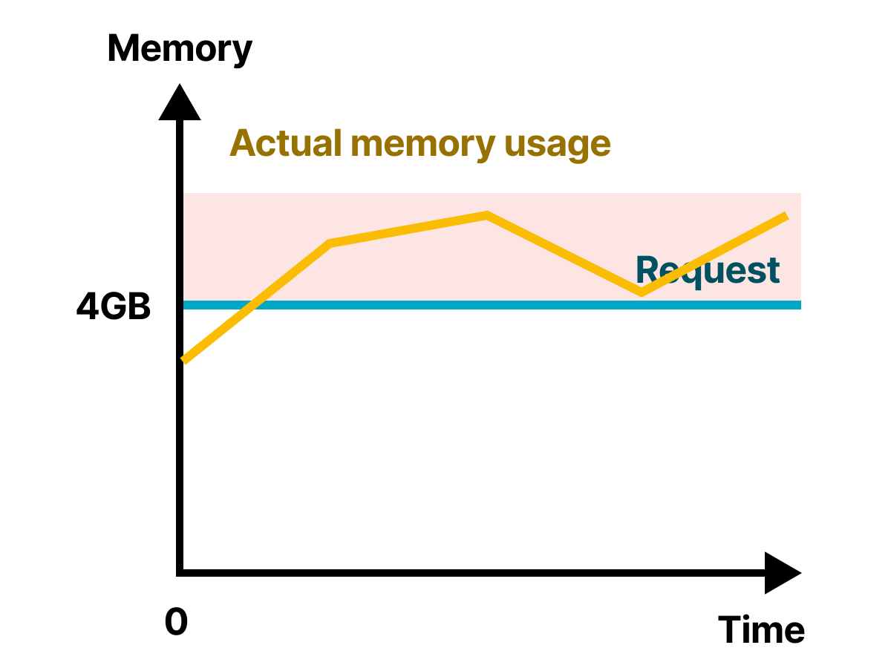
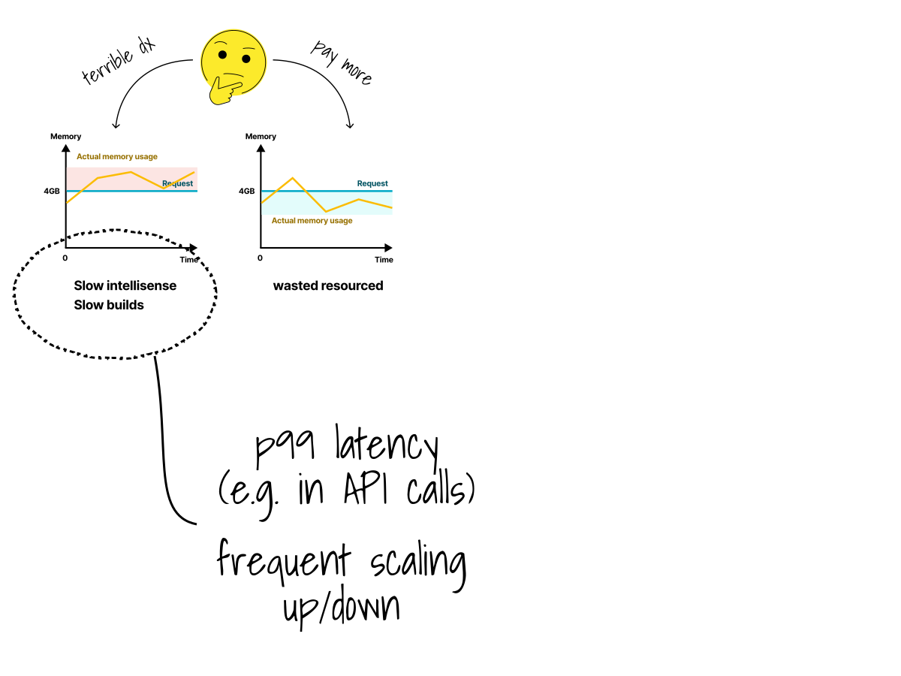
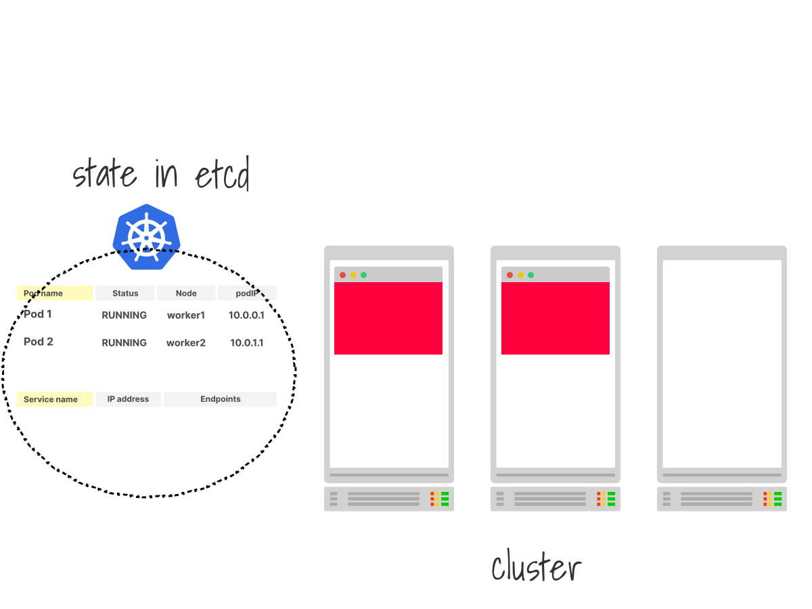
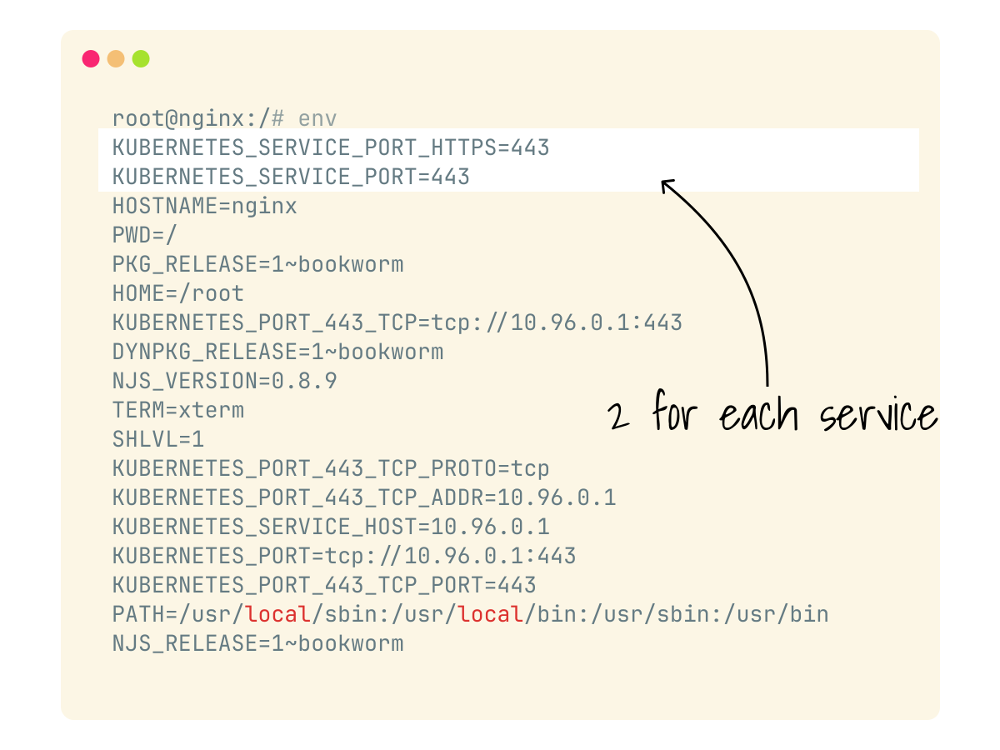
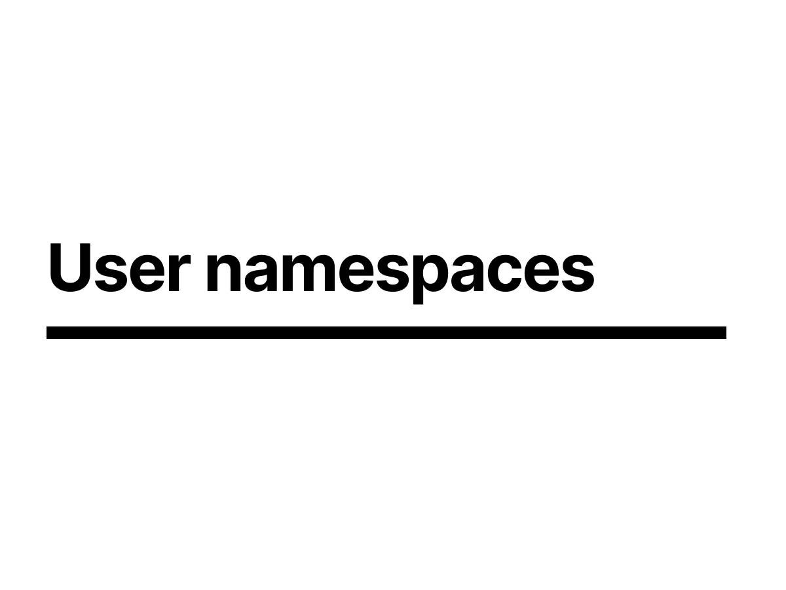
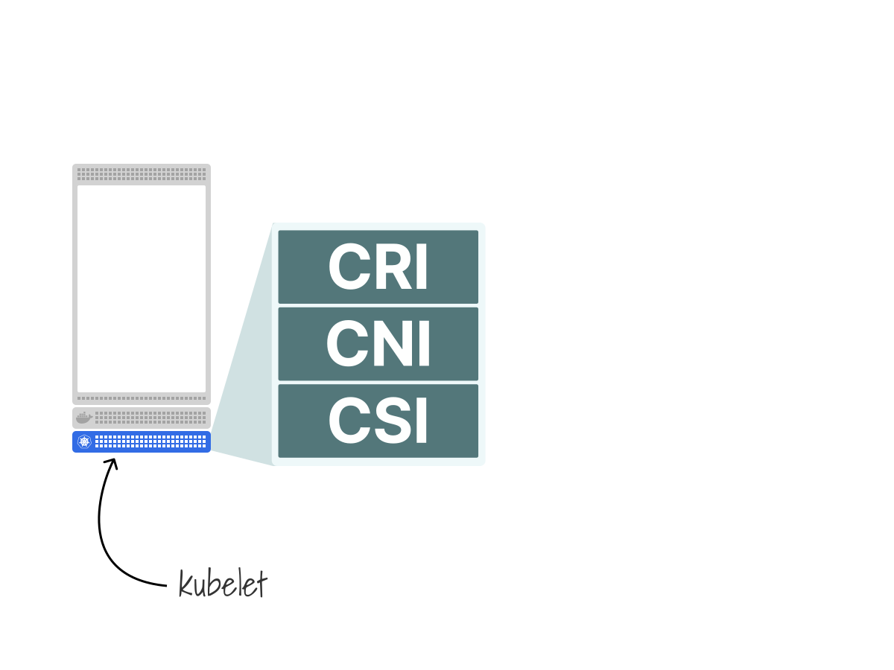
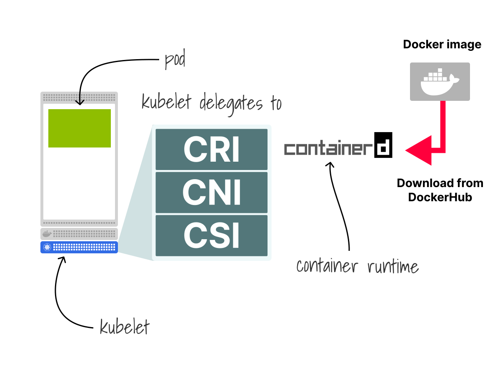
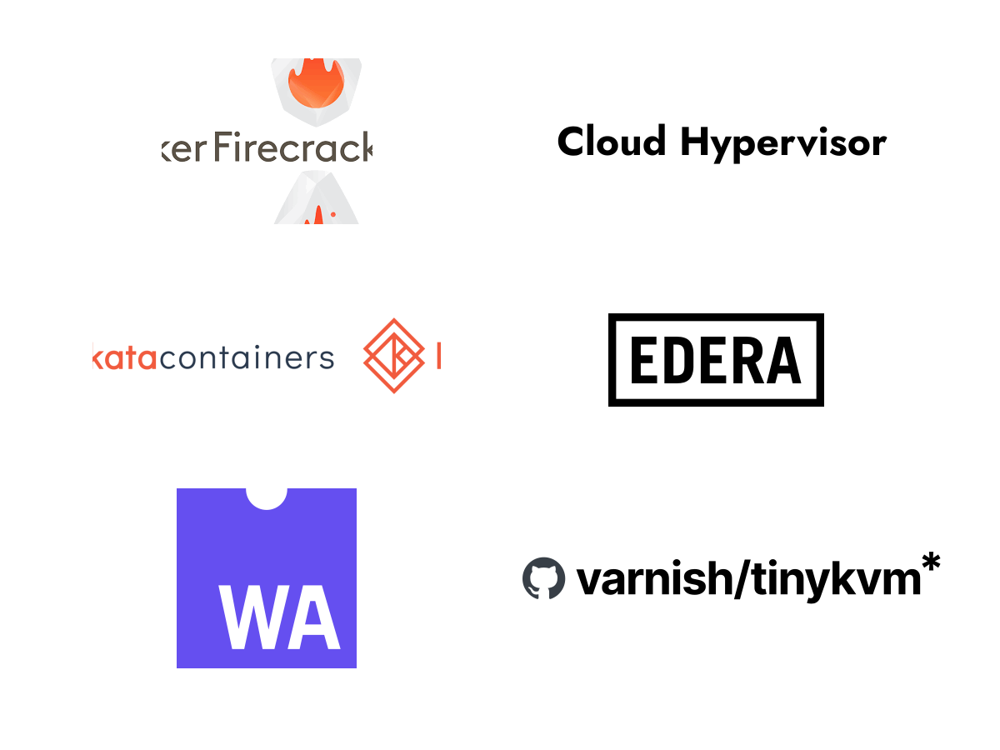

<!--
Hello!
-->

---

<!--
So, to kick things off my name is Chris Nesbitt-Smith, I'm based in London and currently work with some well known brands like learnk8s, control plane, and various bits of UK Government I'm also a tinkerer of open source stuff.

I've using and abusing Kubernetes in production since it was 0.4, believe me when I say its been a journey!

I've definitely got the war wounds to show for it.

We should have time for questions and your best heckles at the end, but if we run out of time or you're not watching this live, then please find me on LinkedIn or in the loft labs slack.

Right lets get going
-->

---

<!--
I'm going to spend a bit of time talking about security in the context of multitenancy with a case study.

With the caveat that I've based this entirely on publicly available information, so I'm likely off the mark on many of the points in how they relate to GitPod, they're a big company with much smarter people than I so they likely came up with more innovative solutions than anything I could consider in a few days to write this talk, but it still gives us something relatable to talk to.

So with caveats and disclaimers out of the way, lets dive in.
-->

---

<!--
If you've not used gitpod before, you can try it quite simply by going to your favourite github repository
-->

---

<!--
by simply prefixing the address with https://gitpod.io/# will
-->

---

<!--
take you through to a fully fledged development environment, much like github codespaces or Amazon's cloud9.
-->

---

<!--
GitPod is Open Source, so you can run your own instance in your organisation if you want to, particularly in regulated environments where you might otherwise end up using Virtual Desktop Infrastructure (VDIs) for development environments.
-->

---

<!--
The interface should feel very familiar to anyone who has used Visual Studio code or any of the forks
-->

---

<!--
You get a fully dedicated environment dynamically provisioned for you, with a full IDE and all the tools and plugins you're used to.
-->

---

<!--
This should run shivers down the spine of anyone beginning to think about the security implications of basically giving all your users the ability to execute arbitrary code on a remote server and not let one instance affect another, and thats just within a single organisation with a single trust boundary.
Imagine providing this publicly on one a gigantic Kubernetes cluster.
-->

---

<!--
The architecture for gitpod is pretty simple, if we take a familiar looking kubernetes cluster
-->

---

<!--
And we deploy Gitpod, each instance of a user's development environment is a pod on the cluster.
-->

---

<!--
And if we were to look inside a Gitpod Pod,
-->

---

<!--
we'd see something along the lines of this, with a single container running multiple processes
-->

---

<!--
arguably a bit of an anti-pattern for kubernetes purists, where you might expect to see a more microservice like architecture
-->

---

<!--
with a single process running in each container, and pods being 1:1 mapped to the containers apart from sidecars
-->

---

<!--
But why run this way?
-->

---

<!--
Because gitpod is multi-tentanted, each user needs all the resources for their environment locally, it also needs to be portable to run on environments that work quite like Kubernetes that allow you to compose pods.
-->

---

<!--
The complexity would be even more unweildly if you were to run something like this
-->

---

<!--
for every instance
-->

---

<!--
You might wonder why I'm even talking about GitPod, especially if you've followed the news
-->

---

<!--
Where they publicly declared that they're leaving kubernetes
-->

---

<!--
After trying relentless for 6 years!
-->

---

<!--
well they highlight some of the challenges they were facing, and the complexity of the architecture and give some clues that are interesting to dissect around resource management, security and networking
-->

---

<!--
So lets step through some of those starting with resource management
-->

---

<!--
Containers have requests
 -->

---

<!--
and limits
 -->

---

<!--
Which allows your application to live anywhere in the range up to the limit
 -->

---

## <!-- including below the request -->

<!--
When it's lower, you are still using all of your CPU and memory requests since those are guaranteed to the process.
-->

---

<!--
So if you allocate a large amount of memory, but your app uses a fraction, the rest is wasted
-->

---

<!--
No other process is allowed to used that memory.
-->

---

<!--
Over-allocating requests is a defensive strategy, but you end up paying for the resources that you don't use.
-->

---

<!--
An ideal scenario, memory and CPU consumption are close to the actual request value.
-->

---

<!--
When you define a request lower than the actual usage, your app uses more resources than what's guaranteed.
-->

---

<!--
If all apps are under allocating requests, the node will be often overcommitted and the kubelet will be forced to evict pods to maintain a reasonable amount of memory.
-->

---

<!--
Overcommitting could also trigger the autoscale more frequently, leading to nodes being provisioned and destroyed.
-->

---

<!--
This can present a challenge when you're trying to minimize cost while still providing a good experience for your users, not allowing them to impact one another.
-->

---

<!--
Since the shape of a user interactions will be very spikey, especially if they're using intellisense, building, compiling, running tests or even just linting
-->

---

<!--
So all your load will be bursty, and you'll likely find yourself frequently unwittingly exhausting your resources, exhausting the node, evicting pods, and probably triggering the autoscaler
-->

---

<!--
Consequently you're left between a rock and a hard place between terrible developer experience
-->

---

<!--
And paying over the odds

-->

---

<!--
We've got some options here,
The Completely Fair Scheduler is a Linux thing that you can use to give processes priority over one another, if you've used NICE before as a linux user then you'll understand the concept.
Its very hard to manage and low level
-->

---

<!--
Then they tried to do Dynamic resource allocation
which is basically adjusting the requests and limits on the fly, something you'd typically have to redeploy the application since they are immutable properties on the pod spec.
But that didn't really work for them because they can't really move the pods without disrupting the user experience, since they're anchored to the node, for the storage
-->

---

<!--
And then you can use SWAP memory which allows you to allocate more memory than you physically hold by using the swap space on the node, which kinda works, but is slow.
-->

---

<!--
Those are all quite involved, what are your options though?
-->

---

<!--
In gitpod's scenario this developer experience looks like slow intelisense, slow builds, tests and lints.
But in a more traditional application development scenario these are more likely to be presented as latency, so for example API calls to external services and other processing, maybe some machine learning or AI.
So your P99 latency is going to be less predictable causing frequent scaling up/down.
-->

---

<!--
Of course you could pay more which is what most people do and we generally gravitate towards, but there is a cost
-->

---

<!-- by overspecing the requests, but in that there will always be some CPU and memory that is not used -->

---

<!--
so if this is what our world looks like before
-->

---

<!--
we can increase the requests, and we accept that we're wasting a bit of money to just give us some headspace
-->

---

<!--
The other option of course is you can allocate a whole node which is possibly more extreme
-->

---

<!--
So to plot that a bit
-->

---

<!--
If we oversubscribe on resources, we're getting cheaper with some risks but reasonably managable
-->

---

<!--
or we can go fully isolated where you don't have a issue with noisy neighbours but its very expensive
-->

---

<!--
There is a option in between which is adjusting the requests and limits on the fly, which
-->

---

<!--
gets us a bit cheaper
-->

---

<!--
There are tools for this, that will basically track usage analyse the data and depending on your configuration of risk toleration will adjust the numbers on the fly
-->

---

<!--
There a few tools to do that like Stormforge, Perfect Scale
-->

---

<!--
And Kubex, but in essence they all do the same thing here.
-->

---

<!--
Second problem they talked about in the blog with gitpod was network complexity which was by far the biggest problem for them
-->

---

<!--
So they have loads of environments, and they want to spend the absolute minimum running them, they need to be super lightweight.
Naturally developers you want to make sure can't touch each others instances
well there is network policy for that
-->

---

<!--
GitPod is exposing a bunch of ports, which you'll obviously need if you're developing an application you'll want to expose your work to the outside world somehow
-->

---

<!--
Naturally the kubernetes answer to that is a service, which means a service for each pod
-->

---

<!--
At the beginning they started with an ingress per pod
-->

---

<!--
However found that didn't scale to well and caused lots of traffic to move unneccesarily around the cluster
-->

---

<!--
If I have all these tenants and they all need their own dedicated ingress controller, the cost is going to increase, I will need more resources to run these pods

-->

---

<!--
They then tried a single ingress
-->

---

<!--
like you might be more used to seeing
-->

---

<!--
However that presented the issue that they had too many services,
which isn't a thing you see very typically in most ordinary situations running regular web services
-->

---

<!--
Which you can help a bit by disabling the the service links configuration in the pod
-->

---

<!--
But they still got to a point where DNS was failing
-->

---

<!--
It worth a brief recap on how services work in kubernetes
-->

---

<!--
If we start with a clsuter that looks like this

-->

---

<!--
And we create a service
-->

---

<!--
The controller manager creates the Endpoint object and populates it with the IP address and port pairs from the Pods.

-->

---

<!--
Kube-proxy is a helper component that lives in the cluster
-->

---

<!--
 and subscribe to changes.
Which will then update the IPVS or iptables rules on the node
-->

---

<!--
with the intercept and rewrite rule on its node. In this case, three kube-proxies will write the same rules three times.
-->

---

<!--
At the same time, coreDNS will also be notified
-->

---

<!--
and dns entries will be created or updated accordingly
-->

---

<!--
So where are the issues
-->

---

<!--
Well it turns out, if you have a few thousand services in a cluster, managing these iptables can become slow and problematic, resulting in multi minute delays on propagation of service information
-->

---

<!--
And with servicelinks enabled as it is by default, every pod is going to have a awful lot of environment variables in scope, with 5000 services in the cluster, you can expect 10,000 environment variables, most of which it won't hopefully won't be able to access by network policy, and its also revealing of what else is going on in the cluster.
-->

---

<!--
But why is coredns so slow
-->

---

<!--
Its not entirely clear from their write up, but you can imagine that if you've many pods doing DNS lookups this could easily overload the internal DNS resolver
-->

---

## <!-- and also create lots of traffic within the cluster network -->

<!--
So what are your options to sharing resources
-->

---

<!--
So generally follow the normal kubernetes way of doing things and avoid having a dedicated thing for everything and share common resources
-->

---

<!--
GitPod did network policy to create isolations which is a great start, and you can do the same
-->

---

<!--
By default of course all pods in the cluster can talk to any other pod
-->

---

<!--
Network policies are a Kubernetes native object that give you the chance to define rules for your internal network.
For example, you might want to control all the outbound or inbound traffic for a namespace.
-->

---

<!--
Let's take a look at the example
-->

---

<!--
In this particular scenario, we want to limit the inbound traffic to the backend api server.
In particular we want to make sure that:
- The front-end component can issue API request.
- The authentication service cannot issue API requests.
-->

---

<!--
We can define a network policy that is just another YAML file.
-->

---

<!--
Lets look at all the environment variables that are created for each service
-->

---

<!--
We can disable the servicelinks at the pod level, which will prevent them being created,
as a sidebar, kubernetes has paid my bills for a while, but I absolutely loathe the inconsistent naming of things like this, nowhere else in the API does it name properties like this, but now we're stuck with it forever.
-->

---

<!--
Rant aside, setting this to false will prevent the environment variables being created, so no longer will there be 2 environment variables for each service port
This only ever existed to provide a consistency with Docker compose, drop a message in the chat if you're using this, or just tell me your favourite API bugbear
-->

---

<!--
And then when it comes to iptables limits, lets have a look at the current state of play
-->

---

<!--
In this cluster, the purple Pod makes a request to a `type: ClusterIP` Service.
-->

---

<!--
Now we know that the Service doesn’t exist.
The IP is just a placeholder.
As soon as the request reaches the network interface, it has to be intercepted and rewritten.
We have to pretend that the IP exists.
-->

---

<!--
So the request is changed on the fly and on of the Pod are selected as the destination.
-->

---

<!--
We're now back at the Pod to Pod scenario, which of course has to work as the first rule of Kubernetes networking.
-->

---

<!--
So the request is changed on the fly and on of the Pod are selected as the destination,
We've described iptables, but that of course it not the only technology that can do that, many things like modern service meshes use eBPF as a trendy new but actually old technology for this
-->

---

<!--
What about DNS scaling
-->

---

<!--
So what we can do is rather than every pod hitting the coredns service with every single query, if we see that coredns is getting overwhelmed
-->

---

<!--
We could run a daemonset that would intercept
-->

---

<!--
the queries and provide a local cache
-->

---

<!--
if when it it gets a cache hit, it can return the result locally,
-->

---

<!--
and only hit the upstream DNS if there is a cache miss
-->

---

<!--
though you'd have to be naturally careful to prevent cache poisoning
-->

---

<!--
However in the first scenario where coredns is shared
-->

---

<!--
if one of your tennants is creating more queries than the others, you've got the possiblity for one tenant to impact others, which is not an unreasonable thing to happen in the real world
-->

---

<!--
coredns provides some policies that you can apply which can act as a firewall to at least limit the traffic
-->

---

<!--
Obviously friends don't let friends run service mesh in production, but if you've got a bad friends
-->

---

<!--
You might find yourself taking your simple vanilla kubernetes cluster with simple networking
-->

---

<!--
And adding a service mesh to it with lots of extra proxies with benefits like more containers and processes running than you wanted, another thing to feed and water
-->

---

<!--
But it does allow you to define some policies
-->

---

<!--
to define how the traffic is allowed to flow through all that extra complexity
-->

---

<!--
The last one is workload isolation
-->

---

<!--
So the other issue they had, which they have a pod running, which are developer environments, so they'll want to basically have root access to the pod, because you'll want to do stuff like run on privilaged ports, install things, etc
-->

---

<!--
breaking your own pod, and maybe others near by you is a problem
-->

---

<!--
But it becomes dramatically worse in a hurry if they can start taking over the overall cluster, and a kubelet takeover can often become a rapid route to
-->

---

<!--
total cluster takeover, which is a very bad thing for someone trying to provide a trustable multi tenanted cloud developer environment
-->

---

<!--
So gitpod solved this with two ways, one is they use kubernetes user namespaces which is a beta feature still not currently generally available.
-->

---

<!--
The other is sandboxed runtimes
-->

---

<!--
So lets look at user namespaces to start with
-->

---

<!--
you basically run the pod as root, but with usernamespaces
-->

---

<!--
it uses namespaces in the linux kernel that will map root to any other user on the host node, which gives you the illusion of running as root, you can in general run anything you like, but you're contained
-->

---

<!--
Sandbox runtimes
-->

---

<!--
If we remember the interfaces in the kubelet with how it creates a pod
-->

---

<!--
most the time we create containers the them with the container runtime interface or CRI which is usually containerd by default
-->

---

<!--
Which will pull the cointainer image
-->

---

<!--
and then run the pod
-->

---

<!--
but of course it is modular, we can swap out containerd for something compatible like firecracker or a cloud hypervisor
-->

---

<!--
Which will run a lightweight VM basically with vscode inside, which isn't a necessarily bad idea, but isn't what they did
-->

---

<!--
So what could we do instead?
-->

---

<!--
You can mitigate the risk by reducing privileges in the container.
-->

---

<!--
You can set the securityContext property on the Pod or container level to restrict what a Pod or container can do.
Most of the time, you want to make sure that there are no privileged pods and the container does not run as root.
-->

---

<!--
Also be careful what capabilities do you assign, and only choose the ones you really need, e.g. the NET_ADMIN on the screenshot is usually not needed, so only assign it if it's needed.
-->

---

<!--
The other option you have is to run containers with a stronger isolation.
There are two projects that are popular in this space: gVisor and Katacontainers.
-->

---

<!--
The general idea with processes in the linux world is that every call such as reading from the filesystem of using the network from your application is dispatched to the Kernel?
-->

---

<!--
Well, with gVisor all those calls are proxied and you can set policies on what containers are allowed to do.
-->

---

<!--
Katacontainers takes a different approach
-->

---

<!--
to try to solve the issue by running every container in a lightweight VM, instead of filtering on the syscalls.

there are alternatives such as using the cloud hypervisor, firecracker, edera, webassemebly, tinykvm and others that all take a similar approach
there is current innovation in the space, and its worth keeping an eye on
-->

---

<!--
if you play back the talk Salman did a couple of weeks ago, his talk was basically that so long as its compatible, you maybe don't need the strong isolation for your non prod workloads, but you might want a more strong isolation for your prod workloads, so please go watch that back if you've not seen it already.

-->

---

<!--
What about security then, so I have spoken to you about sharing the cluster between various teams. What about security in that scenario.
Lets explore how we can apply that to start with, since theres zero overhead its a useful baseline
-->

---

<!--
Well let me present to you what Daniele presented in the first webinar. On the very left we have namespaces for multi tenancy and on the very right you have dedicated cluster per workload
-->

---

<!--
Within that spectrum there options that give you varying levels of isolation to trade with cost and complexity overhead.
-->

---

<!--
And its unlikely to be a situation where you just choose one, you'll likely have a mix of solutions and configurations of those to suit your needs.
-->

---

<!--
But as I said at the start, GitPod ultimately concluded on none of these, and you should always keep that in mind rather than trying to force with kubernetes is the answer whats the problem mentality.
-->

---

<!--
If you're able to understand what kind of constraints you have
 -->

---

<!--
and what goals you want to acheive
-->

---

<!--
you can begin to evaluate what kind of tooling you might need, and its important to do it that way round rather than solutions looking for a problem
-->

---

<!--
Aligned to that spectrum, looking back to Daniele's talk
-->

---

<!--
He spent some time mapping some of the tools to that spectrum in order to segregate tenants
-->

---

<!--
He gave a great overview

- Comparison of soft multi-tenancy vs. hard multi-tenancy (and everything in between)
- Evaluation of namespace-based, virtual cluster, and dedicated cluster approaches
- Criteria for selecting the most appropriate multi-tenancy strategy
- Comparison of tools such as vCluster, Capsule, Kamaji, kcp, k3k.
-->

---

<!--
What i am going to focus on is really this part the left hand side as dedicated clusters is hard so you can see we have a few option, I will talk about those
-->

---

<!--
I do want to point one thing out though that if you want crd isolation then its a bit trickey as crds are global objects. If thats is something that you want to look at you should definetly check vcluster as you can implement this without breaking the bank. Anyway lets look at these options starting from the left
-->

---

<!--  -->

<!--

-->

---

<!--
Once you've figured out your strategy of if a single cluster is sufficient
-->

---

<!--
or you need a cluster manager to orchestrate your orchestrators
-->

---

<!--
or dedicated clusters
-->

---

<!--
you can then layer on top the relevant tooling on that estate to make it meet your needs with the relevant tools be them built in kubernetes primitive things, or more complex solutions
-->

---

<!--
That was a long journey!
#recap-probes-1

-->

---

<!--
Kubernetes works best when you can share things, if you can share things, you'll find things easier
-->

---

<!--
However that sharing is predicated on a expectation that everyone is in the same trust domain, managing that sharing is much like dealing with a class of toddlers, it's hard and you'll be struggling to establish any degree of fairness

-->

---

<!--
Network resource is similarly difficult to divvy out fairly
-->

---

<!--
And limiting the blast radius of one workload to another in any sense is also hard
-->

---

<!--
In general security is a constant trade of security, and isolation for cost, complexity and usability
-->

---

<!--
And finally a quick thank you to loft labs, for hosting these three sessions with us.
If you've not seen them, then I'd consider Daniele and Salman's talk as essential watching, so absolutely go feast on those
-->

---

<!--
Thank you so much for your time, we've hopefully got some time for questions, if you don't get a chance to ask it, or you're not watching this live then please do drop a line in the loftlabs slack, or hunt me down on linkedin
-->
