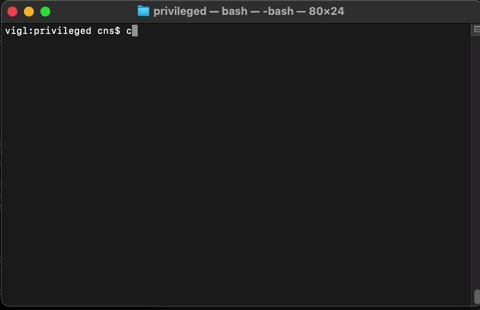
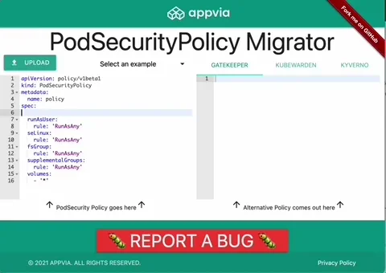
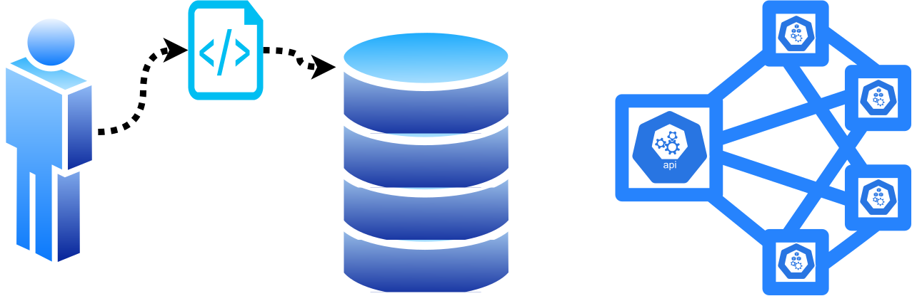
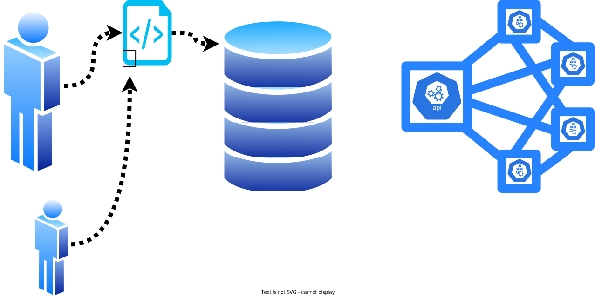
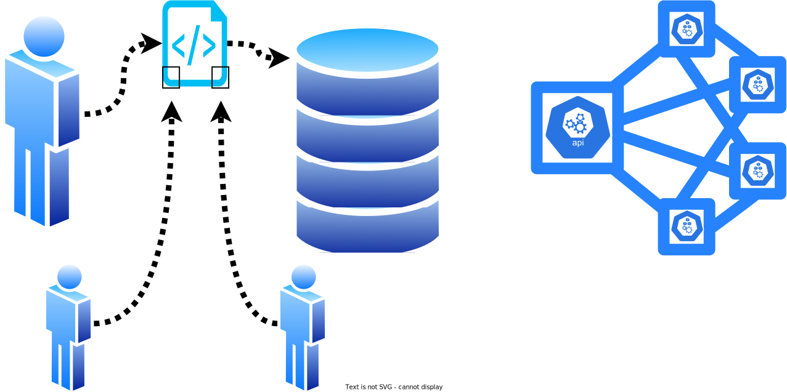
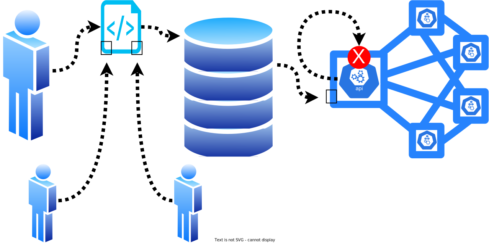
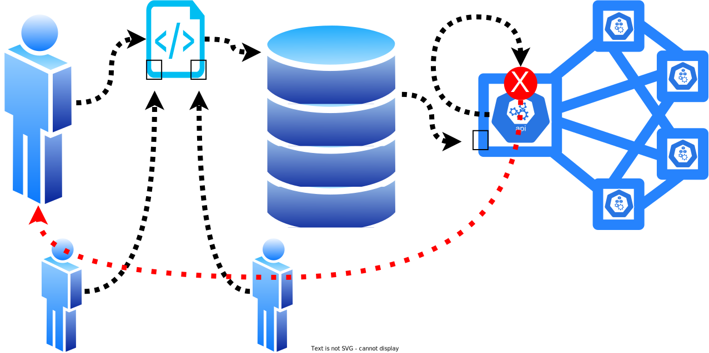
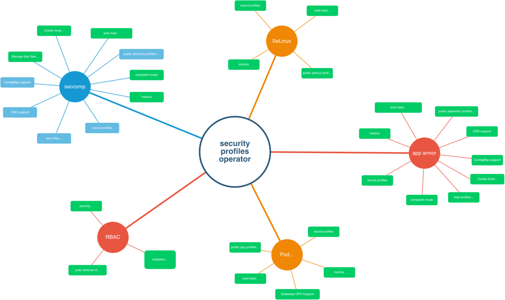
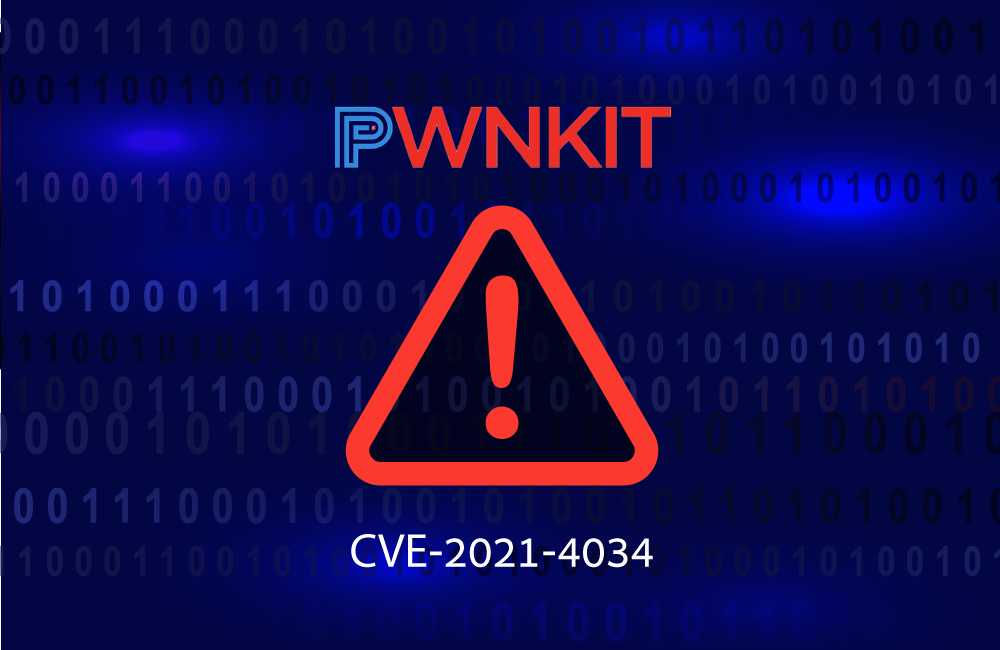

<!-- _class: lead invert -->

# PodSecurityPolicy is Dead,<br/>Long Live...?

Chris Nesbitt-Smith

Appvia | LearnK8s

---

# 👋<!--fit-->

<!--
Hello! Imagine a thing with human faces, what a treat.
My name is Chris, and I've been trying to use Kubernetes since 0.4 and I'm a masochist, clearly.

I'm Solution Architect at Appvia, instructor at LearnK8s, and tinkerer of open source including maintaining some high profile open source projects.

I'm often told I talk too fast when doing these, please shout at me if this happens, and jump in with questions though there will hopefully be time at the end if I don't get covered in rotten tomatoes and booed off.
-->

---

# `kubectl get pods` <!--fit-->

<!--
By show of hands who's worked with pods before?
-->

---

# 🙋🙋‍♀️🙋‍♂️<!--fit-->

---

```yaml
apiVersion: v1
kind: Pod
metadata:
  name: nginx
spec:
  containers:
    - name: nginx
      image: nginx:1.14.2
      ports:
        - containerPort: 80
```

<!--
Cool, and for anyone else, welcome to the party!

Pods are the smallest deployable units of computing that you can create and manage in Kubernetes and represents a single instance of a containerized application running in your cluster.
-->

---

# PodSecurityWhat?

<!--
Ok so now for the topic of this talk, pod security policies
-->

---

```yaml
kind: PodSecurityPolicy
```

<!--
They've been around since 1.0, which is about a million Kubernetes years.
-->

---

```yaml
apiVersion: policy/v1beta1
kind: PodSecurityPolicy
```

<!--
and in that time have never made it past the beta classification, and I believe may be last v1beta1 resource that is routinely used in production after ingress matured to a real v1 not long ago.
-->

---

# 😢 <!--fit-->

<!--
Sadly that's not the case for PSPs, they were deprecated in 1.21 April last year, and will be removed entirely in 1.25 which will be around August this year.
-->

---

<!-- _class: invert -->

# What is a PSP?

Pod Security Policies enable fine-grained authorization of pod creation and updates.

A Pod Security Policy is a cluster-level resource that controls security sensitive aspects of the pod specification. The PodSecurityPolicy objects define a set of conditions that a pod must run with in order to be accepted into the system, as well as defaults for the related fields.

https://kubernetes.io/docs/concepts/policy/pod-security-policy/

<!--
What is a PSP apart from more words than I'd put on a slide?
-->

---

<!-- _class:  invert fade -->

# What is a PSP?

Pod Security Policies enable **fine-grained authorization** of pod **creation** and **updates**.

A Pod Security Policy is a **cluster-level** resource that controls security sensitive aspects of the pod specification. The PodSecurityPolicy objects define a set of conditions that a pod must run with in order to be accepted into the system, as well as defaults for the related fields.

<!--
Thats better
PSPs give cluster admins an ability to impose limits over things like running as root, opening ports on the host, types of volume you can use etc
-->

---

```yaml
apiVersion: policy/v1beta1
kind: PodSecurityPolicy
metadata:
  name: example
spec:
  privileged: false
  seLinux:
    rule: RunAsAny
  supplementalGroups:
    rule: RunAsAny
  runAsUser:
    rule: RunAsAny
  fsGroup:
    rule: RunAsAny
  volumes:
    - "*"
```

<!--
If you've not seen one before it looks something like this
-->

---

# 👍 <!--fit-->

<!--
Sounds like a great idea right?
-->

---

# ✋ <!--fit-->

<!--
Not so fast bucko!
Theres a whole heap of usability issues you might have encountered if you'd tried to use them.
-->

---


<!--
The policy is based on the user that created the pod, not the workload.
If you're creating pods with CI for example that might require you to have multiple identities to authenticate to the API server with
But when was the last time you created a pod and not a deployment, statefulset or whatever else, well in that case the identity creating the pod is the service account for that controller
-->

---


<!--
Some of the parameters aren't simply admission controllers that accept or reject but mutating, this is not clear
-->

---


<!--
The of order of evaluation can be confusing and unpredictable with multiple policies
-->

---

# 🏃‍♀️ <!--fit-->

<!--
Only applies to new pods, not to anything already running in the cluster, which means you might not know if you introduce a policy if it breaks your production apps until they happen to try to reschedule and fail.
-->

---

# So now what? <!--fit-->

<!--
So what are the alternatives, what should we do
-->

---

# Admission Control | Anchore | Azure Policy | Istio | jspolicy | K-rail | Kopf | Kubewarden | Kyverno | OPA Gatekeeper | Opslevel | Polaris | Prisma Cloud | Qualys | Regula | Sysdig | TiDB

<!--
Theres a fair amount of choice, here's just a few, you can of course right your own, it is just a webhook.
-->

---

<!-- _class: fade lead invert -->

# Admission Control | Anchore | Azure Policy | Istio | jspolicy | K-rail | Kopf | **Kubewarden** | **Kyverno** | **OPA Gatekeeper** | Opslevel | Polaris | Prisma Cloud | Qualys | Regula | Sysdig | TiDB

<!--
I'm going to focus on a few, because with a little help they provide a straight forward-ish migration journey
-->

---

# Wait, what about </br>Pod Security Standards </br>and the</br> Pod Security Admission?

<!--
There is an 'in tree' answer i.e. built in to Kubernetes, so why am I not going to just point at that, grab my drink and walk off.
Pod Security Standards are most easily thought of as three rigidly defined predefined Pod Security Policies
-->

---

<!-- _class:  invert lead -->

# Privileged <!--fit-->

<!--
Those are privileged, basically anything goes, and is the same as not defining a policy
-->

---

<!-- _class:  invert lead -->

# Baseline<!--fit-->

<!--
Baseline, middle ground, stops some of the super obvious stuff, most your stuff should run at this tier without change
-->

---

<!-- _class:  invert lead -->

# Restricted<!--fit-->

<!--
Restricted, The most restrictive policy, stops most things.
You should aspire to run stuff here, but realistically you'll probably have issues
-->

---

<!-- _class:  invert lead -->

# 😀 <!--fit-->

<!--
Rigid universal policies sounds great, its super easy to communicate these between teams, test against them and no confusion when deploying between different clusters, happy days right?
-->

---

<!-- _class:  invert lead -->

# ☹️ <!--fit-->

<!--
Sadly not, for a few reasons
Ideally you'd run all your workload at restricted, but inevitably there'll be some things that can't quite fit that
Well restrictions are applied on a namespace level
And theres no way to grant fine grained exemptions, so your only option is to take a massive step down, and not for just the container but whole namespace
-->

---

<!-- _class:  invert lead -->

# 😱 <!--fit-->

<!--
Oh, and its applied with a label on the namespace, not even an annotation
WTF guys?!
So what's it good for, well the only thing I can see this as possibly good for is if you're a Software Vendor building products to run on Kubernetes.
-->

---

<!-- _class:  invert lead -->

# 😜 <!--fit-->

<!--
And if you're mad enough to be in that business
-->

---

<!-- _class:  invert lead -->

# 🌟 <!--fit-->

<!--
If you can make your product run in restricted then it'll give you a good head start for whatever unique configuration your customers have implemented and demonstrate that you have considered the security implications of your product
-->

---

# 🧓👴 <!--fit-->

<!--
Ok so how do we migrate all our old legacy PSPs to something new
Well there is unfortunately no simple like-for-like mapping, PodSecurityPolicy and any of the replacements behave slightly differently, and for good reason too.

If you’ve been using PodSecurityPolicy for a while, you’ve likely developed some quite complex rules which have become entangled with the usability issues, so I would encourage you to take the opportunity to refactor and simplify over trying to continue what you’ve always done.

That said, there has been some work to ease the transition by reproducing the key capabilities and even calling them the same things in some cases.
-->

---

# 🥁 <!--fit-->

<!--
The short answer is...
-->

---


<!--
use our whizz-bang-super-duper tool
-->

---



<!--
Simply provide your existing PSP and take your pick of policy engine from Kyverno, Kubewarden, or Gatekeeper.
-->

---



<!--
Or just paste it into our simple web app and let your browser do the work
-->

---

<!-- _class:  invert lead -->
<style scoped>
h1 {
  bottom: 0;
  position: absolute;
  font-size: 4em;
  -webkit-text-stroke-width: 3px;
  -webkit-text-stroke-color: black;
}
</style>

# Live demo


<!--
Live demo time!
-->

---

<!-- _class:  invert lead -->

# PodSecurityPolicy

```yaml
apiVersion: policy/v1beta1
kind: PodSecurityPolicy
metadata:
  name: example
spec:
  privileged: false
  seLinux:
    rule: RunAsAny
  supplementalGroups:
    rule: RunAsAny
  runAsUser:
    rule: RunAsAny
  fsGroup:
    rule: RunAsAny
  volumes:
    - "*"
```

<!--
Your PSP just converted seamlessly to
-->

---

<!-- _class:  invert lead -->

# Kyverno

```yaml
apiVersion: kyverno.io/v1
kind: ClusterPolicy
metadata:
  name: example
spec:
  rules:
    - validate:
        pattern:
          spec:
            "=(initContainers)":
              - "=(securityContext)":
                  "=(privileged)": false
            "=(ephemeralContainers)":
              - "=(securityContext)":
                  "=(privileged)": false
            containers:
              - "=(securityContext)":
                  "=(privileged)": false
        message: Rejected by psp-privileged-0 rule
      match:
        resources:
          kinds:
            - Pod
      name: psp-privileged-0
```

<!--
Kyverno . .
-->

---

<!-- _class:  invert lead -->

# Kubewarden

```yaml
apiVersion: policies.kubewarden.io/v1alpha2
kind: ClusterAdmissionPolicy
metadata:
  name: example
spec:
  module: registry://ghcr.io/kubewarden/policies/pod-privileged:v0.1.9
  rules:
    - apiGroups:
        - ""
      apiVersions:
        - v1
      resources:
        - pods
      operations:
        - CREATE
        - UPDATE
  mutating: false
  settings: null
```

<!--
Kubewarden . .
-->

---

<!-- _class:  invert lead -->

# OPA Gatekeeper

```yaml
apiVersion: constraints.gatekeeper.sh/v1beta1
kind: K8sPSPPrivilegedContainer
metadata:
  name: example
spec:
  match:
    kinds:
      - apiGroups:
          - ""
        kinds:
          - Pod
  parameters: null
```

<!--
or Gatekeeper . .
-->

---


<!--
That was easy
-->

---

# But, should you migrate from PodSecurityPolicy?

<!--
But should you?
Don't be fooled, just because I wrote a tool to help does not mean I think any of this is even remotely a good idea for the vast majority of use cases.

But it got your attention, now let me bend your ear.
-->

---

# 🚫 <!--fit-->

<!--
Using a cluster enforced policy does not guaranty any real security, and its hard to know the effectiveness of policy without constantly monitoring the impact it is having, by seeing how many requests are being rejected.
-->

---

# 🗝 <!--fit-->

<!--
The key to making this succeed is for all the stakeholders to understand the need, why their thing is being rejected
-->

---

# 🧙🧝‍♀️👩‍✈️👩‍🚀👩‍🚒🧑‍⚖️</br>🕵️‍♂️👩‍🌾💂‍♀️👳‍♀️🧕👷‍♀️ <!--fit-->

<!--
Imagine a problem that can't just be solved with a tools and requires you to focus on the people and process first. Shocking right?!
-->

---

# Shift ⬅️ <!--fit-->

<!--
We should always be thinking about shifting the process to the left so issues are caught as early as possible. Using cluster enforced policy alone does not help, the request to create the resource has to reach the API server, be authenticated and authorised before it is rejected/accepted. In order to get to that point the request would have gone through pipelines to be deployed and if the request is rejected valuable time and resources will have been wasted.

This is further exacerbated if your cluster enforced policy is based on the pod, since your deployment/daemonset/statefulset/job/crd/etc would be accepted by the API server and policy, but the pods it tries to create would be rejected within the internal loops within the controller or other operators present on the cluster.

Kubernetes is already complex enough, adding policies to the cluster adds another layer of complexity that needs to be managed, maintained and documented to ensure smooth operation of your cluster.

I’m not saying you shouldn’t have policies and security controls; but it’s too easy to get carried away and reinvent all the painful bureaucracy that ‘devops’ promised we wouldn’t have to endure.
-->

---

# GitOps? <!--fit-->

<!--

If you’re doing the latest buzzword of GitOps and you arguably should be then the only thing that can make changes to your cluster is the CI pipeline, theres a more to gitops but thats another talk for another day; the relevant bit I want to point at is version control is considered truth and no humans access the cluster directly in order to preserve that truth, so surfacing information back out requires some thought and extra process.

The consequence of policy being evaluated and enforced in the cluster is you’ve committed the cardinal sin of devops by shifting all that responsibility right and making it harder to observe.

A common story might look like this
-->

---



<!--
Person (a) writes a change to a deployment yaml file locally, yaml appears valid, so they push it to a branch and raise a pull request
-->

---



<!--
Person (b) looks at the diff, agrees with the change and approves it
-->

---



<!--
Because we live in an untrusting world, company policy stipulates that two people need to approve, so person (c) also approves
And one of those three people merges the changes
-->

---


<!--
CI/CD or something like flux picks up the change and successfully applies the changed deployment yaml to the Kubernetes cluster
-->

---


<!--
The deployment yaml was valid so is accepted by the api server
-->

---


<!--
The deployment controller creates a replicaSet and submits it to the Kubernetes API (which is also accepted by the api server)
-->

---



<!--
The replicaSet controller creates pods and submits to the API, the API server rejects these pods since they fail a PodSecurityPolicy Rule or similar cluster enforced policy.
-->

---



<!--
Not only do you need to create this line yourself, when you do eventually find out things aren't right you're left with rework and wasted time delivering zero business value dancing through security theatre, and depending on the application, you may have wiped out production until you can go through the security theatre of pull request approvals etc.

Imagine how much even more complicated this can get with changes to the policy itself!
-->

---

<!-- _class:  invert lead -->

# Cut to the chase Chris,</br>What’s the answer? <!--fit-->

<!--
Cluster policy is fine but failures should cause alerts you’d be glad to be awoken at 3am to deal with.

They should represent genuine incidents, not just a developer trying to do their job.
-->

---

# as-code<!--fit-->

<!--
Infrastructure as Code is the answer for this all. Developers who write code solved this problem a long time ago with linters and static analysis, and they have a passion for running these FAST, and consistently, in their IDE, and then in CI before any pull request review occurs which assures that the teams code all looks similar and conforms to some mutually agreed standards the team develops.
-->

---


<!--
You can have as many policies you like as long as these policies are treated as code, committed into source control and versioned accordingly. This will give you a complete view of the policies in use in your cluster at any point in time and help understand the risk landscape, target what workloads should be supported and when you should stop supporting a given policy version.
-->

---


<!--
The key thing is that your developers should be able to evaluate against that policy locally, maybe even within their editor and your CI pipeline and version control can enforce compliance.

Your cluster level policy failures should then be limited to real fires where something has gone drastically wrong and a 3am call will cause warranted panic and gratitude for the policy’s existence.
-->

---

# ⚠️👀 <!--fit-->

<!--
If you’re going to turn on warnings rather than just rejections, be sure someone will see them, if your gitops is even vaguely real, that won’t be a human in the first instance, so your teams will need to get that in front of them somehow; otherwise what’s the point?
-->

---


<!--
Some would argue that setting cluster policy is at the point of execution, the last protection as it were.
But when we actually look at the mechanics, the checks are run on the control plane, the worker node and container runtime is not checking anything, it is trusting the word of api server with its limited capability to carry out checks, wow, you couldn’t get further from zero trust could you.
-->

---

# Trusted<br/>!=<br/>Trustworthy <!--fit-->

<!--
So how can you get closer to that zero trust nirvana?
Fortunately the linux kernel, the same marvel that brings us containers, provides a few capabilities for this.
-->

---

<style scoped>
li {
  font-size: 3em;
}
</style>

<!-- prettier-ignore -->
* seccomp
* AppArmor
* SELinux

<!--
In short [click]
Seccomp can reduce the chance that a kernel vulnerability will be successfully exploited.[click]
AppArmor and [click] SELinux can prevent an application from accessing files it should not.
-->

---

# + ☸️<!--fit-->

<!--
And Kubernetes exposes these, hurrah!
-->

---

<style scoped>
h1 {
  font-size: 4em;
}
</style>

# Not Easy


<!--
However, managing them is not easy, so unsurprisingly lots of commercial products have entered the space with all sorts of buzzwords like ‘artificial intelligence’ and ‘machine learning’.

These commercial offerings are great and can simplify the implementation but it’s worth understanding how things are working under the hood and electing how much control you might relinquish to an algorithm.
-->

---



<!--
Relatively recently a Kubernetes special interest group has developed the Security Profiles Operator which works to expose the power of seccomp, SELinux and AppArmor to end users.

The technologies are not mutually exclusive, and I would encourage combining them.
-->

---



<!--
In fact its worth noting that seccomp even the default policy would mitigate some recent high profile vulnerabilities like Polkit's Pwnkit that any cluster admission policy would have waved through.
-->

---

# appvia.github.io/psp-migration

# github.com/appvia/psp-migration

<!--
If you must, feel free to use the PSP migration tool.
-->

---

<style scoped>
li {
  font-size: 2em;
}
</style>

# Summary

<!-- prettier-ignore -->
* appvia.github.io/psp-migration
* KiSS
* Shift ⬅️
* SecurityProfilesOperator
<!--
So to wrap things up [click]
use our tool[click]
Keep it Stupid Simple, refrain from liberal use of of pod based cluster enforced policy[click]
carry out as many of those checks using CI/CD pipelines as the priority before looking to cluster enforced policy [click]
Look at Security Profiles Operator and maybe commercial products in this space that leverage seccomp, apparmor and or selinux 
-->

---

<!-- _class: invert -->
<style scoped>
h2 {
  position: absolute;
  bottom: 1ch;
  left: 2vw;
  width: 95%
}
</style>

# 🙏 Thanks 🙏 <!--fit-->


- cns.me
- github.com/chrisns
- github.com/appvia
- appvia.io/blog

## Chris Nesbitt-Smith <!--fit-->

<!--
Thanks for your time, hopefully this has been interesting
Feel free to follow me on LinkedIn, Twitter, Github and you can be assured there'll be no spam since I'm awful at self promotion especially on social media. cns.me just points at my linkedin

At Appvia we're doing a tonne of opensource, so checkout both mine and the appvia github orgs, star and watch to your hearts content.

The original content for this talk and similar stuff in this space including how to do Policy as Versioned Code are on the appvia blog.

Questions are very welcome on this or anything else, I'll hold the stage as long as I'm allowed, or find me afterwards, I'm pretty thirsty so I'll be over there.
-->
