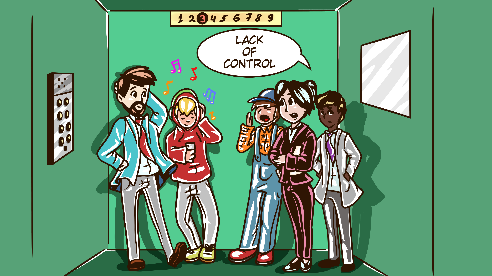
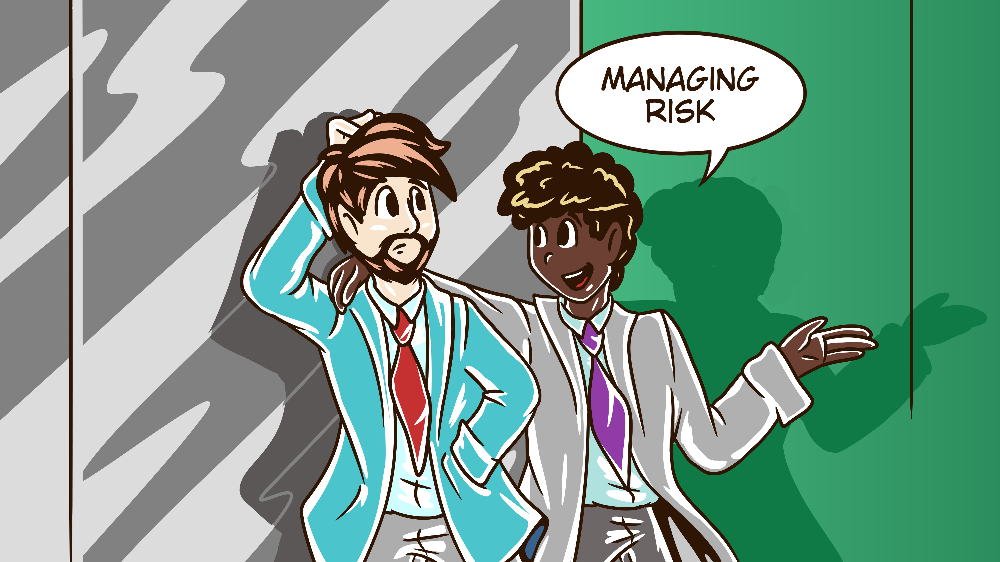

<!-- _class: invert front -->

# Policy as _[versioned]_ Code <!--fit-->

## Chris Nesbitt-Smith

### UK Gov | esynergy | ControlPane | LearnK8s </br>& lots of open source

---

# 👋<!--fit-->

<!--
Hello! Imagine a thing with human faces, what a treat, I get to stand up, not worry about being on mute, use my clicker and everything!

This is exciting!
-->

---

# 🐘🥱<!--fit-->

<!--
Ok, elephant in the room, policy is a dull thing, its kinda hard to make sexy, but I'm going to try and get your attention, so bare with me.
-->

---


<!--
So to set the scene I'm in the lift (yes, American friends we really do call them lifts) four people walk in.

I think to myself, Chris! this is your moment, now or never. as the door closes, I position myself in front of the door, a captive audience, they're mine, I've got them. I hear the doors seal shut behind me, I take a breath.
-->

---


<!--

I look at the first person on my left, she's in a suit, she looks really important, I gesture to her C...
-->

---


<!--
she looks back to me as if to say yes, go on,
eye she nods,
Oh.
ok perfect the CIO the policy maker, the one who's neck is on the block, what are the chances of finding you in my imaginary lift today?

I ask her, what keeps you up at night?
-->

---


<!--

She tells me
I don't know what teams are really doing what, the volume of risk and what I should show more interest in.
-->

---


<!--
Setting and changing policy is slow and hard to communicate
-->

---



<!--

People just go off and do their own thing, they think they know better, and to be honest often they do, but I'm left playing catchup with the risk they've signed me up to
-->

---


<!--

Ok, I say. trying not to sound like a patronizing snake oil salesman I can help.
-->

---


<!--

I turn my attention to the second person, in a suit, look less important. I make a guess, (lets face it, this is my imagination it'd be weird if I was wrong). Product manager I say, they nod. ah the whip cracker I say. What's important to you?
-->

---



<!--

Managing risk, mostly opportunity risk, the fear of missing out. so getting features out the door, avoiding getting bogged down with
-->

---


<!--
 (they glance to the CIO) bureaucracy that is designed to slow me down.
-->

---


<!--

Awesome I say, this is your lucky day.
-->

---


<!--

I turn to the next person, dressed in overalls, I am in a trendy part of town, they could be the CTO, before I ask they sense me staring at them. -->

---


<!--
Cleaner they say, errr ok how did you get in my imagination, let me come back to you.
-->

---


<!--

My attention goes to the last person, hoodie, headphones round their neck. Ah my stereotypical developer, yes I know you well. -->

---


<!--
What code do you write I ask (it doesn't matter), python, cool have you got everything updated to work with, I pause, Python 3? they say, yeah, python 3, that must be hard I add. They don't know it yet but I've won their trust which is important. Nearly they say. cool. Whats important to you?
-->

---


<!-- Staying on top of patching dependencies, so we can react to the next fire.
-->

---


<!--
Knowing what rules exist, what ones I can bend, what I can break, and what might cause me to loose my job.
-->

---


<!--
Writing consistent good quality code, avoiding technical debt, the rest of my team being able to cohesively work as one.
-->

---


<!--
Use any tools to help you with that I ask?
Yeah, linters, code quality and test coverage tools, the usual.
-->

---

# @TODO: 20 me handing a qr code

<!--

Great I say, I write code too, lets be friends, I hand them a printed QR code here's my public gpg key, so you know to trust me what I say.
-->

---

# @TODO: 21 person in boiler suit

<!--

I return my focus to the cleaner, I've got it, How do you get told what to do, and when it changes.
-->

---

# @TODO: 22 memo stuck to notice board

<!--
We get a memo, or something stuck to the notice board, last week we got a memo saying that all the meeting room whiteboards need to be cleaned every night.
Interesting I say, how does that work out, well its up to us to then maintain the todo list, so we can on board new people.
-->

---

# @TODO: 23 binder full of docs

<!--Go wrong at all? yeah, sometimes if when we compile our operational manual we miss a memo, or don't apply them in sequence we get things wrong, -->

---

# @TODO: 24 person in boiler suit glances apologetically at man in suit

<!--
they glance apologetically to the product manager, like when we hadn't updated the guide that the meeting room on the 3rd floor was being used as a dedicated war room, and we wiped their boards down.
-->

---

# @TODO: 25 person in hoodie, nodding

<!--
I look to the dev, sound familiar I ask, they nod.

Turns out we're not all special snowflakes hey!

Ah all is not lost, I knew there was a reason I imagined you here.
-->

---

# @TODO: 26 all of us in lift, focus drawn to floor number counter

<!--

The lift is slowing, I feel it coming to its destination

Great, I have got the silver bullet for you too.
-->

---

# @TODO: 27 important business woman pulling money out their pockets

<!--
The CIO looks to me ready to buy whatever it is I'm selling, they ask me as the doors open who are you, what team are you in?
-->

---

# @TODO: 28 me moving out way of door

<!--
As I move out the way so to stop obstructing the door I answer, oh I don't work here, I'm just here to fix the lift, people have been complaining it only goes to the top floor no matter what button they push and is actually pretty slow.
-->

---

# @TODO: 29 all 4 people leaving lift towards sign to stairs

<!--
My audience storms out, furious, heading towards the stairs, the door shut, I get back to my job.
-->

---

# @TODO: 30 business woman, business man, dev cleaner in a line up

<!--
Ok so if any of that sounds familiar, and you relate to my imaginary friends then I've got the answers for you.
-->

---

<!-- class: lead invert -->

# What if... <!--fit-->

<!--
What if I said:
-->

---

<!-- class: lead invert -->

# Update policy... <!--fit-->

<!-- You could update policy easily, even releasing several version updates, not just in a year, a month -->

---

<!-- class: lead invert fade-->

# Update policy... <br/>**Daily!?**<!--fit-->

<!--
what about ten updates in a single day, and seamlessly communicate that to people that need to consume it without derailing them?
-->

---

<!-- class: lead invert -->

# 👀<!--fit-->

<!--
You could have visibility on compliance using tools you already use?
-->

---

<!-- class: lead invert -->


<!--
That policy could be readily consumable, easy to parse, demonstrate compliance, make sense and not be bureaucratic to change when it needs to be and not get in the way?
-->

---

<!-- class: lead invert -->

# 👩‍👦 <!--fit-->

<!--
That same policy could be treated as a dependency, and operate like a linter, so you can run compliance checks locally, in CI and guard production ultimately
-->

---

<!-- class: lead invert -->

# 👨‍👨‍👦‍👦 <!--fit-->

<!--
That multiple versions of policy like a dependency are supported, so emergencies like you must update now because theres now known vulnerabilities type updates are a business as usual activity to communicate.
-->

---

<!-- class: lead invert -->

# 🤔<!--fit-->

<!--
Interesting, ok, hang around.
-->

---

<!-- class: lead  -->

# ⏲<!--fit-->

<!--
HOW AM I DOING FOR TIME? .... GREAT, THANKS, I THINK I'VE GOT THIS, YOU CAN UNLOCK THE DOOR NOW.
-->

---

<!-- _class: white -->


# Chris Nesbitt-Smith<!--fit-->

- Learnk8s & ControlPlane - Instructor+consultant
- eSynergy - Digital Transformation Consultant
- Crown Prosecution Service (UK gov) - Consultant
- Opensource

<!--
Now I've hopefully got your attention, its time to introduce, and start explaining myself.

Hi, My name is Chris Nesbitt-Smith, I'm an instructor for Learnk8s and ControlPlane, consultant at eSynergy, Crown Prosecution Service and tinkerer of open source.
I've spent a fair chunk of my professional career now working in UK Government and large organizations where problems like these are rife.

I've been promised we'll have time for questions and heckles at the end, even if I run way over, if not come find me at the bar afterwards.
-->

---

# 🙋👩‍🌾👩‍🚒</br>🙋‍♀️🦹‍♀️🙋‍♂️<!--fit-->

<!--
Given I've got the luxury of an audience, and most of you have clothes on for a change.
By show of hands who's with my CIO and set, written, or applied policy before?
-->

---

<!-- _class: lead invert -->

# 👩‍🌾🙋🙋‍♂️</br>🦹‍♀️🙋‍♀️👩‍🚒<!--fit-->

<!--
Ok, thanks, you can put your hands down.
now how many have sought exemption or consciously bent, broken, circumvented, ignored, bypassed, whatever a policy with at least good intentions?
-->

---

<!-- _class: lead invert -->

# 😜<!--fit-->

<!--
HA, you fell for it.-->

---

# 📝 <!--fit-->

<!--We've got all your names and employers details, so put your phones down, lend me your ears, the stakes just got raised.
-->

---


<!--
Where do I see policy as code going wrong?
-->

---

<style scoped>
section {
  font-size: 2.7em;
}
h1 {
  font-size: 2em;
}
</style>

<!-- _class: invert -->

# `policy`

### noun [ C ]

### UK /ˈpɒl.ə.si/ US /ˈpɑː.lə.si/

`a set of ideas or a plan of what to do in particular situations that has been agreed to officially by a group of people, a business organization, a government, or a political party`

<!--
Before we dig into that, what do I mean by policy
-->

---


<!--
It usually comes in one of two forms
-->

---

# 🔐 <!--fit-->

<!-- Security enforcing, like data at rest being encrypted -->

---

# 👯‍♀️<!--fit-->

<!--
Consistency enforcing such as code style, tabs being two or four space indentation maybe
-->

---

<!-- _class: invert lead -->

# 🎰 <!--fit-->

<!--
Or maybe you can think of some others, but in any case its hopefully intended to mitigate a risk of some sort
-->

---

# 🤪🎛 <!--fit-->

<!--
However with the best of intentions these are often emotionally led rather than being grounded in a proportionate control which is the open door to case-by-case exemptions being required when you come against a situation you weren't anticipating
-->

---

# 👩‍⚖️ <!--fit-->

<!-- This is not unlike how the laws of the land are created, with case law making for a complex to navigate rulebook, and harder still to measure compliance -->

---


<!--
It often looks like the thin bit of a wedge, where the precedent which may have been an uncomfortable pill to swallow the first time round, becomes dangerous with others looking to expand its scope.
-->

---

# 💊 | 🦠<!--fit-->

<!-- which can lead us to sometimes wonder if the cure is actually worse than the disease -->

---

# 👩‍💻<!--fit-->

<!-- but thats not how we (at least typically) develop software, so why does this have to be so hard? there must be a better answer -->

---

# Policy, as `<code/>`? <!--fit-->

<!-- we've codified everything else so isn't this the answer, well yes in part but my point of this talk is we do it wrong -->

---

<!-- _class: listline animate lead  -->
<style scoped>
li {
  font-size: 1.7em;
}
</style>

- Admission Control
- Anchore
- Apparmor
- Azure Policy
- Checkov
- Istio
- jspolicy
- K-rail
- Kopf
- Kubewarden
- Kyverno
- Network Policy
- OPA Gatekeeper
- Opslevel
- Polaris
- Prisma Cloud
- Qualys
- Rego
- Regula
- Seccomp
- SeLinux
- Sentinel
- ServiceControlPolicy
- Sysdig
- TiDB

<!--
Maybe some of you are screaming your favorite product name at me in your heads as the solution, and you're not wholly wrong
-->

---

# 👹 <!-- fit -->

<!-- Devil in the detail though, throwing some curly braces at something doesn't inherently fix things though. -->

---

# 🤫 <!-- fit -->

<!-- If it's a security control its often tempting to keep the policy a secret, exposing it could maybe be used against you by an adversary  -->

---

# SHIFT⬅️? <!-- fit -->

<!-- however that does not support us shifting left at all, it results in devs effectively reverse engineering what the policy is by finding out when we smash our heads against it -->

---

# ✅❌✅✅✅ = ❌<!-- fit -->

<!-- it doesn't take much imagination to see that in the scenario of an application deploy midway through finding one resource is non-compliant and rejected would leave the overall deploy in an inconsistent halfway state likely resulting in downtime -->

---

<!-- _class: invert -->


<!-- Which begs the question of was the policy better than the downtime -->

---


<!-- Especially if it leads your engineers who are hopefully all plenty smart finding 'inventive' shall we say ways around the -->

---


<!-- computer says no response they got. -->

---


<!-- this is further exasperated when updates to the policy are desired, maybe you get a pen test or something goes wrong so you form that case law and need to apply a new policy, maybe all s3 buckets now need to be encrypted, a change that could be considered a 'breaking change' -->

---

<!-- _class: invert lead -->

# But, we just provide <!--fit-->

# `warn`ings not `error`s? <!--fit-->

<!-- sure you might say that you provide warnings, on at least the less important issues or new emerging policy, which is great
 -->

---

# 👀 <!--fit-->

<!-- So long as someone sees them -->

---

<!-- _class: invert lead -->

# _~~jenkins~~_

# gitops <!--fit-->

<!-- But if you've adopted gitops or at least CI/CD is anyone seeing those warnings? Who studies the results of a successful build log every time? -->

---


<!-- anyone, every time? -->

---

# ✅ = 👍 <!--fit-->

<!-- Well if you are, I'd politely suggest you're probably missing the point of CI/CD, you should be able to trust your job status -->

---


<!-- Ok, well I'm not here today to just throw stones -->

---


# (easily:)

- visible
- communicable
- consumable
- testable
- usable
- updatable
- measurable

<!-- Remember my implied promises to my four imaginary friends of what the promised land might look like?-->

---


<!-- well theres nothing new under the sun, we've already unwittingly solved these problems elsewhere, we just need to be reminded and join the dots -->

---


 <!-- well the first is something if you're doing policy as code, you're probably already doing, put it in version control. the thing you might not be doing though is then making that visible -->

---

# >= inner source <!--fit-->

<!-- so at least inner source this, by which i mean allow anyone within your walled garden (employees, suppliers etc) to see the policy, I'm not saying give all your threat monitoring rules and intel away, you can probably keep those to yourself, but I'd argue visible policy and the gaps therein is often better than downtime, reverse engineered workarounds, and opaque legacied exemption spaghetti soup.
-->

---

# open source? <!--fit-->

<!-- If you're brave you might even open source it, you'll find it unlocks the ability to work well with prospective suppliers without NDAs and what not, and widely distributed secrets are expensive to maintain, difficult to handle and often only stay secret for so long after all -->

---


# (easily:)

- visible ✅
- communicable
- consumable
- testable
- usable
- updatable
- measurable

<!-- Ok, we're off to a good start, our policy is visible now to those that need to see it -->

---

# semver <!--fit-->

# (semantic versioning)

<!-- many of you are no doubt used to semantic versioning, but a quick recap -->

---

<!-- _class: fade lead -->

# **1**.20.300 <!--fit-->

# **Breaking change**

<!-- The first segment is to indicate breaking, perhaps conflicting changes, in the context of policy, lets say it's requiring resources to have a department label, maybe that'll help with some internal cross charging, who knows, I'm not judging -->

---

<!-- _class: fade lead invert -->

# **2**.20.300 <!--fit-->

# **Breaking change**

<!-- An increment to that might look like requiring that to be from a predetermined list rather than be freetext -->

---

<!-- _class: fade lead  -->

# 2.**20**.300 <!--fit-->

# **Minor change**

<!-- The second segment is to indicate minor changes, that shouldn't break anyone   -->

---

<!-- _class: fade lead invert -->

# 2.**21**.300 <!--fit-->

# **Minor change**

<!-- An increment to that might look like correcting a spelling mistake one of the department names -->

---

<!-- _class: fade lead -->

# 2.21.**300** <!--fit-->

# **Patch change**

<!-- The third segment is to indicate patch changes, these should be a no brainer to keep to to date with -->

---

<!-- _class: fade lead invert -->

# 2.21.**301** <!--fit-->

# **Patch change**

<!-- An increment to that might look like adding a department to the available options -->

---


# (easily:)

- visible ✅
- communicable ✅
- consumable
- testable
- usable
- updatable
- measurable

<!-- Ok so our policy is visible in a repository now, its versioned so we can easily communicate the policy, we can tack on release notes, and expectations are managed by semantic versioning -->

---

# `sudo apt-get install coffee`<!--fit-->

<!-- in software we're used to handling dependencies, so what if your policy was just another dependency -->

---

<!-- _class: lead invert -->

# `npm install --save-dev eslint`<!--fit-->

<!--you might unwittingly already be doing this if for example you have eslint as a dependency in your javascript package perhaps? -->

---


# (easily:)

- visible ✅
- communicable ✅
- consumable ✅
- testable
- usable
- updatable
- measurable

<!-- Ok so our policy is visible in a repository now, its versioned so we can easily communicate the policy, we can tack on release notes, and expectations are managed by semantic versioning, you know, like software! -->

---

# unit testing <!--fit-->

## no really...

<!-- ok, i know testing is a dirty word, but in order to make this an asset everyone can depend on, and also provide known good examples, tests are essential to give  -->

---


# (easily:)

- visible ✅
- communicable ✅
- consumable ✅
- testable ✅
- usable
- updatable
- measurable

<!-- everyone confidence in the stability and surface potential side effects before they hurt everyone involved. -->

---

# SHIFT ⬅️<!--fit-->

<!-- consumers of this policy need to be able to test themselves against the policy locally and in CI/CD -->

---


# (easily:)

- visible ✅
- communicable ✅
- consumable ✅
- testable ✅
- usable ✅
- updatable
- measurable

<!-- thus shortening the feedback loop better informing -->

---

# bonus[able]: reliable <!--fit-->

<!-- so as a bonus, we should find our consumers able to rely on the artifact we're sharing with them -->

---

<style scoped>
h1 {
  margin-top: -0.21em;
  font-size: 35em;
}
</style>

# ♼

<!-- we're well and truly on the home stretch, its a dependency so updating it should be no different to any other -->

---


# (easily:)

- visible ✅
- communicable ✅
- consumable ✅
- testable ✅
- usable ✅
- updatable ✅
- measurable

<!-- we can even use some magic like github's dependabot or whitesource's renovate to do that for us, think automatic pull requests, tests, even auto merging if you like -->

---

# 🦹‍♀️🙋👩‍🚒</br>🙋‍♀️👩‍🌾🙋‍♂️<!--fit-->

<!-- ok, to check you're awake still, can anyone tell me a recent event that caused people to want to know what version of a certain logging java doohickey you were potentially running literally everywhere in the estate? -->

---


# CVE-2021-44228 <!--fit-->

<!-- yup, as you know all presentations this year are contractually required to reference log4j -->

---


<!-- _class: invert lead -->

# CVE-2021-45046 <!--fit-->

<!-- even when its almost entirely out of context -->

---


# CVE-2021-45105 <!--fit-->

<!-- and include some memes.

in just a few short months I can remove these and hopefully -->

---


<!-- just point broadly at a list of scary looking CVEs in order to command your behavior through fear


https://www.cvedetails.com/vulnerability-list/cvssscoremin-9/cvssscoremax-10/vulnerabilities.html
-->

---


<!-- What I'm getting at here though is, the situational awareness piece around software supply chain is something your organization is hopefully already  -->

---


<!-- thinking about if not already addressing, so if our policy is a dependency this at least not a new problem. Software Bill of Materials for the win right? -->

---


# (easily:)

- visible ✅
- communicable ✅
- consumable ✅
- testable ✅
- usable ✅
- updatable ✅
- measurable ✅

<!-- Which can allow us to measure the compliance across the estate -->

---


<!-- I've just covered a lot of ground, and hopefully sounded convincing, and not just a fictional utopia painted in powerpoint -->

---

# `/\w*able/g` <!--fit-->

<!-- its time to look at how you might be *able* to do this and -->

---


# 🙄🤖 <!--fit-->

<!--
I know you really came here wanting to see a million words on a slide not just an emoji or two-->

---


<!-- so we've reached the point where I show you some code, hooray! -->

---


<!-- to maintain scope, I'm going to limit this to talking about two things, to prove its not just one tech, or tool. -->

---

# terraform + k8s <!--fit-->

<!--  I've arbitrarily picked terraform and Kubernetes -->

---


<!--but I could have picked anything -->

---

# 🛠 <!--fit-->

<!-- naturally I'll need some tools to go along with this, I'm too lazy to invent anything here -->

---

<!-- _class: fade listline lead  -->
<style scoped>
li {
  font-size: 1.7em;
}
</style>

- Admission Control
- Anchore
- Apparmor
- Azure Policy
- **Checkov**
- Istio
- jspolicy
- K-rail
- Kopf
- Kubewarden
- **Kyverno**
- Network Policy
- OPA Gatekeeper
- Opslevel
- Polaris
- Prisma Cloud
- Qualys
- Rego
- Regula
- Seccomp
- SeLinux
- Sentinel
- ServiceControlPolicy
- Sysdig
- TiDB

<!--
so likewise I'm going to pick two tools, but again I could use any, some, or even all, probably. Checkov will do my terraform, kyverno will to my kubernetes.
-->

---

<!-- _class: white -->

# github.com/policy-as-versioned-code <!--fit-->


<!-- If you want to browse along with me, I've created a example git hub organization here, I'm not expecting you to read or grok the code on screen, so don't worry about it too much, its just to prove its a real thing. -->

---

<!-- _class: white -->


<!-- The policy is stored here -->

---

<!-- _class: -->
<style scoped>
pre {
  width: 45%;
}
pre:nth-child(2) {
  right: 1vh;
  position: absolute;
}
</style>

# v1.0.0 policy

```yaml
# kyverno kubernetes
apiVersion: kyverno.io/v1
kind: ClusterPolicy
metadata:
  name: require-department-label
  annotations:
    policies.kyverno.io/title: Require Department Label
    policies.kyverno.io/category: Example Org Policy
    policies.kyverno.io/description: >-
      It is important we know the department that resources
      belong to, so you need to define a 'mycompany.com/department'
      label on all your resources.
    pod-policies.kyverno.io/autogen-controllers: none
spec:
  validationFailureAction: enforce
  background: false
  rules:
    - name: require-department-label
      validate:
        message: >-
          The label `mycompany.com/department` is 
          required.
        pattern:
          metadata:
            labels:
              "mycompany.com/department": "?*"
```

```yaml
# checkov terraform
metadata:
  name: >-
    Check that all resources are tagged with
    the key - department"
  id: "CUSTOM_AWS_1"
  category: "CONVENTION"
scope:
  provider: aws
definition:
  and:
    - cond_type: "attribute"
      resource_types: "all"
      attribute: "tags.mycompany.com.department"
      operator: "exists"
```

<!-- so heres where my policy starts at v1.0.0 I've got policy that requires a department label on all resources, so long as its set, doesn't matter what it is -->

---

<!-- _class: invert -->
<style scoped>
pre {
  width: 45%;
}
pre:nth-child(2) {
  right: 1vh;
  position: absolute;
}
</style>

# v1.0.0 policy tests

```yaml
# fail0.yaml
apiVersion: v1
kind: Pod
metadata:
  name: require-department-label-fail0
spec: ...
---
# pass0.yaml
apiVersion: v1
kind: Pod
metadata:
  name: require-department-label-pass0
  labels:
    mycompany.com/department: finance
spec: ...
```

```js
// fail0.tf
resource "aws_s3_bucket" "b" {
  bucket = "my-tf-test-bucket"
}
---
// pass0.tf
resource "aws_s3_bucket" "b" {
  bucket = "my-tf-test-bucket"
  tags = {
    mycompany.com.department = "finance"
  }
}
```

<!-- I've written tests for this, note how the passing test cases are usable as a great example of what good and bad looks like -->

---

<!-- _class: white -->


<!-- we've pushed a tag in git, we've added release notes, I can sign it to provide further assurance if my heart so desires. -->

---

<!-- _class: white -->


<!-- it does (obviously)

moving on-->

---

<!-- _class: -->
<style scoped>
pre {
  width: 45%;
}
pre:nth-child(2) {
  right: 1vh;
  position: absolute;
}
</style>

# v2.0.0 policy

```yaml
# kyverno kubernetes
apiVersion: kyverno.io/v1
kind: ClusterPolicy
metadata:
  name: require-department-label
  annotations:
    policies.kyverno.io/title: Require Department Label
    policies.kyverno.io/category: Example Org Policy
    policies.kyverno.io/description: >-
      It is important we know the department that resources
      belong to, so you need to define a 'mycompany.com/department'
      label on all your resources.
    pod-policies.kyverno.io/autogen-controllers: none
spec:
  validationFailureAction: enforce
  background: false
  rules:
    - name: require-department-label
      validate:
        message: >-
          The label `mycompany.com/department` is required to be one
          of [acounts|hr]"
        pattern:
          metadata:
            labels:
              "mycompany.com/department": "acounts|hr"
```

```yaml
# checkov terraform
metadata:
  name: >-
    Check that all resources are tagged with the key - department"

  id: "CUSTOM_AWS_1"
  category: "CONVENTION"
scope:
  provider: aws
definition:
  or:
    - cond_type: "attribute"
      resource_types: "all"
      attribute: "tags.mycompany.com.department"
      operator: "equals"
      value: hr
    - cond_type: "attribute"
      resource_types: "all"
      attribute: "tags.mycompany.com.department"
      operator: "equals"
      value: acounts
```

<!-- version 2.0.0 looks similar, only now that department field has to be one of a predetermined list, like before, tests exist, release notes are written, tags are signed -->

---

<!-- _class: invert -->
<style scoped>
pre {
  width: 45%;
}
pre:nth-child(2) {
  right: 1vh;
  position: absolute;
}
</style>

# v2.1.0 policy

```yaml
# kyverno kubernetes
apiVersion: kyverno.io/v1
kind: ClusterPolicy
metadata:
  name: require-department-label
  annotations:
    policies.kyverno.io/title: Require Department Label
    policies.kyverno.io/category: Example Org Policy
    policies.kyverno.io/description: >-
      It is important we know the department that resources
      belong to, so you need to define a 'mycompany.com/department'
      label on all your resources.
    pod-policies.kyverno.io/autogen-controllers: none
spec:
  validationFailureAction: enforce
  background: false
  rules:
    - name: require-department-label
      validate:
        message: >-
          The label `mycompany.com/department` is required to be one
          of [accounts|hr]"
        pattern:
          metadata:
            labels:
              "mycompany.com/department": "accounts|hr"
```

```yaml
# checkov terraform
metadata:
  name: >-
    Check that all resources are tagged with the key - department"

  id: "CUSTOM_AWS_1"
  category: "CONVENTION"
scope:
  provider: aws
definition:
  or:
    - cond_type: "attribute"
      resource_types: "all"
      attribute: "tags.mycompany.com.department"
      operator: "equals"
      value: hr
    - cond_type: "attribute"
      resource_types: "all"
      attribute: "tags.mycompany.com.department"
      operator: "equals"
      value: accounts
```

<!--
This is where we notice and correct a spelling mistake of one of the options in that list of departments
-->

---

<!-- _class: -->
<style scoped>
pre {
  width: 45%;
}
pre:nth-child(2) {
  right: 1vh;
  position: absolute;
}
</style>

# v2.1.1 policy

```yaml
# kyverno kubernetes
apiVersion: kyverno.io/v1
kind: ClusterPolicy
metadata:
  name: require-department-label
  annotations:
    policies.kyverno.io/title: Require Department Label
    policies.kyverno.io/category: Example Org Policy
    policies.kyverno.io/description: >-
      It is important we know the department that resources
      belong to, so you need to define a 'mycompany.com/department'
      label on all your resources.
    pod-policies.kyverno.io/autogen-controllers: none
spec:
  validationFailureAction: enforce
  background: false
  rules:
    - name: require-department-label
      validate:
        message: >-
          The label `mycompany.com/department` is required to be one
          of [tech|accounts|hr]"
        pattern:
          metadata:
            labels:
              "mycompany.com/department": "tech|accounts|hr"
```

```yaml
# checkov terraform
metadata:
  name: >-
    Check that all resources are tagged with
    the key - department"
  id: "CUSTOM_AWS_1"
  category: "CONVENTION"
scope:
  provider: aws
definition:
  or:
    - cond_type: "attribute"
      resource_types: "all"
      attribute: "tags.mycompany.com.department"
      operator: "equals"
      value: hr
    - cond_type: "attribute"
      resource_types: "all"
      attribute: "tags.mycompany.com.department"
      operator: "equals"
      value: accounts
    - cond_type: "attribute"
      resource_types: "all"
      attribute: "tags.mycompany.com.department"
      operator: "equals"
      value: tech
```

<!-- I've now added a new department to the list. -->

---

<style scoped>
table {
  font-size: 2em;
}
</style>

# app1 (k8s) | infra1 (tf) <!--fit-->

| 1.0.0 | 2.0.0 | 2.1.0 | 2.1.1 |
| ----- | ----- | ----- | ----- |
| ✅    | ❌    | ❌    | ❌    |

<!-- app1 and infra1 depend on version 1.0.0 of the policy, it is not compliant with version 2.0.0 or beyond, but how do I know that? -->

---

```json
$schema: "https://docs.renovatebot.com/renovate-schema.json",
labels: ["policy"],
regexManagers: [{
  fileMatch: ["kustomization.yaml"],
  matchStrings: ['mycompany.com/policy-version: "(?<currentValue>.*)"\\s+'],
  datasourceTemplate: "github-tags",
  depNameTemplate: "policy",
  packageNameTemplate: "policy-as-versioned-code/policy",
  versioningTemplate: "semver",
},{
  fileMatch: [".*tf$"],
  matchStrings: [
    '#\\s*renovate:\\s*policy?\\s*default = "(?<currentValue>.*)"\\s',
  ],
  datasourceTemplate: "github-tags",
  depNameTemplate: "policy",
  lookupNameTemplate: "policy-as-versioned-code/policy",
  versioningTemplate: "semver",
}],
```

<!-- I've configured renovate to automatically make a pull request -->

---

<!-- _class: white -->


<!--  when theres a new version of the policy, so its super obvious if I can update my dependency, and I can see -->

---

<!-- _class: invert -->


<!-- clear feedback about where and why I'm not compliant -->

---


<!-- I can also see all the pull requests over the org, so I can measure the compliance of my policy
https://github.com/pulls?q=is%3Aopen+is%3Apr+archived%3Afalse+user%3Apolicy-as-versioned-code
-->

---

<style scoped>
table {
  font-size: 2em;
}
</style>

# app2 (k8s) | infra2 (tf) <!--fit-->

| 1.0.0 | 2.0.0 | 2.1.0 | 2.1.1 |
| ----- | ----- | ----- | ----- |
| -     | ✅    | ☑️    | ☑️    |

<!-- moving on from that app2 and infra2 depend on version 2.0.0 of the policy -->

---

<!-- _class: white -->


<!-- however we could merge the open pull request all the way up to 2.1.1 -->

---

<style scoped>
table {
  font-size: 2em;
}
</style>

# app3 (k8s) | infra3 (tf) <!--fit-->

| 1.0.0 | 2.0.0 | 2.1.0 | 2.1.1 |
| ----- | ----- | ----- | ----- |
| -     | -     | -     | ✅    |

<!-- finally app3 and infra3 are dependent on 2.1.1 they get a gold star from the CIO -->

---

<!-- _class: invert lead -->

# 🪄 <!--fit-->

<!-- there is a small touch of magic, and its not pretty -->

---

# `#!/bin/bash` <!--fit-->

<!-- I've written some bash -->

---

<!-- _class: white -->


<!-- don't judge me, even though I've probably, definitely, written worse -->

---

<!-- _class: white -->

<style scoped>
pre {
  width: 50%;
}
h1 {
  width: 50% !important;
  right: 1vh;
  position: absolute;
}

</style>

# 👩‍💻 <!--fit-->

```bash
$ docker run --rm -ti \
  -v $(pwd):/apps \
  ghcr.io/policy-as-versioned-code/policy-checker

Found kustomization.yaml
Checking policy version...
Policy version: 1.0.0
Fetching Policy...
Policy fetched.
Running policy checker...

Applying 1 policy to 1 resource...
(Total number of result count may vary as the
policy is mutated by Kyverno. To check the
mutated policy please try with log level 5)

pass: 1, fail: 0, warn: 0, error: 0, skip: 0
```

<!-- what this does is allows me from my dev laptop or in CI to evaluate my code against the version of policy, ideally this might be less cumbersome, but it is what it is for now, pull requests are welcome! -->

---

# 🧩 <!--fit-->

<!-- and the last piece to the puzzle is managing the lifecycle of the policies, and allowing multiple versions of policy to be accepted and evaluated within a single runtime -->

---

# k8s ~~terraform~~ <!--fit-->

<!-- I've cheated a bit here, kube gives you admission controllers, its not so easy to get the same policy evaluation in a cloud, they've got their their own policy code, I've not figured how to be able to evaluate that policy locally, again pull requests, contribution, collaboration are all very welcome -->

---

<!-- _class: invert lead -->

# many-to-many <!--fit-->

<!-- You may have noticed the way the policy is designed and distributed lends it self well to co-exist in a Kubernetes cluster -->

---

<!-- _class: white -->


<!-- which brings us to the cluster1 which describes a cluster that accepts all the versions we've described so far -->

---

<!-- _class: white -->


<!-- likewise cluster2, only accepts 2.0.0 and greater -->

---

<!-- _class: white -->


<!-- we automate using KiND for CI to deploy the apps -->

---

<!-- _class: white -->


<!-- and there we have it a full org all done, all compliant, policy all versioned, CIO all aware of whats going on -->

---


<!-- So this is great, but just one more thing, wouldn't it be awesome if the the policy carried a story of why it exists -->

---


<!-- after all if your agile team is even half effective it will reject anything it perceives as friction if it doesn't see value in it -->

---

# ⁉️ <!--fit-->

<!-- it could allow our devs to know why they're compliant, and if they want to do something outside what the policy permits, they don't need any sort of exemption granted per-say, they can have a well reasoned and informed debate with rationale behind a pull request to the policy -->

---

# 💡 <!--fit-->

<!-- imagine, if you will, this going through a stage of versions, with risks that inform the mitigations manifested as policy maintained as one.
so when the risk landscape changes, your policies can move with it -->

---


<!-- when some new privacy regulation comes out, or your latest marketing strategy pays off and you acquire more data for example, even if your policy was perfect at one time, the risks and the appetite stand still for no one -->

---


<!-- we can liken this to over provisioning, that we might be familiar with elsewhere, where lead times are long, change is hard, and there is a significant pressure in nailing it first time, which can lead to hedging bets against what some future state might be, rather than proportionate mitigation to risks that are more tangibly real in the now -->

---


<!-- thats where the real culture change is needed, and the execution of that is likely a long series of talks in itself -->

---


<!--
So now this is really over to you, honestly the best thing you could do right now is tell me its madness, already done, irrelevant or otherwise unachievable; something my esteemed echo chamber of peers has yet to do. -->

---

# @TODO: line up of 4 people again (img30)

<!--
So beyond making pull requests and developing the theory more, I'd really like to start building a case study with a willing real organization, and allow me to swap out my imaginary friends for real ones -->

---

# 🗣📢🧠 <!--fit-->

<!-- But the most important thing I want you to remember from our time together is that.

And feel free to say it out loud with me
-->

---

<!-- _class: invert fade -->

# <code> **Purposeless** policy </br>is potentially</br>practically</br>pointless policy. </code><!--fit-->

<!-- Purposeless -->

---

<!-- _class: invert fade -->

# <code>Purposeless **policy** </br>is potentially</br>practically</br>pointless policy.</code><!--fit-->

<!-- policy is -->

---

<!-- _class: invert fade -->

# <code>Purposeless policy </br>is **potentially**</br>practically</br>pointless policy.</code><!--fit-->

<!-- potentially -->

---

<!-- _class: invert fade -->

# <code>Purposeless policy </br>is potentially</br>**practically**</br>pointless policy.</code><!--fit-->

<!-- practically -->

---

<!-- _class: invert fade -->

# <code>Purposeless policy </br>is potentially</br>practically</br>**pointless** policy.</code><!--fit-->

<!-- pointless-->

---

<!-- _class: invert fade -->

# <code>Purposeless policy </br>is potentially</br>practically</br>pointless **policy**.</code><!--fit-->

<!-- policy. -->

---

<!-- _class: invert fade -->

# <code>Purposeless policy </br>is potentially</br>practically</br>pointless policy.</code><!--fit-->

<!-- I've been practicing saying that far too many times. -->

---

<!-- _class: invert -->
<style scoped>
h2 {
  position: absolute;
  bottom: 1ch;
  left: 2vw;
  width: 95%
}
</style>

# 🙏 Thanks 🙏 <!--fit-->


- cns.me
- talks.cns.me
- github.com/chrisns
- github.com/policy-as-versioned-code
- learnk8s.io

## Chris Nesbitt-Smith <!--fit-->

<!--

I've been Chris Nesbitt-Smith, thanks for your time, you're now free to leave, I'll destroy the evidence of your guilt admissions earlier - no really I will

Like subscribe whatever the kids do these days on LinkedIn, Github whatever and you can be assured there'll be no spam or much content at all since I'm awful at self promotion especially on social media. cns.me just points at my LinkedIn.

talks.cns.me contains this and other talks, they're all open source.

-->

---

<!-- _class: invert end lead-->
<style scoped>

</style>

# Q&A🙋‍♀️🙋🙋‍♂️ <!--fit-->


### </br>

<div class="container">
  <div class="glitch" data-text="cns.me">cns.me</div>
  <div class="glow">cns.me</div>
</div>
<div class="scanlines"></div>

#### github.com/policy-as-versioned-code

## Chris Nesbitt-Smith <!--fit-->

<!--
Questions are very welcome on this or anything else, I'll hold the stage as long as I'm allowed, or find me afterwards, I'm pretty thirsty so I'll be over there.
-->
