<!-- _class: title-page-->

<div>
<svg class="waves" xmlns="http://www.w3.org/2000/svg" xmlns:xlink="http://www.w3.org/1999/xlink"
viewBox="0 24 150 28" preserveAspectRatio="none" shape-rendering="auto">
<defs>
<path id="gentle-wave" d="M-160 44c30 0 58-18 88-18s 58 18 88 18 58-18 88-18 58 18 88 18 v44h-352z" />
</defs>
<g class="parallax">
<use xlink:href="#gentle-wave" x="48" y="0" fill="rgba(255,255,255,0.7" />
<use xlink:href="#gentle-wave" x="48" y="3" fill="rgba(255,255,255,0.5)" />
<use xlink:href="#gentle-wave" x="48" y="5" fill="rgba(255,255,255,0.3)" />
<use xlink:href="#gentle-wave" x="48" y="7" fill="#fff" />
</g>
</svg>
</div>

<div class="scanlines"></div>

# ⚡️ Policy as <br/> &nbsp;&nbsp;&nbsp;&nbsp;&nbsp; _[versioned]_ Code

<div class="glitch emoji" data-text="🤔">🤔</div>

## Chris Nesbitt-Smith

### UK Gov | esynergy | Control Pane | LearnK8s | lots of open source

---

<!-- class: lead invert -->

# ⚡️ <!--fit-->

<!-- This is a lightning version of a longer talk, of a longer blog, of a longer thesis.
Strap in, I've only got ten minutes for about a hundred slides
-->

---

# 🐘🥱<!--fit-->

<!--
Elephant in the room, policy is not sexy, but I'm going to try and get your attention.
-->

---


<!--
So to set the scene I'm in the lift (yes, American friends we really do call them lifts) four people walk in.

Chris! this is your moment, a captive audience. I hear the doors seal shut behind me, I take a breath.
-->

---


<!--
I look at the first person, CIO the policy maker, the one who's neck is on the block, what are the chances of finding you in my imaginary lift today?

I ask her, what keeps you up at night?
-->

---

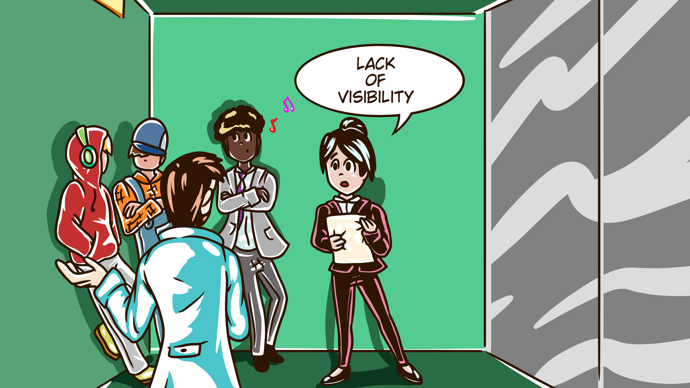

<!--
Don't know what teams are doing.
-->

---


<!--
Setting and changing policy is slow and hard to communicate
-->

---


<!--
People go off and do their own thing, they do know better, but I'm left playing catchup with the risk they've signed me up to
-->

---

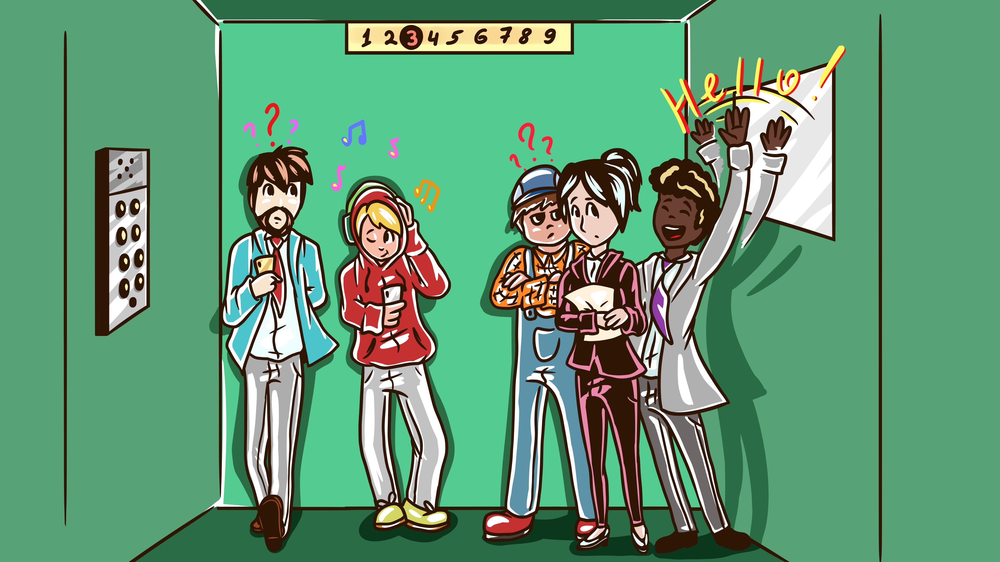

<!--
Second person, Product manager - the whip cracker. What's important to you?
-->

---


<!--
Managing risk, mostly opportunity risk, the fear of missing out. getting features out the door, avoiding getting bogged down with
-->

---


<!--
bureaucracy that seems designed to slow me down.
-->

---


<!--
Next person, dressed in overalls, they could be the CTO, before I ask, -->

---


<!--
Cleaner they say, errr ok how did you get in my imagination, I'll come back to you.
-->

---


<!--
My attention goes to the last person, hoodie, headphones. Ah my stereotypical developer, I know you well. -->

---


<!--
Whats important to you?
-->

---

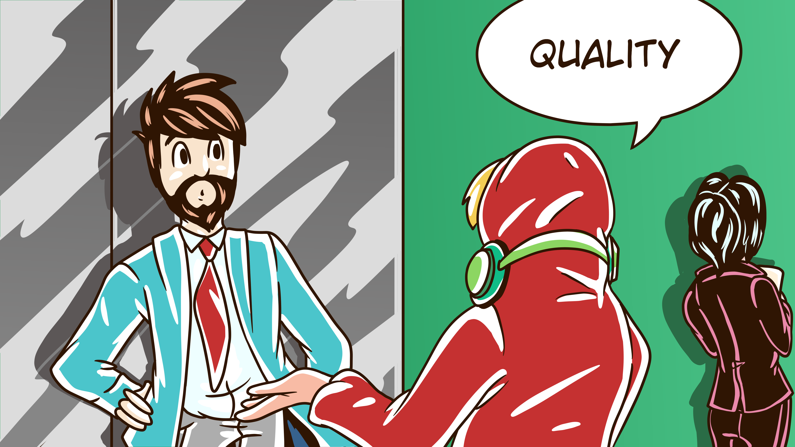

<!--
Writing consistent quality code, avoiding technical debt, the rest of my team being able to cohesively work as one.
-->

---


<!--
linters, code quality, test coverage tools, the usual help with that.
-->

---


<!--
Great I say, I write code too, lets be friends, and hand them a printed QR code of my public gpg key, so they can trust me.
-->

---


<!--
Back to the cleaner, How do you get told what to do, and when it changes.
-->

---


<!--
Something stuck to the notice board, last week we were told all the meeting room whiteboards need to be cleaned every night.
-->

---


<!-- It's then up to us to keep everything in sequence. -->

---


<!--
Like when we hadn't updated the meeting room on the 3rd floor was being used as a dedicated war room, and we wiped their boards down.
-->

---


<!--
I look to the dev, sound familiar? they nod.
-->

---


<!--
Ok so if any of that sounds familiar, and you relate to my imaginary friends then I've got the answers for you.
-->

---

<!-- class: lead invert -->

# What if... <!--fit-->

<!--
What if I said:
-->

---

<!-- class: lead invert -->

# Update policy... <!--fit-->

<!-- You could update policy easily, even releasing several version updates -->

---

<!-- class: lead invert fade-->

# Update policy... <br/>**Daily!?**<!--fit-->

<!--
in a single day, seamlessly communicated without derailing anyone?
-->

---

<!-- class: lead invert -->

# 👀<!--fit-->

<!--
visibility on compliance using tools you already use?
-->

---

<!-- class: lead invert -->

# 👨‍👨‍👦‍👦 <!--fit-->

<!--
Multiple concurrent versions of policy are supported
-->

---

<!-- _class: white -->


# Chris Nesbitt-Smith<!--fit-->

- Learnk8s & ControlPlane - Instructor+consultant
- esynergy - Digital Transformation Consultant
- Crown Prosecution Service (UK gov) - Consultant
- Opensource

<!--
I'm Chris Nesbitt-Smith, I'm an instructor for Learnk8s and Control Plane, consultant to UK Government and tinkerer of open source.
I've spent a fair chunk of my professional career now working in Government and large organizations where problems like these are rife.

This is a lightning speech, so you'll have to come find me after if you've got questions
-->

---

# 🙋👩‍🌾👩‍🚒</br>🙋‍♀️🦹‍♀️🙋‍♂️<!--fit-->

<!--
By show of hands who's with my CIO and set, written, or applied policy before?
-->

---

<!-- _class: lead invert -->

# 👩‍🌾🙋🙋‍♂️</br>🦹‍♀️🙋‍♀️👩‍🚒<!--fit-->

<!--
Next round who's sought exemption or consciously bent, broken, circumvented, ignored, bypassed, whatever a policy with at least good intentions?
-->

---

<!-- _class: lead invert -->

# 😜<!--fit-->

<!--
HA, you fell for it.-->

---

# 📝 <!--fit-->

<!--We've got all your names and employers details, so put your phones down, lend me your ears, the stakes just got raised.
-->

---

<style scoped>
section {
  font-size: 2.7em;
}
h1 {
  font-size: 2em;
}
</style>

<!-- _class: invert -->

# `policy`

### noun [ C ]

### UK /ˈpɒl.ə.si/ US /ˈpɑː.lə.si/

`a set of ideas or a plan of what to do in particular situations that has been agreed to officially by a group of people, a business organization, a government, or a political party`

<!--
Policy usually comes in one of two forms
-->

---


<!-- Security, like data at rest being encrypted -->

---

# 👯‍♀️<!--fit-->

<!--
Consistency such as code style
-->

---

<!-- _class: invert lead -->

# 🎰 <!--fit-->

<!--
Both are intended to mitigate a risk of some sort
-->

---

# 🤪🎛 <!--fit-->

<!--
However with the best of intentions these are often emotionally led rather than being grounded in a proportionate control which is the open door to case-by-case exemptions being required when you come against a situation you weren't anticipating
-->

---

<!-- _class: listline animate lead  -->
<style scoped>
li {
  font-size: 1.7em;
}
</style>

- Admission Control
- Anchore
- Apparmor
- Azure Policy
- Checkov
- Istio
- jspolicy
- K-rail
- Kopf
- Kubewarden
- Kyverno
- Network Policy
- OPA Gatekeeper
- Opslevel
- Polaris
- Prisma Cloud
- Qualys
- Rego
- Regula
- Seccomp
- SeLinux
- Sentinel
- ServiceControlPolicy
- Sysdig
- TiDB

<!--
Theres plenty of policy as code products out there to help
-->

---

# 👹 <!-- fit -->

<!-- Devil in the detail though -->

---

# {👹} <!-- fit -->

<!-- Throwing some curly braces or yaml at something doesn't inherently fix things. -->

---


<!-- Especially if it leads your engineers who are hopefully all plenty smart finding 'inventive' ways around the -->

---


<!-- computer says no response they got. -->

---

<!-- _class: invert lead -->

# But, we just provide <!--fit-->

# `warn`ings not `error`s? <!--fit-->

<!-- sure you might say that you provide warnings, on less important issues or new emerging policy, but only useful if someone sees them -->

---


# CVE-2021-44228 <!--fit-->

<!-- yup, as you know all presentations this year are contractually required to reference log4j -->

---


<!-- _class: invert lead -->

# CVE-2021-45046 <!--fit-->

<!-- even when its entirely out of context -->

---

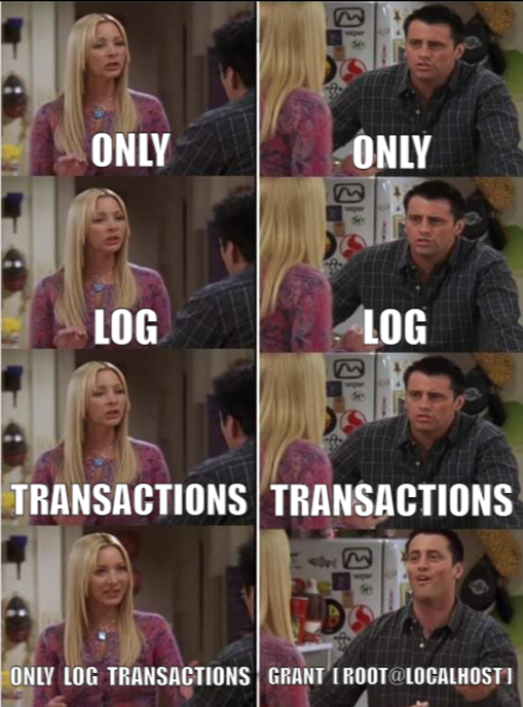

# CVE-2021-45105 <!--fit-->

<!-- and include some memes.

in just a few short months I can remove these -->

---


<!-- I've just covered a lot of ground, and hopefully sounded convincing, and not just a fictional utopia painted in powerpoint -->

---


# 🙄🤖 <!--fit-->

<!--
I know you really came here wanting to see a million words on a slide not just an emoji or two-->

---


<!-- I'm going to talk about two things, to prove its not just one tech, or tool. -->

---

# 🏔 + ☸️ <!--fit-->

# (Terraform + Kubernetes)

<!--  I've picked terraform and Kubernetes -->

---


<!--but I could have picked anything -->

---

<!-- _class: fade listline lead  -->
<style scoped>
li {
  font-size: 1.7em;
}
</style>

- Admission Control
- Anchore
- Apparmor
- Azure Policy
- **Checkov**
- Istio
- jspolicy
- K-rail
- Kopf
- Kubewarden
- **Kyverno**
- Network Policy
- OPA Gatekeeper
- Opslevel
- Polaris
- Prisma Cloud
- Qualys
- Rego
- Regula
- Seccomp
- SeLinux
- Sentinel
- ServiceControlPolicy
- Sysdig
- TiDB

<!--
likewise, two tools, but again I could use any, some, or even all, probably. Checkov will do my terraform, kyverno will to my kube.
-->

---

<!-- _class: white -->

# github.com/policy-as-versioned-code <!--fit-->


<!-- I've created a example git hub organization here, I'm not expecting you to read or grok the code on screen, its just to prove its a real thing. -->

---

<!-- _class: white -->

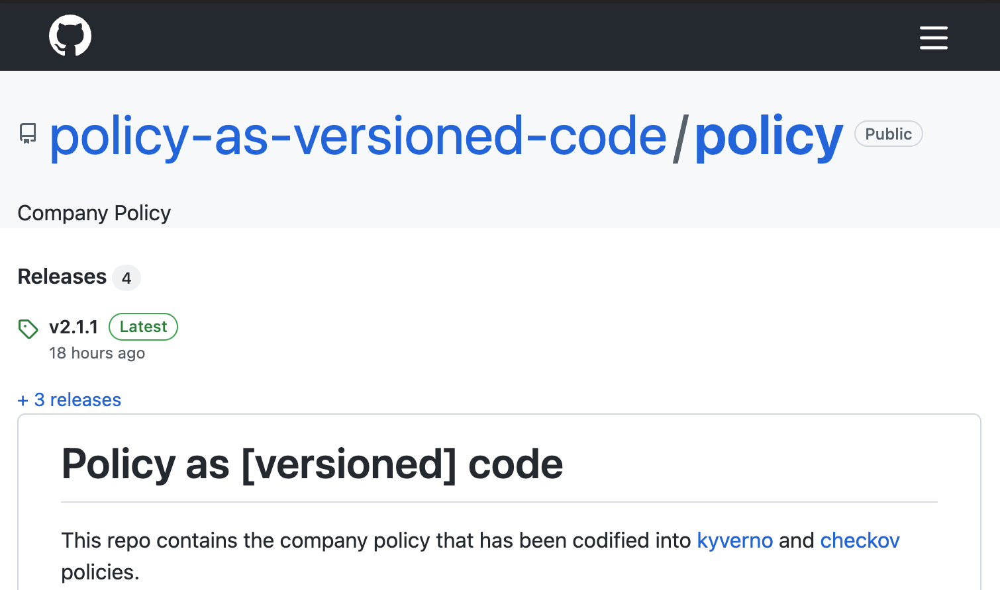

<!-- The policy is stored here -->

---

<!-- _class: -->
<style scoped>
pre {
  width: 45%;
}
pre:nth-child(2) {
  right: 1vh;
  position: absolute;
}
</style>

# v1.0.0 policy

```yaml
# kyverno kubernetes
apiVersion: kyverno.io/v1
kind: ClusterPolicy
metadata:
  name: require-department-label
  annotations:
    policies.kyverno.io/title: Require Department Label
    policies.kyverno.io/category: Example Org Policy
    policies.kyverno.io/description: >-
      It is important we know the department that resources
      belong to, so you need to define a 'mycompany.com/department'
      label on all your resources.
    pod-policies.kyverno.io/autogen-controllers: none
spec:
  validationFailureAction: enforce
  background: false
  rules:
    - name: require-department-label
      validate:
        message: >-
          The label `mycompany.com/department` is 
          required.
        pattern:
          metadata:
            labels:
              "mycompany.com/department": "?*"
```

```yaml
# checkov terraform
metadata:
  name: >-
    Check that all resources are tagged with
    the key - department"
  id: "CUSTOM_AWS_1"
  category: "CONVENTION"
scope:
  provider: aws
definition:
  and:
    - cond_type: "attribute"
      resource_types: "all"
      attribute: "tags.mycompany.com.department"
      operator: "exists"
```

<!-- so heres where my policy starts at v1.0.0 I've got policy that requires a department label on all resources, so long as its set, doesn't matter what it is -->

---

<!-- _class: invert -->
<style scoped>
pre {
  width: 45%;
}
pre:nth-child(2) {
  right: 1vh;
  position: absolute;
}
</style>

# v1.0.0 policy tests

```yaml
# fail0.yaml
apiVersion: v1
kind: Pod
metadata:
  name: require-department-label-fail0
spec: ...
---
# pass0.yaml
apiVersion: v1
kind: Pod
metadata:
  name: require-department-label-pass0
  labels:
    mycompany.com/department: finance
spec: ...
```

```js
// fail0.tf
resource "aws_s3_bucket" "b" {
  bucket = "my-tf-test-bucket"
}
---
// pass0.tf
resource "aws_s3_bucket" "b" {
  bucket = "my-tf-test-bucket"
  tags = {
    mycompany.com.department = "finance"
  }
}
```

<!-- I've written tests for this, passing test cases become great examples of what good and bad looks like -->

---

<!-- _class: white -->


<!-- pushed a tag in git, we've added release notes -->

---

<!-- _class: white -->


<!-- and signed it -->

---

<!-- _class: -->
<style scoped>
pre {
  width: 45%;
}
pre:nth-child(2) {
  right: 1vh;
  position: absolute;
}
</style>

# v2.0.0 policy

```yaml
# kyverno kubernetes
apiVersion: kyverno.io/v1
kind: ClusterPolicy
metadata:
  name: require-department-label
  annotations:
    policies.kyverno.io/title: Require Department Label
    policies.kyverno.io/category: Example Org Policy
    policies.kyverno.io/description: >-
      It is important we know the department that resources
      belong to, so you need to define a 'mycompany.com/department'
      label on all your resources.
    pod-policies.kyverno.io/autogen-controllers: none
spec:
  validationFailureAction: enforce
  background: false
  rules:
    - name: require-department-label
      validate:
        message: >-
          The label `mycompany.com/department` is required to be one
          of [acounts|hr]"
        pattern:
          metadata:
            labels:
              "mycompany.com/department": "acounts|hr"
```

```yaml
# checkov terraform
metadata:
  name: >-
    Check that all resources are tagged with the key - department"

  id: "CUSTOM_AWS_1"
  category: "CONVENTION"
scope:
  provider: aws
definition:
  or:
    - cond_type: "attribute"
      resource_types: "all"
      attribute: "tags.mycompany.com.department"
      operator: "equals"
      value: hr
    - cond_type: "attribute"
      resource_types: "all"
      attribute: "tags.mycompany.com.department"
      operator: "equals"
      value: acounts
```

<!-- version 2.0.0 looks similar, only now that field has to be from a predetermined list, like before, tests, release notes, tags, signed -->

---

<!-- _class: invert -->
<style scoped>
pre {
  width: 45%;
}
pre:nth-child(2) {
  right: 1vh;
  position: absolute;
}
</style>

# v2.1.0 policy

```yaml
# kyverno kubernetes
apiVersion: kyverno.io/v1
kind: ClusterPolicy
metadata:
  name: require-department-label
  annotations:
    policies.kyverno.io/title: Require Department Label
    policies.kyverno.io/category: Example Org Policy
    policies.kyverno.io/description: >-
      It is important we know the department that resources
      belong to, so you need to define a 'mycompany.com/department'
      label on all your resources.
    pod-policies.kyverno.io/autogen-controllers: none
spec:
  validationFailureAction: enforce
  background: false
  rules:
    - name: require-department-label
      validate:
        message: >-
          The label `mycompany.com/department` is required to be one
          of [accounts|hr]"
        pattern:
          metadata:
            labels:
              "mycompany.com/department": "accounts|hr"
```

```yaml
# checkov terraform
metadata:
  name: >-
    Check that all resources are tagged with the key - department"

  id: "CUSTOM_AWS_1"
  category: "CONVENTION"
scope:
  provider: aws
definition:
  or:
    - cond_type: "attribute"
      resource_types: "all"
      attribute: "tags.mycompany.com.department"
      operator: "equals"
      value: hr
    - cond_type: "attribute"
      resource_types: "all"
      attribute: "tags.mycompany.com.department"
      operator: "equals"
      value: accounts
```

<!--
2.1.0 is where we correct a spelling mistake in that list of departments
-->

---

<!-- _class: -->
<style scoped>
pre {
  width: 45%;
}
pre:nth-child(2) {
  right: 1vh;
  position: absolute;
}
</style>

# v2.1.1 policy

```yaml
# kyverno kubernetes
apiVersion: kyverno.io/v1
kind: ClusterPolicy
metadata:
  name: require-department-label
  annotations:
    policies.kyverno.io/title: Require Department Label
    policies.kyverno.io/category: Example Org Policy
    policies.kyverno.io/description: >-
      It is important we know the department that resources
      belong to, so you need to define a 'mycompany.com/department'
      label on all your resources.
    pod-policies.kyverno.io/autogen-controllers: none
spec:
  validationFailureAction: enforce
  background: false
  rules:
    - name: require-department-label
      validate:
        message: >-
          The label `mycompany.com/department` is required to be one
          of [tech|accounts|hr]"
        pattern:
          metadata:
            labels:
              "mycompany.com/department": "tech|accounts|hr"
```

```yaml
# checkov terraform
metadata:
  name: >-
    Check that all resources are tagged with
    the key - department"
  id: "CUSTOM_AWS_1"
  category: "CONVENTION"
scope:
  provider: aws
definition:
  or:
    - cond_type: "attribute"
      resource_types: "all"
      attribute: "tags.mycompany.com.department"
      operator: "equals"
      value: hr
    - cond_type: "attribute"
      resource_types: "all"
      attribute: "tags.mycompany.com.department"
      operator: "equals"
      value: accounts
    - cond_type: "attribute"
      resource_types: "all"
      attribute: "tags.mycompany.com.department"
      operator: "equals"
      value: tech
```

<!-- 2.1.1 added a new department to the list. -->

---

<style scoped>
table {
  font-size: 2em;
}
</style>

# app1 (k8s) | infra1 (tf) <!--fit-->

| 1.0.0 | 2.0.0 | 2.1.0 | 2.1.1 |
| ----- | ----- | ----- | ----- |
| ✅    | ❌    | ❌    | ❌    |

<!-- couple more repos in the org, app1 and infra1 depend on version 1, and not compliant with 2 or beyond, but how do I know that? -->

---

```json
$schema: "https://docs.renovatebot.com/renovate-schema.json",
labels: ["policy"],
regexManagers: [{
  fileMatch: ["kustomization.yaml"],
  matchStrings: ['mycompany.com/policy-version: "(?<currentValue>.*)"\\s+'],
  datasourceTemplate: "github-tags",
  depNameTemplate: "policy",
  packageNameTemplate: "policy-as-versioned-code/policy",
  versioningTemplate: "semver",
},{
  fileMatch: [".*tf$"],
  matchStrings: [
    '#\\s*renovate:\\s*policy?\\s*default = "(?<currentValue>.*)"\\s',
  ],
  datasourceTemplate: "github-tags",
  depNameTemplate: "policy",
  lookupNameTemplate: "policy-as-versioned-code/policy",
  versioningTemplate: "semver",
}],
```

<!-- Renovate is automatically making pull requests -->

---

<!-- _class: white -->


<!--  with new versions of the policy, so I can update my dependency -->

---

<!-- _class: invert -->

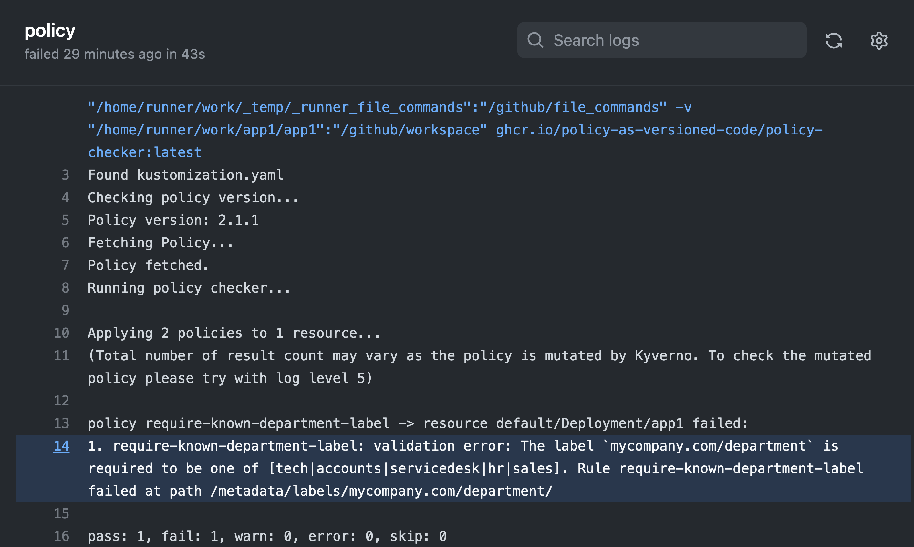

<!-- and get feedback when I'm not compliant -->

---

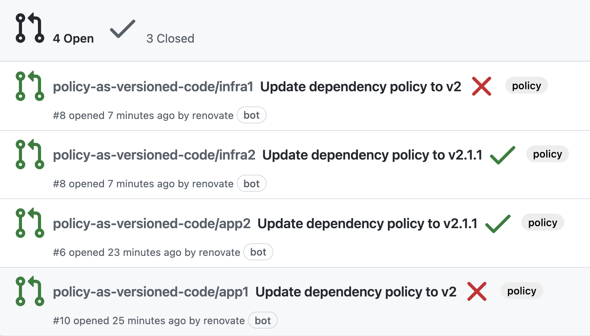

<!-- I can also see the pull requests over the org, so I can measure the compliance of my policy
https://github.com/pulls?q=is%3Aopen+is%3Apr+archived%3Afalse+user%3Apolicy-as-versioned-code
-->

---

<style scoped>
table {
  font-size: 2em;
}
</style>

# app2 (k8s) | infra2 (tf) <!--fit-->

| 1.0.0 | 2.0.0 | 2.1.0 | 2.1.1 |
| ----- | ----- | ----- | ----- |
| -     | ✅    | ☑️    | ☑️    |

<!-- couple more repos, app2 and infra2 depend on version 2 of the policy -->

---

<!-- _class: white -->

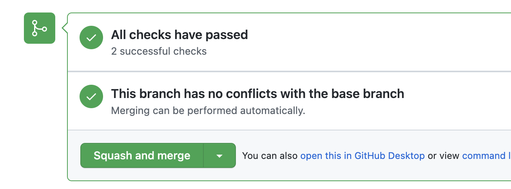

<!-- however we could merge the open pull request up to 2.1.1 -->

---

<style scoped>
table {
  font-size: 2em;
}
</style>

# app3 (k8s) | infra3 (tf) <!--fit-->

| 1.0.0 | 2.0.0 | 2.1.0 | 2.1.1 |
| ----- | ----- | ----- | ----- |
| -     | -     | -     | ✅    |

<!-- app3 and infra3 are dependent on 2.1.1 -->

---

<!-- _class: white -->

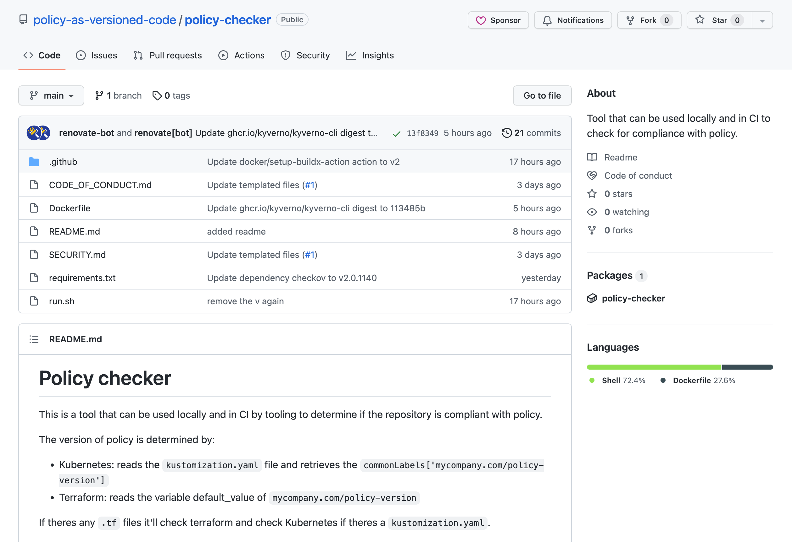

<!-- I've written some bash, sorry -->

---

<!-- _class: white -->

<style scoped>
pre {
  width: 50%;
}
h1 {
  width: 50% !important;
  right: 1vh;
  position: absolute;
}

</style>

# 👩‍💻 <!--fit-->

```bash
$ docker run --rm -ti \
  -v $(pwd):/apps \
  ghcr.io/policy-as-versioned-code/policy-checker

Found kustomization.yaml
Checking policy version...
Policy version: 1.0.0
Fetching Policy...
Policy fetched.
Running policy checker...

Applying 1 policy to 1 resource...
(Total number of result count may vary as the
policy is mutated by Kyverno. To check the
mutated policy please try with log level 5)

pass: 1, fail: 0, warn: 0, error: 0, skip: 0
```

<!-- now from my laptop or in CI can evaluate my code against the right policy version -->

---

# 🧩 <!--fit-->

<!-- and the last puzzle piece is managing the lifecycle of the policies, and allowing multiple versions of policy to be accepted and evaluated within a single runtime -->

---

# ~~terraform~~ <br/>kubernetes <!--fit-->

<!-- I've cheated, kube gives you admission controllers,
I haven't found a sane way to evaluate against Azure, GCP or AWS policy without doing it for real -->

---

<!-- _class: invert lead -->

# many-to-many <!--fit-->

<!-- The way the policy is designed and distributed lends it self well to co-exist with previous and future versions of itself in a Kubernetes cluster -->

---

<!-- _class: white -->

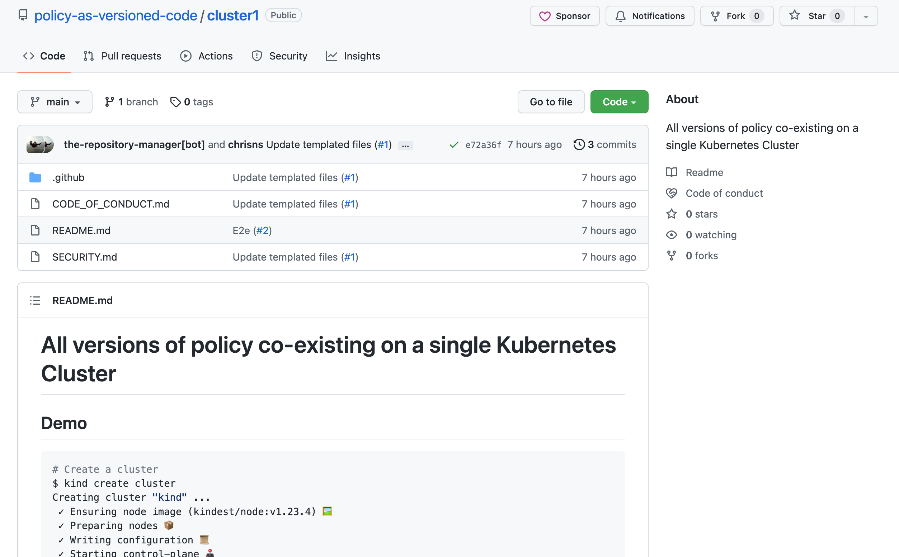

<!-- cluster1 describes a cluster that accepts all the versions we've described so far -->

---

<!-- _class: white -->


<!-- likewise cluster2, only accepts 2.0.0 and greater -->

---

<!-- _class: white -->

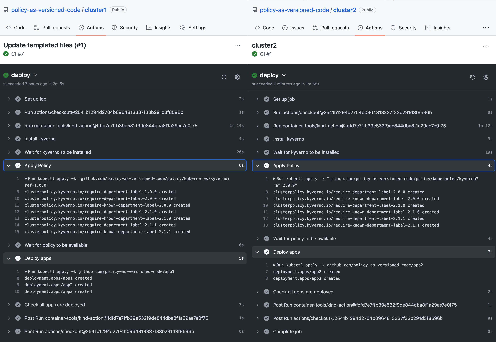

<!-- to demo used KiND to deploy the apps -->

---

<!-- _class: white -->


<!-- and there we have it full org all done, all compliant, policy all versioned, CIO all aware of whats going on.

So this is great, -->

---


<!-- when some new privacy regulation comes out, or you acquire more data, the risks and the appetite stand still for no one and now neither does our policy -->

---

# 🗣📢🧠 <!--fit-->

<!-- But the most important thing I want you to remember from our time together is that.

And feel free to say it out loud with me
-->

---

<!-- _class: invert fade -->

# <code> **Purposeless** policy </br>is potentially</br>practically</br>pointless policy. </code><!--fit-->

<!-- Purposeless -->

---

<!-- _class: invert fade -->

# <code>Purposeless **policy** </br>is potentially</br>practically</br>pointless policy.</code><!--fit-->

<!-- policy is -->

---

<!-- _class: invert fade -->

# <code>Purposeless policy </br>is **potentially**</br>practically</br>pointless policy.</code><!--fit-->

<!-- potentially -->

---

<!-- _class: invert fade -->

# <code>Purposeless policy </br>is potentially</br>**practically**</br>pointless policy.</code><!--fit-->

<!-- practically -->

---

<!-- _class: invert fade -->

# <code>Purposeless policy </br>is potentially</br>practically</br>**pointless** policy.</code><!--fit-->

<!-- pointless-->

---

<!-- _class: invert fade -->

# <code>Purposeless policy </br>is potentially</br>practically</br>pointless **policy**.</code><!--fit-->

<!-- policy. -->

---

<!-- _class: invert fade -->

# <code>Purposeless policy </br>is potentially</br>practically</br>pointless policy.</code><!--fit-->

<!-- I've been practicing saying that far too many times. -->

---

<!-- _class: invert -->
<style scoped>
h2 {
  position: absolute;
  bottom: 1ch;
  left: 2vw;
  width: 95%
}
</style>

# 🙏 Thanks 🙏 <!--fit-->


- cns.me
- talks.cns.me
- github.com/chrisns
- github.com/policy-as-versioned-code
- learnk8s.io

## Chris Nesbitt-Smith <!--fit-->

<!--
I've been Chris Nesbitt-Smith, thanks for your time, you're now free to leave, I'll try destroy the evidence of your guilt admissions earlier.

Like subscribe whatever the kids do these days on LinkedIn, Github whatever. cns.me points at my LinkedIn.

talks.cns.me contains this and other talks, they're all open source.

-->

---

<!-- _class: invert end lead-->
<style scoped>

</style>

# ⚡️⚡️🙏⚡️⚡️ <!--fit-->


### </br>

<div class="container">
  <div class="glitch" data-text="cns.me">cns.me</div>
  <div class="glow">cns.me</div>
</div>
<div class="scanlines"></div>

### </br>

#### github.com/policy-as-versioned-code

## Chris Nesbitt-Smith <!--fit-->
