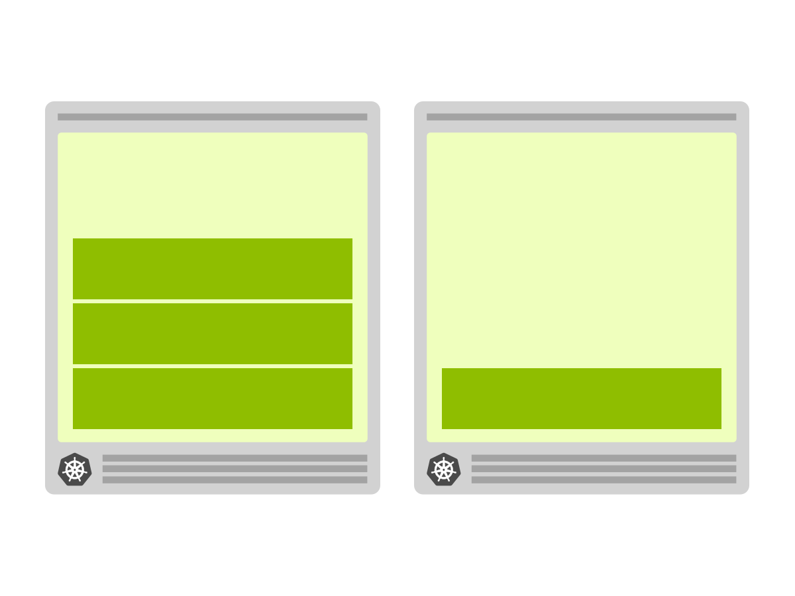
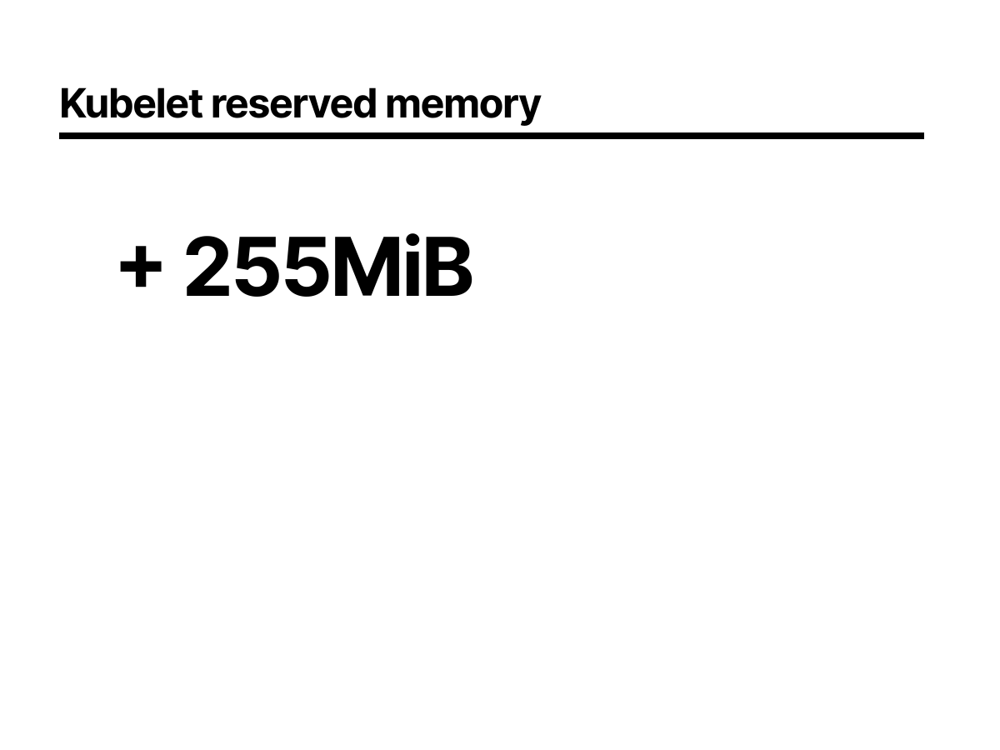
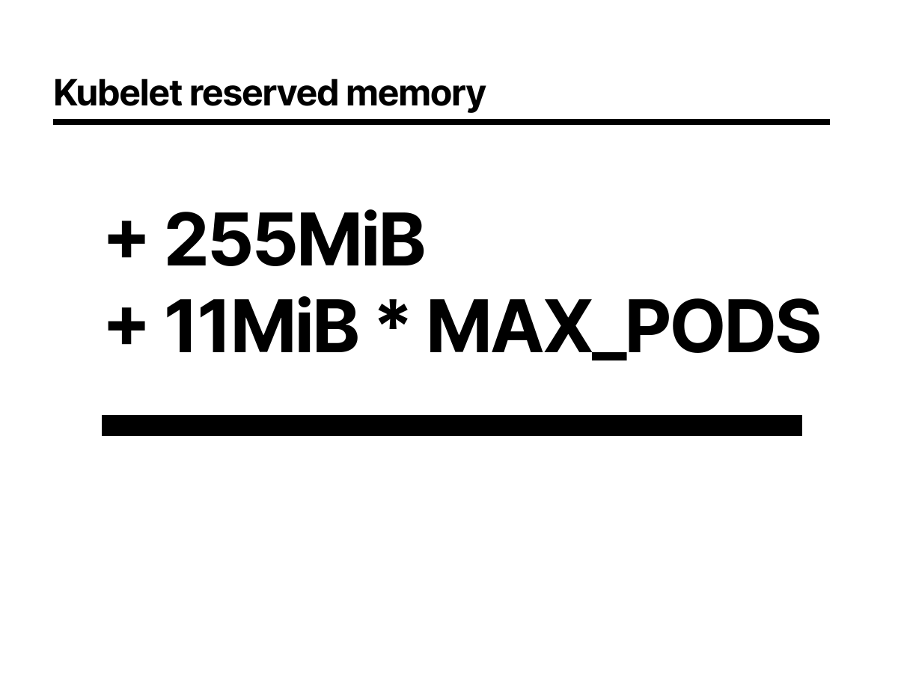
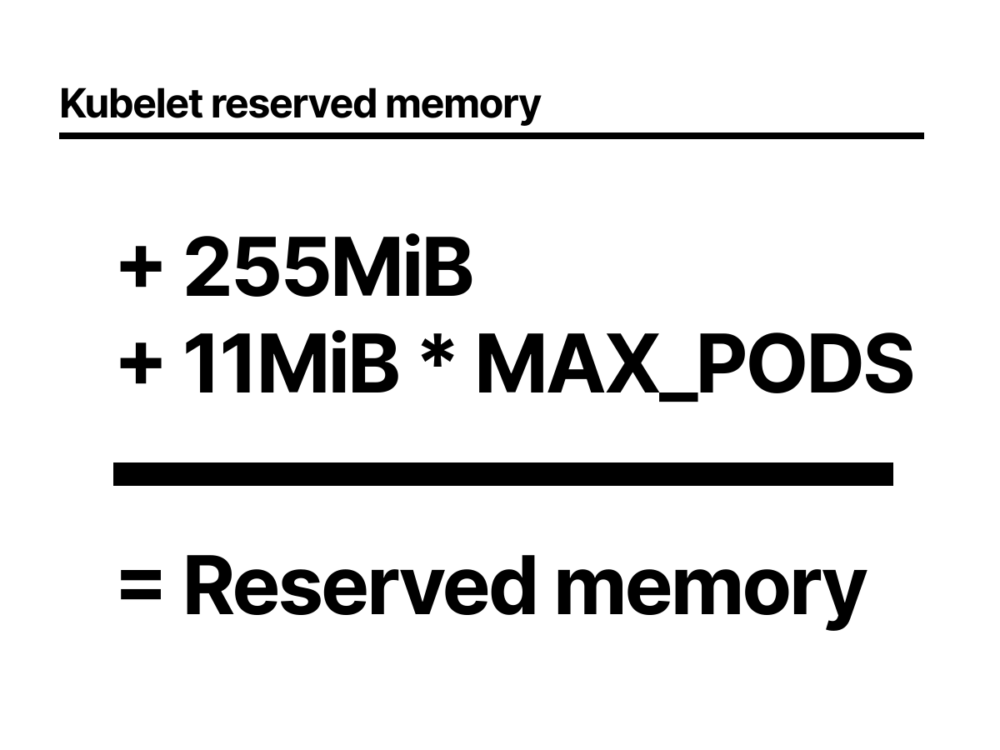
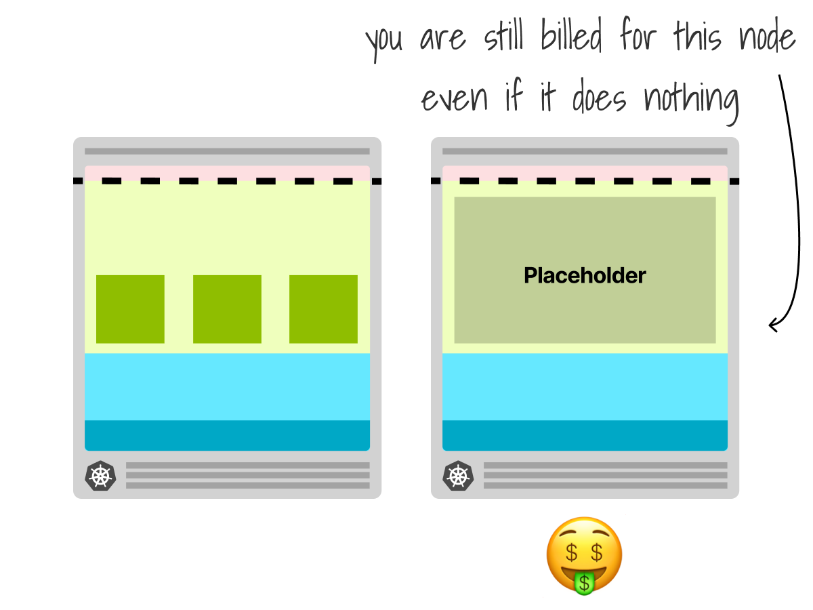
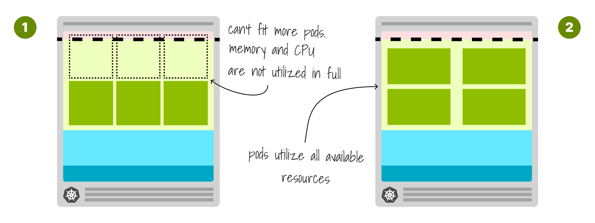

# 👋<!--fit-->

<!-- Hi,
Thank you so much for joining me here today, it'd be great to hear where you're all from so please do leave a comment in the chat and introduce yourself.
Likewise please use the comments if you've got any questions throughout this webinar and I'll do my best to get to them at the end, I'm also joined by some friends helping me in the chat who may get to them before I do.-->

---

<!-- _class: invert front -->


<!-- _class: white -->

# Proactive cluster<br/>autoscaling in<br/> Kubernetes <!--fit-->

## Chris Nesbitt-Smith<!--fit-->

- Learnk8s - Instructor+consultant
- Crown Prosecution Service (UK gov) - Consultant
- Opensource

<!--

So, to kick things off my name is Chris Nesbitt-Smith, I'm based in London and currently an instructor for Learnk8s, consultant to UK Government and tinkerer of open source stuff.
I've using and abusing Kubernetes in production since it was 0.4, believe me when I say its been a journey!

I've definitely got the scars to show for it.
-->

---

<!-- _class: invert lead -->

# 🤩 <!--fit-->

<!-- So you believed the hype, that Kubernetes lets you scale infinitely, auto heal and so on.
Your cluster is self monitoring and scaling up instances of your cloud native stateless applications on demand when you need more. -->

---


<!-- But all of a sudden your nodes are full, you can scale no more -->

---

# Cluster AutoScaler <!--fit-->

### github.com/kubernetes/autoscaler/tree/master/cluster-autoscaler <!--fit-->

<!--
Enter the cluster autoscaler and of course a splash of yaml to save the day
-->

---


<!-- It can integrate with your cloud vendor -->

---


<!-- To provision necessary nodes -->

---

# Cluster AutoScaler

1. Memory Utilization
1. CPU Utilization
1. Pending pods

<!-- and good news the autoscaler is configurable -->

---

# Cluster AutoScaler

1. ~~Memory Utilization~~
1. ~~CPU Utilization~~
1. Pending pods

<!-- though sadly as we'll see its not quite as configurable as you might expect
-->

---


<!-- there are alternatives but the official cluster autoscaler only scales up when there are pending pods-->

---


<!--  in order to satisfy the demand, which is probably a good idea
since there is little point adding more nodes unless you have workload that needs them
-->

---

# Kubernetes Scheduler <!--fit-->

<!-- ok, so first lets refresh ourselves on how the Kubernetes scheduler works -->

---


<!-- If I create a deployment with 2 replicas -->

---


<!-- I do this by submitting my yaml to the API server, which writes it to etcd -->

---


<!-- the controller is watching for this type of event, recognizes it needs to create some pods, which it does and these are now pending -->

---


<!-- the scheduler is the component that is looking for pending pods, sees these and then schedules them to a node -->

---


<!-- the scheduling however is broken into a few steps
From the initial queue
through filtering viable nodes to then scoring them before creating a binding
-->

---

# Requests & Scheduler <!--fit-->

<!--
but how does the scheduler know how much memory and cpu a pod uses? It does not… -->

---


<!--
you need to spoon feed this with requests and limits
-->

---


<!--
Applications come in all sorts of shapes and sizes, so you may have some applications that are CPU intensive but don't require much memory, while others
-->

---


<!--
May have a greater memory than CPU footprint
-->

---


<!--
Those applications have to be deployed inside computing units which have (again) CPU and memory characteristics.
-->

---


<!--
For every application deployed in the cluster, Kubernetes makes a note of the memory and CPU requirement.
-->

---


<!--
It then decides where to place the application in the cluster. In this case, it's the node on the left.
-->

---


<!--
If another application of the same size is deployed, Kubernetes goes through the same process and finds the best node to run the app.
-->

---


<!--
In this case, Kubernetes places the app on the right side.
-->

---


<!--
As more applications
-->

---


<!-- are submitted to the cluster, -->

---


<!-- Kubernetes keeps making -->

---


<!-- notes of the CPU and  -->

---


<!-- memory requirements... -->

---


<!--... and allocating these apps in the cluster.-->

---


<!--
If you play the game long enough, you might notice that Kubernetes is a skilled Tetris player:
- Your servers are the board.
- The apps are the blocks.
Kubernetes tries to fit as many blocks as efficiently as possible.
-->

---

# Requests & Limits <!--fit-->

<!--
But what about the size of the worker nodes

What kind of instance types can you use to build the cluster?
Nowadays the cloud vendors make almost every instance type available to be part of a cluster, so you've got free choice.
There's a catch, though.
-->

---


<!-- You'd be forgiven for thinking that if you get an 8gb ram 2 cpu node from your cloud vendor
you could deploy 4 pods that are 1.5gb ram and need a quarter CPU
-->

---


<!-- however its not quite so -->

---


<!-- one pod remains pending, which if configured will of course cause the -->

---



<!-- cluster autoscaler to create a new node and then your workload is eventually scheduled -->

---

# Node instances <!--fit-->

<!-- but why is this -->

---


<!--
When you provision a managed instance, you might think that the memory and CPU available can be used for running Pods.
And you are right.
-->

---


<!--
However, some memory and CPU should be saved for the operating system.
-->

---


<!--
And you should also reserve memory and CPU for the kubelet.
-->

---


<!--
Surely the the rest is made available to the pods?
-->

---


<!--
Not quite yet. You also need to reserve memory for the Eviction threshold.
If the kubelet notices that memory usage is going over that threshold, it will start evicting pods.
-->

---



<!--
Your cloud vendor will usually choose these numbers for you
For example AWS reserves 255MB of memory for the kubelet...
-->

---



<!--
And 11MB of memory for each Pod that you could deploy on that instance.
-->

---



<!--
This is the reserved memory for the kubelet. The CPU reserved is usually around 0.3 to 0.4.
For the operating system they reserve 100MB of memory and 0.1 CPU and for the eviction threshold, another 100 MB.
-->

---


<!--
In AWS If you select an M5.large, here's a visual recap of how the resources are subdivided.
With this particular instance, you can deploy up to 27 pods.
-->

---

# Cluster AutoScaler </br>Lead Time <!--fit-->

<!-- The other thing to consider is all this takes time -->

---


<!-- to start with about 90 seconds for your Horizontal Pod Autoscaler to react and decide to scale up -->

---


<!-- Then the cluster autoscaler takes around 30 seconds to request a new node from the cloud vendor -->

---


<!-- Then around 4minutes for the machine to boot -->

---


<!-- Then around another 30 seconds to join the cluster and be ready to run workload
Then you can of course add on time for pulling your container image that won't be cached
-->

---

<!-- _class: invert-->

# github.com/appvia/cloud-spend-forecaster <!--fit-->


<!-- To help visualize the impact this can have I have made a library that fakes a Kubernetes scheduler, and it allows you to specify many different types of pods, and model their scaling dynamics, tracking container startup times, and so on.
And define your node properties, it takes a lot of shortcuts in order to provide hundreds of thousands of intervals representing days in tens of milliseconds, it is not the real Kubernetes scheduler.
Pull requests are very welcome if you'd like to improve it!
-->

---

<style scoped>
iframe {
  width: 100%;
  height: 100%;
}
section {
  padding:0;
}
</style>
<iframe src="https://blackfriday.appvia.io/" title="BlackFriday" frameborder="0"></iframe>

<!-- And to give you a way to play with it, I also made a game as a novelty for kubecon last year called Black Friday.

The scenario is that you're an SRE team supporting a retailer facing a spike in traffic on black friday and again on cyber Monday, with a lull between and a calm before and after.

So the scenario starts Thursday midnight, and ends Tuesday 23:59

There are SLA penalties if you cause a request to be failed

It's a simple three tier app, if you go into the hints, you'll see some of the constraints.

The goal is configure your cluster to as closely follow the traffic spike, with just enough infra, failing some requests and getting a few SLA penalties might actually result in a greater profit.

DEMO POINT CLICK, CHANGE MIN THINGS TO 1 OF EACH AND DEMONSTRATE PROFIT, EXPLAIN GRAPHS

Please do feel free to play, may the odds ever be in your favour -->

---

# Strategies for faster</br>scaling <!--fit-->

<!-- So, what do we do to stack the odds in our favor -->

---

<!-- _class: fade listline  -->

# **Strategies for faster scaling**

1. **Don't scale!**
1. (Pre) scale

<!-- Well, we can not scale at all, thats always an option thats often over looked -->

---

<!-- _class: fade listline  -->

# **Strategies for faster scaling**

1. Don't scale!
1. **(Pre) scale**

<!-- Or what if you could get a head start on the scaling -->

---

# Don't Scale! <!--fit-->

<!-- Maybe not scaling sounds a bit flippant, what do I really mean by that? -->

---


<!-- Going back to our scenario of fitting our pods on a machine -->

---


<!-- taking into account the reserves for the kublet -->

---


<!-- if you size the machine correctly, you can fit all your workload in the node -->

---


<!-- This isn't easy given the vast array of possible machine sizes, so we've done the hard work for you and created an instance calculator -->

---

<style scoped>
iframe {
  width: 105%;
  height: 105%;
  transform-origin: top left;
  transform: scale(0.95);
}
section {
  padding:0;
}
</style>
<iframe src="https://learnk8s.io/kubernetes-instance-calculator" title="instance calc" frameborder="0"></iframe>

<!-- DEMO
drag sliders about
 -->

---

# Proactive scaling <!--fit-->

<!-- Finally, on to the topic of this webinar, the wait is over -->

---


<!-- What if we could always have at least one node ready for when you need it, removing that 4 minute wait -->
<!-- To do this we can create a placeholder pod, that -->

---


<!-- as soon your workload comes along needing the resource, the placeholder pod is evicted -->

---


<!-- causing the cluster autoscaler to boot a new machine to host the new replacement placeholder, and this will continue as you scale into further nodes, keeping you always one step ahead -->

---

# 😬</br>LIVE DEMO <!-- fit -->

<!--
Ok now to pray to the demo gods where I do a real live demo
-->

---

<style scoped>
iframe {
  width: 100%;
  height: 100%;
}
section {
  padding: 0;
}
</style>
<iframe src="http://localhost:8001/static" title="" frameborder="0"></iframe>

<!--
I've got a simple application, where you can see the effects of me clicking the scale buttons,
behind this is a real kubernetes cluster running in linnode, I've just got some javascript driving the changes to the kubernetes api to scale up and down

so we start with 1 replica, and I click to scale to 5, the current node gets saturated with 4 pods, and one is pending, behind the scenes now the cluster autoscaler is going to request a new node from linnode, so while I stall for about 3 minutes of what would otherwise be silence and me praying for it to work are there any questions?

As you saw, the node became available, and then it took a little longer for the CNI to come up and then to be able to schedule our pod.
And the timer shows that took .....
ok, now lets schedule back down to 1 and enable our placeholder <click scale to 1> <click placeholder on>

now thats all running, lets try scaling to 5 again <click scale to 5>

and as you can see that is far more performant

phew! that was more stressful than you can imagine, I can assure you there is a real cluster, to prove that really happened

-->

---

<style scoped>

section {
  padding:0;
  font-size: 0.01em
  /* display: initial; */
}

</style>
<marp-pre>
<code class="language-text">
default       0s          Normal    ScalingReplicaSet         deployment/podinfo                      Scaled up replica set podinfo-8558cfcd5d to 5
default       0s          Normal    Scheduled                 pod/podinfo-8558cfcd5d-h4c5j            Successfully assigned default/podinfo-8558cfcd5d-h4c5j to lke74013-115226-6331fbd57928
default       0s          Normal    SuccessfulCreate          replicaset/podinfo-8558cfcd5d           Created pod: podinfo-8558cfcd5d-h4c5j
default       0s          Normal    Scheduled                 pod/podinfo-8558cfcd5d-z9hvq            Successfully assigned default/podinfo-8558cfcd5d-z9hvq to lke74013-115226-6331fbd57928
default       0s          Normal    Scheduled                 pod/podinfo-8558cfcd5d-d5khs            Successfully assigned default/podinfo-8558cfcd5d-d5khs to lke74013-115226-6331fbd57928
default       0s          Normal    SuccessfulCreate          replicaset/podinfo-8558cfcd5d           Created pod: podinfo-8558cfcd5d-z9hvq
default       0s          Normal    SuccessfulCreate          replicaset/podinfo-8558cfcd5d           Created pod: podinfo-8558cfcd5d-d5khs
default       0s          Warning   FailedScheduling          pod/podinfo-8558cfcd5d-5x2v7            0/2 nodes are available: 1 Insufficient memory, 1 node(s) didn't match Pod's node affinity/selector.
default       0s          Normal    Pulling                   pod/podinfo-8558cfcd5d-d5khs            Pulling image "stefanprodan/podinfo"
default       0s          Normal    Pulling                   pod/podinfo-8558cfcd5d-h4c5j            Pulling image "stefanprodan/podinfo"
default       0s          Normal    Pulling                   pod/podinfo-8558cfcd5d-z9hvq            Pulling image "stefanprodan/podinfo"
default       0s          Normal    Pulled                    pod/podinfo-8558cfcd5d-d5khs            Successfully pulled image "stefanprodan/podinfo" in 1.708158076s
default       0s          Normal    Created                   pod/podinfo-8558cfcd5d-d5khs            Created container podinfo
default       0s          Normal    Started                   pod/podinfo-8558cfcd5d-d5khs            Started container podinfo
default       0s          Normal    Pulled                    pod/podinfo-8558cfcd5d-h4c5j            Successfully pulled image "stefanprodan/podinfo" in 3.104773992s
default       0s          Normal    Created                   pod/podinfo-8558cfcd5d-h4c5j            Created container podinfo
default       0s          Normal    Started                   pod/podinfo-8558cfcd5d-h4c5j            Started container podinfo
default       0s          Normal    NotTriggerScaleUp         pod/podinfo-8558cfcd5d-5x2v7            pod didn't trigger scale-up: 1 node(s) didn't match Pod's node affinity/selector
default       0s          Normal    Pulled                    pod/podinfo-8558cfcd5d-z9hvq            Successfully pulled image "stefanprodan/podinfo" in 8.442357379s
default       0s          Normal    Created                   pod/podinfo-8558cfcd5d-z9hvq            Created container podinfo
default       0s          Normal    Started                   pod/podinfo-8558cfcd5d-z9hvq            Started container podinfo
default       0s          Warning   FailedScheduling          pod/podinfo-8558cfcd5d-5x2v7            0/2 nodes are available: 1 Insufficient memory, 1 node(s) didn't match Pod's node affinity/selector.
default       1s          Normal    NodeHasSufficientMemory   node/lke74013-115226-6332129f84dd       Node lke74013-115226-6332129f84dd status is now: NodeHasSufficientMemory
default       1s          Normal    NodeHasNoDiskPressure     node/lke74013-115226-6332129f84dd       Node lke74013-115226-6332129f84dd status is now: NodeHasNoDiskPressure
kube-system   0s          Normal    SuccessfulCreate          daemonset/calico-node                   Created pod: calico-node-tpxpn
kube-system   0s          Normal    Scheduled                 pod/csi-linode-node-fvk46               Successfully assigned kube-system/csi-linode-node-fvk46 to lke74013-115226-6332129f84dd
kube-system   0s          Normal    Scheduled                 pod/calico-node-tpxpn                   Successfully assigned kube-system/calico-node-tpxpn to lke74013-115226-6332129f84dd
kube-system   0s          Normal    SuccessfulCreate          daemonset/csi-linode-node               Created pod: csi-linode-node-fvk46
kube-system   0s          Normal    Scheduled                 pod/kube-proxy-ds24f                    Successfully assigned kube-system/kube-proxy-ds24f to lke74013-115226-6332129f84dd
kube-system   0s          Normal    SuccessfulCreate          daemonset/kube-proxy                    Created pod: kube-proxy-ds24f
default       0s          Normal    Synced                    node/lke74013-115226-6332129f84dd       Node synced successfully
default       0s          Normal    Starting                  node/lke74013-115226-6332129f84dd       Starting kubelet.
default       0s          Normal    NodeAllocatableEnforced   node/lke74013-115226-6332129f84dd       Updated Node Allocatable limit across pods
default       0s          Normal    NodeHasSufficientMemory   node/lke74013-115226-6332129f84dd       Node lke74013-115226-6332129f84dd status is now: NodeHasSufficientMemory
default       0s          Normal    NodeHasNoDiskPressure     node/lke74013-115226-6332129f84dd       Node lke74013-115226-6332129f84dd status is now: NodeHasNoDiskPressure
default       0s          Normal    NodeHasSufficientPID      node/lke74013-115226-6332129f84dd       Node lke74013-115226-6332129f84dd status is now: NodeHasSufficientPID
default       0s          Normal    RegisteredNode            node/lke74013-115226-6332129f84dd       Node lke74013-115226-6332129f84dd event: Registered Node lke74013-115226-6332129f84dd in Controller
kube-system   1s          Normal    Pulling                   pod/kube-proxy-ds24f                    Pulling image "linode/kube-proxy-amd64:v1.23.10"
kube-system   1s          Normal    Pulling                   pod/calico-node-tpxpn                   Pulling image "docker.io/calico/cni:v3.22.1"
kube-system   0s          Normal    Pulling                   pod/csi-linode-node-fvk46               Pulling image "bitnami/kubectl:1.16.3-debian-10-r36"
kube-system   0s          Normal    Pulled                    pod/kube-proxy-ds24f                    Successfully pulled image "linode/kube-proxy-amd64:v1.23.10" in 3.544455967s
kube-system   0s          Normal    Created                   pod/kube-proxy-ds24f                    Created container kube-proxy
kube-system   0s          Normal    Started                   pod/kube-proxy-ds24f                    Started container kube-proxy
default       0s          Normal    Starting                  node/lke74013-115226-6332129f84dd
kube-system   0s          Normal    Pulled                    pod/calico-node-tpxpn                   Successfully pulled image "docker.io/calico/cni:v3.22.1" in 8.06147771s
kube-system   1s          Normal    Created                   pod/calico-node-tpxpn                   Created container upgrade-ipam
kube-system   0s          Normal    Started                   pod/calico-node-tpxpn                   Started container upgrade-ipam
kube-system   0s          Normal    Pulled                    pod/calico-node-tpxpn                   Container image "docker.io/calico/cni:v3.22.1" already present on machine
kube-system   0s          Normal    Created                   pod/calico-node-tpxpn                   Created container install-cni
kube-system   0s          Normal    Started                   pod/calico-node-tpxpn                   Started container install-cni
kube-system   0s          Normal    Pulling                   pod/calico-node-tpxpn                   Pulling image "docker.io/calico/pod2daemon-flexvol:v3.22.1"
kube-system   0s          Normal    Pulled                    pod/csi-linode-node-fvk46               Successfully pulled image "bitnami/kubectl:1.16.3-debian-10-r36" in 11.657565568s
kube-system   0s          Normal    Created                   pod/csi-linode-node-fvk46               Created container init
kube-system   0s          Normal    Started                   pod/csi-linode-node-fvk46               Started container init
kube-system   0s          Normal    Pulling                   pod/csi-linode-node-fvk46               Pulling image "linode/csi-node-driver-registrar:v1.3.0"
default       0s          Warning   FailedScheduling          pod/podinfo-8558cfcd5d-5x2v7            0/2 nodes are available: 1 Insufficient memory, 1 node(s) didn't match Pod's node affinity/selector.
kube-system   0s          Normal    Pulled                    pod/calico-node-tpxpn                   Successfully pulled image "docker.io/calico/pod2daemon-flexvol:v3.22.1" in 5.534993769s
kube-system   0s          Normal    Created                   pod/calico-node-tpxpn                   Created container flexvol-driver
kube-system   0s          Normal    Started                   pod/calico-node-tpxpn                   Started container flexvol-driver
kube-system   0s          Normal    Pulling                   pod/calico-node-tpxpn                   Pulling image "docker.io/calico/node:v3.22.1"
default       0s          Normal    NodeReady                 node/lke74013-115226-6332129f84dd       Node lke74013-115226-6332129f84dd status is now: NodeReady
kube-system   0s          Normal    Pulled                    pod/csi-linode-node-fvk46               Successfully pulled image "linode/csi-node-driver-registrar:v1.3.0" in 4.741448054s
kube-system   0s          Normal    Created                   pod/csi-linode-node-fvk46               Created container csi-node-driver-registrar
kube-system   0s          Normal    Started                   pod/csi-linode-node-fvk46               Started container csi-node-driver-registrar
kube-system   0s          Normal    Pulling                   pod/csi-linode-node-fvk46               Pulling image "linode/linode-blockstorage-csi-driver:v0.5.0"
default       0s          Normal    Scheduled                 pod/podinfo-8558cfcd5d-5x2v7            Successfully assigned default/podinfo-8558cfcd5d-5x2v7 to lke74013-115226-6332129f84dd
default       0s          Warning   FailedCreatePodSandBox    pod/podinfo-8558cfcd5d-5x2v7            Failed to create pod sandbox: rpc error: code = Unknown desc = failed to set up sandbox container "4d21d0493b5ac49eb7a173b9946fb379f9e0d98b1d55ab13547ad0826842bc6d" network for pod "podinfo-8558cfcd5d-5x2v7": networkPlugin cni failed to set up pod "podinfo-8558cfcd5d-5x2v7_default" network: stat /var/lib/calico/nodename: no such file or directory: check that the calico/node container is running and has mounted /var/lib/calico/
default       0s          Normal    TaintManagerEviction      pod/podinfo-8558cfcd5d-5x2v7            Cancelling deletion of Pod default/podinfo-8558cfcd5d-5x2v7
default       0s          Normal    SandboxChanged            pod/podinfo-8558cfcd5d-5x2v7            Pod sandbox changed, it will be killed and re-created.
default       0s          Warning   FailedCreatePodSandBox    pod/podinfo-8558cfcd5d-5x2v7            Failed to create pod sandbox: rpc error: code = Unknown desc = failed to set up sandbox container "5d02b7c46e44913d4fabb9e02dc77044a3163f976c0a46f47c398108ac3fa000" network for pod "podinfo-8558cfcd5d-5x2v7": networkPlugin cni failed to set up pod "podinfo-8558cfcd5d-5x2v7_default" network: stat /var/lib/calico/nodename: no such file or directory: check that the calico/node container is running and has mounted /var/lib/calico/
default       0s          Normal    SandboxChanged            pod/podinfo-8558cfcd5d-5x2v7            Pod sandbox changed, it will be killed and re-created.
default       0s          Warning   FailedCreatePodSandBox    pod/podinfo-8558cfcd5d-5x2v7            Failed to create pod sandbox: rpc error: code = Unknown desc = failed to set up sandbox container "3447a34aeda5501828a9c476e0d6d7077eb7f895c8fbcd7022af1643865241c6" network for pod "podinfo-8558cfcd5d-5x2v7": networkPlugin cni failed to set up pod "podinfo-8558cfcd5d-5x2v7_default" network: stat /var/lib/calico/nodename: no such file or directory: check that the calico/node container is running and has mounted /var/lib/calico/
default       0s          Normal    SandboxChanged            pod/podinfo-8558cfcd5d-5x2v7            Pod sandbox changed, it will be killed and re-created.
default       0s          Warning   FailedCreatePodSandBox    pod/podinfo-8558cfcd5d-5x2v7            Failed to create pod sandbox: rpc error: code = Unknown desc = failed to set up sandbox container "77a8281777afde238f38cddc9141ed2e52c78540ccb4ad7b296da3fc8c20a6ef" network for pod "podinfo-8558cfcd5d-5x2v7": networkPlugin cni failed to set up pod "podinfo-8558cfcd5d-5x2v7_default" network: stat /var/lib/calico/nodename: no such file or directory: check that the calico/node container is running and has mounted /var/lib/calico/
default       0s          Normal    SandboxChanged            pod/podinfo-8558cfcd5d-5x2v7            Pod sandbox changed, it will be killed and re-created.
kube-system   0s          Normal    Pulled                    pod/calico-node-tpxpn                   Successfully pulled image "docker.io/calico/node:v3.22.1" in 6.353089879s
kube-system   0s          Normal    Created                   pod/calico-node-tpxpn                   Created container calico-node
kube-system   0s          Normal    Started                   pod/calico-node-tpxpn                   Started container calico-node
default       0s          Warning   FailedCreatePodSandBox    pod/podinfo-8558cfcd5d-5x2v7            Failed to create pod sandbox: rpc error: code = Unknown desc = failed to set up sandbox container "0fc48fe077b786da531ebc656016468d3ae3f41e6cf520e27b638dbfbab580e2" network for pod "podinfo-8558cfcd5d-5x2v7": networkPlugin cni failed to set up pod "podinfo-8558cfcd5d-5x2v7_default" network: stat /var/lib/calico/nodename: no such file or directory: check that the calico/node container is running and has mounted /var/lib/calico/
default       0s          Normal    SandboxChanged            pod/podinfo-8558cfcd5d-5x2v7            Pod sandbox changed, it will be killed and re-created.
kube-system   0s          Warning   Unhealthy                 pod/calico-node-tpxpn                   Readiness probe failed: calico/node is not ready: BIRD is not ready: Error querying BIRD: unable to connect to BIRDv4 socket: dial unix /var/run/bird/bird.ctl: connect: no such file or directory
default       0s          Normal    Pulling                   pod/podinfo-8558cfcd5d-5x2v7            Pulling image "stefanprodan/podinfo"
kube-system   0s          Warning   Unhealthy                 pod/calico-node-tpxpn                   Readiness probe failed: calico/node is not ready: felix is not ready: readiness probe reporting 503
kube-system   0s          Normal    Pulled                    pod/csi-linode-node-fvk46               Successfully pulled image "linode/linode-blockstorage-csi-driver:v0.5.0" in 6.754070918s
kube-system   0s          Normal    Created                   pod/csi-linode-node-fvk46               Created container csi-linode-plugin
kube-system   0s          Normal    Started                   pod/csi-linode-node-fvk46               Started container csi-linode-plugin
kube-system   0s          Warning   Unhealthy                 pod/calico-node-tpxpn                   Readiness probe failed: calico/node is not ready: BIRD is not ready: Error querying BIRD: unable to connect to BIRDv4 socket: dial unix /var/run/calico/bird.ctl: connect: connection refused
kube-system   0s          Warning   Unhealthy                 pod/calico-node-tpxpn                   Readiness probe failed: 2022-09-26 21:01:13.334 [INFO][249] confd/health.go 180: Number of node(s) with BGP peering established = 1...
default       0s          Normal    Pulled                    pod/podinfo-8558cfcd5d-5x2v7            Successfully pulled image "stefanprodan/podinfo" in 4.44920297s
default       0s          Normal    Created                   pod/podinfo-8558cfcd5d-5x2v7            Created container podinfo
default       0s          Normal    Started                   pod/podinfo-8558cfcd5d-5x2v7            Started container podinfo
default       0s          Normal    ScalingReplicaSet         deployment/podinfo                      Scaled down replica set podinfo-8558cfcd5d to 1
default       0s          Normal    Killing                   pod/podinfo-8558cfcd5d-d5khs            Stopping container podinfo
default       0s          Normal    Killing                   pod/podinfo-8558cfcd5d-z9hvq            Stopping container podinfo
default       0s          Normal    Killing                   pod/podinfo-8558cfcd5d-rxbmc            Stopping container podinfo
default       0s          Normal    Killing                   pod/podinfo-8558cfcd5d-h4c5j            Stopping container podinfo
default       0s          Normal    ScalingReplicaSet         deployment/overprovisioning             Scaled up replica set overprovisioning-7d874998c to 1
default       0s          Normal    Scheduled                 pod/overprovisioning-7d874998c-rgxf9    Successfully assigned default/overprovisioning-7d874998c-rgxf9 to lke74013-115226-6331fbd57928
default       0s          Normal    SuccessfulCreate          replicaset/overprovisioning-7d874998c   Created pod: overprovisioning-7d874998c-rgxf9
default       0s          Normal    Pulling                   pod/overprovisioning-7d874998c-rgxf9    Pulling image "k8s.gcr.io/pause"
default       0s          Normal    Pulled                    pod/overprovisioning-7d874998c-rgxf9    Successfully pulled image "k8s.gcr.io/pause" in 11.25774753s
default       0s          Normal    Created                   pod/overprovisioning-7d874998c-rgxf9    Created container pause
default       0s          Normal    Started                   pod/overprovisioning-7d874998c-rgxf9    Started container pause
default       0s          Normal    ScalingReplicaSet         deployment/podinfo                      Scaled up replica set podinfo-8558cfcd5d to 5
default       0s          Normal    Scheduled                 pod/podinfo-8558cfcd5d-8m87n            Successfully assigned default/podinfo-8558cfcd5d-8m87n to lke74013-115226-6332129f84dd
default       0s          Normal    Scheduled                 pod/podinfo-8558cfcd5d-hlrd8            Successfully assigned default/podinfo-8558cfcd5d-hlrd8 to lke74013-115226-6332129f84dd
default       0s          Normal    Scheduled                 pod/podinfo-8558cfcd5d-4mvj4            Successfully assigned default/podinfo-8558cfcd5d-4mvj4 to lke74013-115226-6332129f84dd
default       0s          Warning   FailedScheduling          pod/podinfo-8558cfcd5d-mh96r            0/3 nodes are available: 1 node(s) didn't match Pod's node affinity/selector, 2 Insufficient memory.
default       0s          Normal    Preempted                 pod/overprovisioning-7d874998c-rgxf9    Preempted by default/podinfo-8558cfcd5d-mh96r on node lke74013-115226-6331fbd57928
default       0s          Normal    Killing                   pod/overprovisioning-7d874998c-rgxf9    Stopping container pause
default       0s          Warning   FailedScheduling          pod/overprovisioning-7d874998c-hm26l    0/3 nodes are available: 1 Insufficient cpu, 3 Insufficient memory.
default       0s          Normal    SuccessfulCreate          replicaset/overprovisioning-7d874998c   Created pod: overprovisioning-7d874998c-hm26l
default       0s          Normal    Pulling                   pod/podinfo-8558cfcd5d-8m87n            Pulling image "stefanprodan/podinfo"
default       0s          Normal    Pulling                   pod/podinfo-8558cfcd5d-4mvj4            Pulling image "stefanprodan/podinfo"
default       0s          Normal    Pulling                   pod/podinfo-8558cfcd5d-hlrd8            Pulling image "stefanprodan/podinfo"
default       0s          Normal    Killing                   pod/overprovisioning-7d874998c-rgxf9    Stopping container pause
default       0s          Warning   FailedKillPod             pod/overprovisioning-7d874998c-rgxf9    error killing pod: failed to "KillContainer" for "pause" with KillContainerError: "rpc error: code = Unknown desc = Error response from daemon: No such container: 4fd559419e945392981b536fefe272c2bac1349002cb29d6d33ea3fbdb1bf98c"
default       0s          Warning   FailedScheduling          pod/overprovisioning-7d874998c-hm26l    0/3 nodes are available: 3 Insufficient memory.
default       0s          Normal    Scheduled                 pod/podinfo-8558cfcd5d-mh96r            Successfully assigned default/podinfo-8558cfcd5d-mh96r to lke74013-115226-6331fbd57928
default       0s          Normal    Pulled                    pod/podinfo-8558cfcd5d-8m87n            Successfully pulled image "stefanprodan/podinfo" in 1.019384148s
default       0s          Normal    Created                   pod/podinfo-8558cfcd5d-8m87n            Created container podinfo
default       0s          Normal    Started                   pod/podinfo-8558cfcd5d-8m87n            Started container podinfo
default       0s          Normal    Pulling                   pod/podinfo-8558cfcd5d-mh96r            Pulling image "stefanprodan/podinfo"
default       0s          Normal    Pulled                    pod/podinfo-8558cfcd5d-4mvj4            Successfully pulled image "stefanprodan/podinfo" in 2.018256028s
default       0s          Normal    Created                   pod/podinfo-8558cfcd5d-4mvj4            Created container podinfo
default       0s          Normal    Started                   pod/podinfo-8558cfcd5d-4mvj4            Started container podinfo
default       0s          Normal    Pulled                    pod/podinfo-8558cfcd5d-hlrd8            Successfully pulled image "stefanprodan/podinfo" in 2.996429351s
default       0s          Normal    Created                   pod/podinfo-8558cfcd5d-hlrd8            Created container podinfo
default       0s          Normal    Pulled                    pod/podinfo-8558cfcd5d-mh96r            Successfully pulled image "stefanprodan/podinfo" in 1.446868994s
default       0s          Normal    Started                   pod/podinfo-8558cfcd5d-hlrd8            Started container podinfo
default       0s          Normal    Created                   pod/podinfo-8558cfcd5d-mh96r            Created container podinfo
default       0s          Normal    Started                   pod/podinfo-8558cfcd5d-mh96r            Started container podinfo
</code>
</marp-pre>

## <!-- here is the results of kubectl get events -->

<style scoped>
iframe {
  width: 100%;
  height: 100%;
}
section {
  padding:0;
}
</style>
<iframe src="https://www.youtube-nocookie.com/embed/stNgDdSX_gE?modestbranding=1&rel=0&iv_load_policy=3&fs=0" title="scaling without placeholder" frameborder="0"></iframe>

<!--
SKIP IF THE LIVE DEMO WORKED

I've built a simple application, where you can see the effects of me clicking the scale button,
so we start with 1 replica, and I scale to 5, as you can see with my old world this takes some time to eventually add the additional node and scale
-->

---

<style scoped>
  iframe {
    width: 100%;
  height: 100%;
}
section {
  padding:0;
}
</style>
<iframe src="https://www.youtube-nocookie.com/embed/i2EBF_wgCIo?modestbranding=1&rel=0&iv_load_policy=3&fs=0" title="scaling with placeholder" frameborder="0"></iframe>

<!--
SKIP IF THE LIVE DEMO WORKED
So same again, only now with our proactive approach of having a placeholder,
as soon as I scale to 5, my placeholder becomes descheduled from the node it was occupying,
so I've scaled up in around 10 seconds as opposed to the around 3 minutes we saw on the previous demo
eventually a new node is provisioned with the placeholder on it again
-->

---

# Designing the right<br/>placeholder<!--fit-->

<!-- So how do we make this happen -->

---


<!-- Firstly we need a placeholder that is big enough to know it'll never be schedule-able along side any real workload on a node, so it should be sized big enough to fill the node -->

---

<!-- _class: invert -->
<style scoped>
pre {
  width: 45%; 
  transform: scale(2);
  transform-origin: 0 0;
}
</style>

```yaml
apiVersion: scheduling.k8s.io/v1
kind: PriorityClass
metadata:
  name: overprovisioning
value: -1
globalDefault: false
```

<!-- Then you need to specify a low priority class, to make sure it is evicted as soon as there is a real workload

The placeholder pod competes for resources, so we need to define that we want it to have a low priority.

With a priority of -1, all other pods will have precedence, and the placeholder is evicted as soon as the cluster runs out of space. -->

---

# DEMO <!--fit-->

---

<style scoped>
iframe {
  width: 100%;
  height: 100%;
}
section {
  padding:0;
}
</style>
<iframe src="https://www.youtube-nocookie.com/embed/kyi2UCzrENA?modestbranding=1&rel=0&iv_load_policy=3&fs=0" title="hpa reactive" frameborder="0"></iframe>

<!--
<CLICK PLAY>

Before I start, to provide a little orientation, on the left side we can see requests per second that we're serving, bottom left you can see the nodes and the pods on them as you can see my nodes can take up to four of my workload pods

I've got a simple application that can handle a fixed number of requests, and I'm ramping up traffic, as you can see we start with two nodes, and we're able to sustainably handle the traffic increasing in, until we fill both nodes, and we continue to start backing up a list of pending pods that the HPA has decided it needs.
then we finally see Cluster autoscaler provide the nodes. I have manipulated these results a little so as to not leave you waiting the around 4 minutes for the node to be available.
In that time while we waited for the nodes to be available the traffic we're able to service really flattens out, but as soon as we've got more resource it goes up
-->

---

<style scoped>
iframe {
  width: 100%;
  height: 100%;
}
section {
  padding:0;
}
</style>

<iframe src="https://www.youtube-nocookie.com/embed/0uDj5Nqnlxc?modestbranding=1&rel=0&iv_load_policy=3&fs=0" title="hpa proactive" frameborder="0"></iframe>

<!--
<CLICK PLAY>

Now we can compare that to our proactive pattern, where we have a placeholder pod keeping us a spare node ready at all times.
As the traffic builds up, we see that placeholder quickly become evicted and our workload pods become scheduled on that node. A new placeholder pod is created as pending, causing the cluster autoscaler to create a new node.
Sometimes however as happens here, the traffic build up and HPA has outpaced the speed at which we were able to stand up a new node.
-->

---



<!-- This all comes at an inevitable cost, your plan is to always have extra capacity ready and waiting for your workload to require it.
What might therefore be the better answers? -->

---



<!--
You can tune your workload to make sure you're not leaving gaps
-->

---

<!-- _class: invert lead -->
<style scoped>
pre {
  width: 45%; 
  transform: scale(2);
  transform-origin: 0 0;
}
</style>

```yaml
apiVersion: scheduling.k8s.io/v1
kind: PriorityClass
```

<!-- Or better yet, remember that pod priority thing we used, if you've got workload that suits on your cluster that you'd like to run and would give you more return on investment than the placeholder, which can handle stopping and starting when you need

Perhaps some house keeping, analytics, machine learning, or maybe just less important services, so you might want to prioritize the shopping cart supporting pods over the customer service desk ones you could structure your cluster workload to be more aligned to your businesses benefits -->

---

<!-- _class: invert -->
<style scoped>
h2 {
  position: absolute;
  bottom: 1ch;
  left: 2vw;
  width: 95%
}
</style>

# 🙏 Thanks 🙏 <!--fit-->


- cns.me
- talks.cns.me
- github.com/chrisns
- learnk8s.io

## Chris Nesbitt-Smith <!--fit-->

<!--
I've been Chris Nesbitt-Smith, thank you again for joining me today.

Like subscribe whatever the kids do these days on LinkedIn, Github whatever and you can be assured there'll be no spam or much content at all since I'm awful at self promotion especially on social media. cns.me just points at my LinkedIn.

talks.cns.me contains this and other talks, they're all open source.

-->

---

<!-- _class: invert end lead-->
<style scoped>

</style>

# Q&A🙋‍♀️🙋🙋‍♂️ <!--fit-->


</br></br>

<div class="container">
  <div class="glitch" data-text="cns.me">cns.me</div>
  <div class="glow">cns.me</div>
</div>
<div class="scanlines"></div>

##### </br></br> learnk8s.io/kubernetes-instance-calculator </br>learnk8s.io/kubernetes-autoscaling-strategies

#### Chris Nesbitt-Smith <!--fit-->

<!--
Questions are very welcome on this or anything else.

If I've not got to your question or you're not watching this live I'll do my best to get back to you, or you can find me on LinkedIn.
-->
