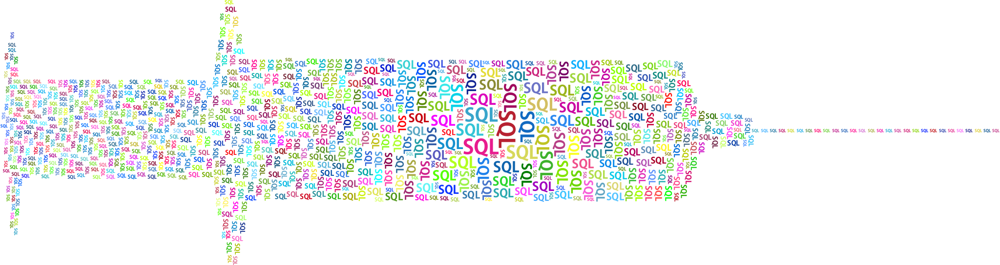
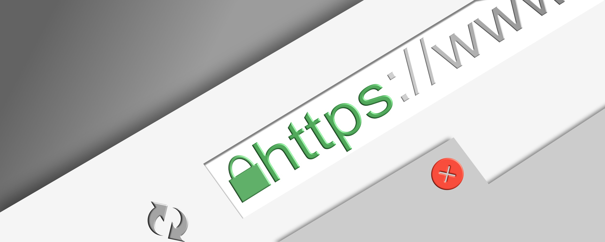
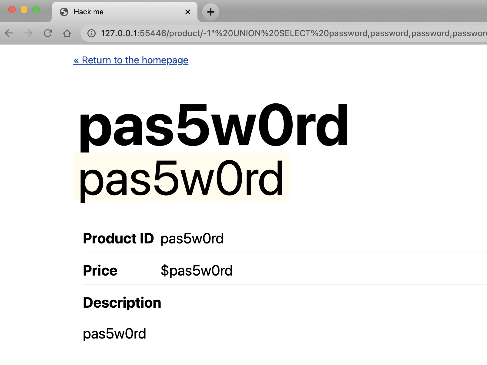
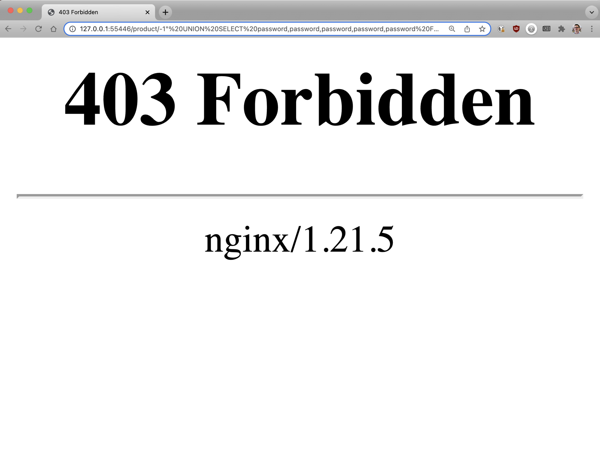
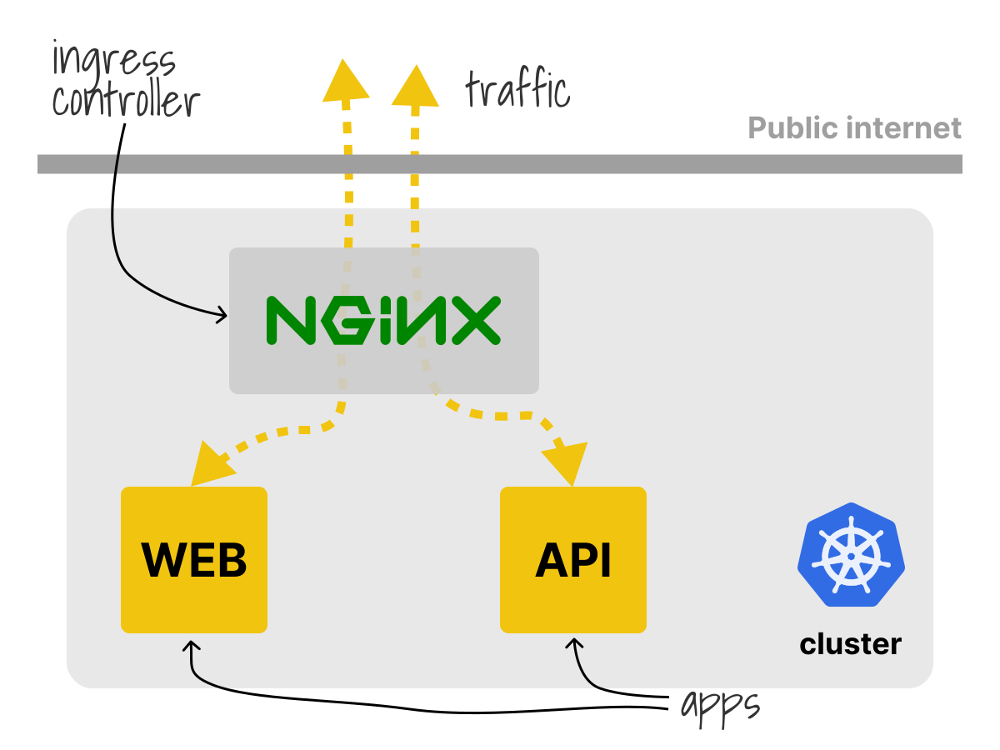
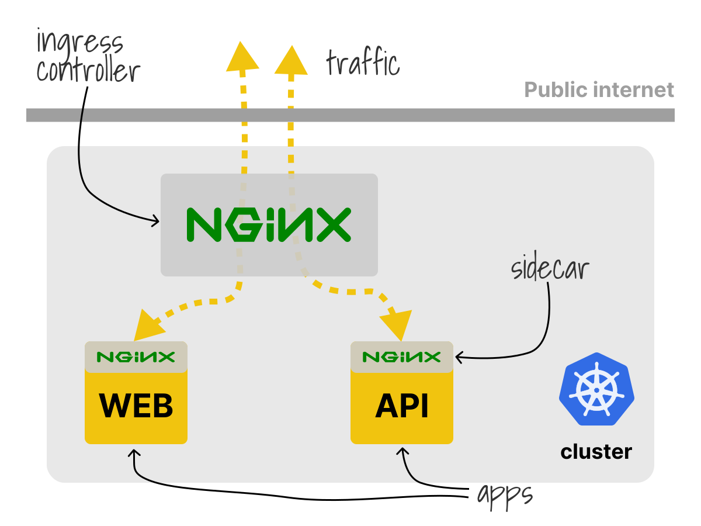

<!-- _class: lead invert -->

# Microservices Security Pattern

## Chris Nesbitt-Smith

### LearnK8s | Appvia

---

# 👋 <!--fit-->

<!--
Hi, thanks for joining me today, welcome!
It would be great to hear who you are so please leave a comment to say hi, introduce yourself, where you're joining from, favorite colour, mothers maiden name, date of birth, credit card details etc this is a security talk after all.
-->

---

# TODO: me

<!--
Hi, My name is Chris Nesbitt-Smith, I'm an instructor at Learnk8s, consultant at Appvia and tinkerer of open source.
I've spent a fair chunk of my professional career now working in UK Government where you often have to assume you're already at breach somewhere and then work backwards from that in terms of damage limitation, terms like "defense in depth" and "zero trust" are found in many meeting notes.
-->

---

# 🙋‍♀️🙋‍♂️🙋 <!--fit-->

<!--
If you've got any questions please drop a comment below at any point, I'm joined by some friends from both Learnk8s and Nginx who'll be helping me, if we don't get to answer it or you're not watching this live, then we'll do our best to respond as soon as possible.
-->

---


<!--
Given this is an nginx event I imagine you're probably here because you run a web service of some sort, and I'll make a leap to assume its not just a static site but probably has some interaction, be it search, contact forms, product catalog, shopping cart, or similar.
-->

---

# 🧨 <!--fit-->

<!--
So to kick things off, and give you all a head start I'm going to invite you to hack me while I explain some theory before I pray to the live demo gods and walk you through a hack and a mitigation.

So, please start your engines
I've one polite ask that to keep things fair and allow everyone to join in, that you only do explorative work and don't try to carry out any destructive attack which includes running any aggressive automated scans.
This an intentionally vulnerable web app, and as such you can probably do all manner of bad things that will only ruin the fun for others.
-->

---


<style scoped>
  h1 {
    background: rgba(255,255,255,0.9);
  padding:1em;
}
</style>

# TODO: url of app

<!--
So the url is on the screen now, and should hopefully remain in the lower section
May the odds ever be in your favour.
-->

---


<!--
TODO: rather than name drop, explain first
O-WASP for those that don't know is the The Open Web Application Security Project run by a non-profit foundation of the same name.
Amongst other great things they periodically publish what is famously referred to as the OWASP top 10 which is broad consensus about the most critical risks to web applications based on the current trends and intel.
-->

---

<!-- _class: lead white -->


<!--
I'm going to be talking about Injection which while down 3 places from its number one spot which it held for 14 years from 2007-2021 is still really important, as we'll see quite common and reasonably easy to mitigate against even when the app has vulnerabilities that you might not know about yet.
-->

---


```
# TODO: insert some nginx logs
```

<!--
If you look beyond great services like google analytics to your server logs you'll likely find all sorts of non browser traffic hitting your web apps from all over the world.
Typically you can expect to start receiving traffic from bots and malicious actors from all over the world looking to suss you out quite soon after presenting yourself to the great unwashed internet.
-->

---



<!--
We're going to focus on SQL injection which while not the only is a very common form, the astute amongst you might find the other injection vulnerabilities we've left open please do take bragging rights in the comments section as you find them, but to keep things fun, please no spoilers.
-->

---

```sql
SELECT * FROM table;
+-----------+-----------+-----------+
| lastname  | firstname | jobtitle  |
+-----------+-----------+-----------+
| Jennings  | Leslie    | Sales Rep |
| Thompson  | Leslie    | Sales Rep |
| Gerard    | Martin    | Sales Rep |
+-----------+-----------+-----------+
3 rows in set (0.00 sec)
```

<!--
So a quick refresher, SQL or structured query language is a commonly implemented interface to a table based database, you will have likely come across this with MySQL, Postgres, SQL server and many others.
-->

---

```sql
SELECT name, password FROM users WHERE email = 'user@example.com';

+--------+-------------------+
| name   | password          |
+--------+-------------------+
| myuser | MySecretPassw0rd! |
+--------+-------------------+
1 rows in set (0.00 sec)
```

<!--
theres a lot more to it, but tables have columns and rows, and with a bit of syntax you can query them
-->

---

```sql
INSERT INTO users (name, password, email)
VALUES('anotheruser', 'letmein', 'user2@example.com');

1 row(s) affected
```

<!--
Even if you're using an ORM you'll normally find under any clever presentation the thing that goes over the wire between your app and the database is some variation of a query that looks like this.
-->

---


# Real world <!--fit-->

<!-- prettier-ignore -->
* Tesla (2014)
* Cisco Prime License Manager (2018) 
* Fortnite (2019)

<!--
[click]
Because of that it's really common
[click]
for mistakes to be made in the implementation.
[click]
Really common
-->

---

# 🛡 <!--fit-->

<!--
Its not all doom and gloom there are some things we can do to provide a first line of defense but first lets look at the offense.
-->

---

<!-- _class: white -->
<style scoped>
  p {
    position: absolute;
    bottom: 0;
    right:0;
  }
</style>


https://xkcd.com/327

<!--
web apps take input in a number of ways, commonly even contact forms on websites will have interactions with databases via a CRM.
-->

---



<!--
but however it happens because of the HTTP protocol you're limited to a number of ways if you ignore websockets which is way more involved and we won't look at that, though many of the same principles apply
-->

---

<style scoped>
  li {
    font-size: 2em;
  }
</style>


- GET
- PUT
- POST
- PATCH
- DELETE
- ETC
<!--
Theres some obvious methods, but really they're arbitrary stings we agree on with expected behavior
-->

---

```
POST /echo/post/json?query=hi HTTP/1.1
Host: example.com
Content-Type: application/x-www-form-urlencoded
Content-Length: 3

a=b
```

<!--
You have a request payload that looks something like this which has a few places you can provide something that the server will interpret.
For the sake of this and simplicity, lets assume log4j and alike's recent issues weren't a thing and stuff that might only ever go to a log won't hurt you.
-->

---

```
POST /echo/post/json?query=hi HTTP/1.1
a=b
```

<!--
The first line here is the path, which you'd see in the browser
The other is the request body which contains the contents of something you've probably filled in a form and submitted.
These are the key areas where application logic and developer code exists, which might be checking user credentials, as part of a login, searching for something or uploading your holiday snaps
-->

---

```php
$result = $con->query("SELECT * FROM products WHERE id = \"{$id}\"");
```

<!--
That code might look something like this, where you can see we've just concatenated the string together to form a query
-->

---

```php
$result = $con->query("SELECT * FROM products WHERE id = \"{$_GET['id']}\"");
```

<!--
the problem starts to become visible when like our code here we don't sanitize the input, and that simple string concatenation starts to hurt you
-->

---

```
http://mydomain.com/products?id=unchecked things
```

```SQL
SELECT * FROM products WHERE id = "unchecked bad things";
```

<!--
and the query you send your database ends up looking like this, oh dear. thats. not. good. is it?!
-->

---

# 🤷 <!--fit-->

<!--
so whats the actual risk? you might ask.
well it can all start to go wrong real fast when those someone breaks out of the intended template query with something like this
-->

---

```
http://mydomain.com/products?id=1" OR id="2"
```

```SQL
SELECT * FROM products WHERE id = "1" OR id = "2";
```

<!--
by simply providing the quote I can extend the query to do whatever I like.
-->

---

# Truncate a table

```SQL
-- http://mydomain.com/products?id=1"; TRUNCATE TABLE products; -- //
SELECT * FROM products WHERE id = "1"; TRUNCATE TABLE products; --//";
```

# Delete a row

```SQL
-- http://mydomain.com/products?id=1"; DELETE FROM products WHERE id="1"; -- //
SELECT * FROM products WHERE id = "1"; DELETE FROM products WHERE id="1"; --//";
```

<!--
So with this I can carry out any action the application can to the database including some destructive ones
-->

---

# Insert a row

```SQL
-- http://mydomain.com/products?id=1"; INSERT INTO payments(orderid, success) VALUES("123", "yes"); -- //
SELECT * FROM products WHERE id = "1"; INSERT INTO payments(orderid, success) VALUES("123", "yes"); --//";
```

<!--
I could insert or update potentially effecting the integrity of the database, maybe I add a row in the payments table to say i paid for an order I didn't so you ship it
 -->

---

# Encrypt

```SQL
UPDATE customers SET email = AES_ENCRYPT(email, PRIVATEKEY);
```

<!--
I could carry out a ransomware attack by encrypting the database and offer to sell you the private key
-->

---


<!--
You might have backups, you might notice it before you ship the order, what about all the data, how might I try and steal that?
-->

---

TODO: example error page with leak

<!--
Well, theres a few ways I can either try and get an error message to return it
-->

---



<!--
or i can manipulate the query to return content in other fields
or update to tables to include all sorts so i can pick it up somewhere else
-->

---

```SQL
SELECT '* * * * * root rm -rf /' INTO outfile /etc/cron.d/bad
```

<!--
or maybe you're running an unpatched database server that has a well known remote code vulnerability or I've a zero-day up my sleeve I can exploit. in which case I might have control of your database server now.
-->

---

# 😱 <!--fit-->

<!--
Ok things are looking pretty scary, don't worry we'll get through this together.
-->

---

```php
$result = $mysqli->query(sprintf("SELECT * FROM products WHERE id ='%s'",
  $mysqli->real_escape_string($_GET['id'])));
```

<!--
So the obvious answer is patch your applications
-->

---


<!--
but you can only do that when you know about it and are in control, what if its a third party app or you don't know about it yet
-->

---


<!--
What if there were a way we could intercept and filter traffic that contained obviously malicious requests before our applications
-->

---


<!--
We could look for the obvious things like SQL commands, SELECT, INSERT, TRUNCATE, JOIN, all terms that we wouldn't normally expect to see in the url
-->

---


<!--
In the before times, you might have reached for things like a web application firewall, either a physical or virtualized appliance, or maybe naxsi, mod_security or some other WAF software product
-->
---


<!--
Well, welcome to 2022 where Kubernetes is seemingly the answer for all that ails you.
So you'll be pleased to know that if your application is running in a Kubernetes cluster there are at least a couple of places we can apply this configuration
-->

---


<!--
Best practice dictates we run only a single process within a container, this allows Kubernetes to best manage the limits, requests and such.
To get around this we can adopt what is commonly referred to as the sidecar pattern which is when we have more than one container in a pod, these act as helpers.
Because its within the pod it scales linearly with the application when there are multiple replicas and each replica has to fit within a single worker node.
-->

---

```yaml
apiVersion: v1
kind: Pod
metadata:
  name: myapp
spec:
  containers:
    - name: myapp
      image: myapp:v1.0.0
      ports:
        - containerPort: 80
```

<!--
so if we take our pod, and
-->

---

```yaml
apiVersion: v1
kind: Pod
metadata:
  name: myapp
spec:
  containers:
    - name: myapp
      image: myapp:v1.0.0
    - name: nginx # <-- sidecar
      image: nginx:1.14.2
      ports:
        - containerPort: 8080
      volumeMounts:
        - mountPath: /etc/nginx
          name: nginx-config
  volumes:
    - name: nginx-config
      configMap:
        name: myapp
```

<!--
add an nginx container (other reverse proxies are available)
and expose a port from that instead
-->

---

```yaml
apiVersion: v1
kind: ConfigMap
metadata:
  name: sidecar
data:
  nginx.conf: |-
    events {}
    http {
      server {
        listen 8080 default_server;
        listen [::]:8080 default_server;

        location ~* "(\'|\")(.*)(drop|insert|md5|select|union)" {
            deny all;
        }

        location / {
            proxy_pass http://localhost:80/;
        }
      }
    }
```

<!--
Provide some config to proxy the connection but filter for some well known keywords in the url we don't like
-->

---

# `kubectl apply` <!--fit-->

<!--
Smack it on the bottom and send it on its way
-->

---



<!--
A quick check now confirms our app isn't vulnerable

I said a couple of ways, what are the other options?
-->

---
<!-- _class: white -->



<!--
What I didn't tell you is this cluster is using nginx-ingress as the ingress controller,
naturally other ingress controllers are available and have similar capabilities to configure them
-->

---
<!-- _class: white -->



<!--
So with a sidecar design we're adding an extra hop for all our traffic since it already passed through
-->

---

```yaml
apiVersion: v1
kind: Pod
metadata:
  name: myapp
spec:
  containers:
    - name: myapp
      image: myapp:v1.0.0
      ports:
        - containerPort: 80
```

<!--
So if we revert back to our first pod without the sidecar
-->

---

```yaml
apiVersion: networking.k8s.io/v1
kind: Ingress
metadata:
  name: myapp
spec:
  ingressClassName: nginx
  rules:
    - host: "example.com"
      http:
        paths:
          - backend:
              service:
                name: myapp
                port:
                  number: 80
            path: /
            pathType: Prefix
```

<!--
And look at our ingress configuration
-->

---

```yaml
apiVersion: networking.k8s.io/v1
kind: Ingress
metadata:
  name: myapp
  annotations:
    nginx.org/server-snippets: |
      location ~* "(\'|\")(.*)(drop|insert|md5|select|union)" {
          deny all;
      }
spec:
  ingressClassName: nginx
  rules:
    - host: "example.com"
      http:
        paths:
          - backend:
              service:
                name: myapp
                port:
                  number: 80
            path: /
            pathType: Prefix
```

<!--
We can add the same configuration chunk we had before for our sidecar as an annotation
-->

---


<!--
Again, apply that and we're good
-->

---

<!-- _class: lead invert -->


# Live demo

<!--
So now its time to put my neck on the line and try this for real
-->

---

<!-- _class: lead invert -->


<!--
questions?
-->

---

# 🙏 Thanks 🙏 <!--fit-->


- cns.me
- github.com/chrisns
- nginx.com/blog
- learnk8s.io/kubernetes-resources

## Chris Nesbitt-Smith <!--fit-->

<!--
Thanks for your time, hopefully you've been enjoying the great microservices march month that Nginx has put on.

Please do follow me on Github and cns.me points at my LinkedIn

The original content for this talk is available on the nginx blog

And you'll find some great related resources at learnk8s.io

Again if we've missed any questions now, or you're not watching this live, please bare with us, we will do our best to respond to them all
-->
